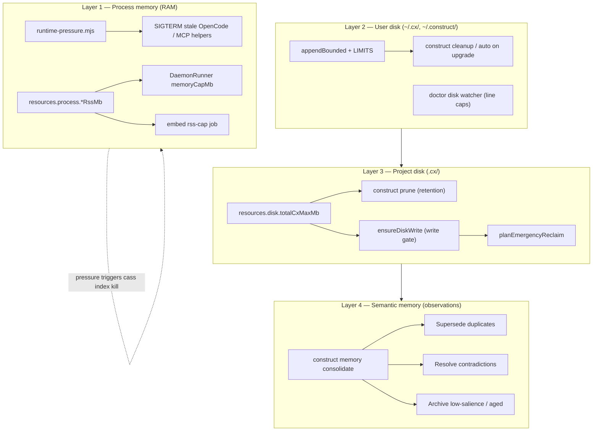
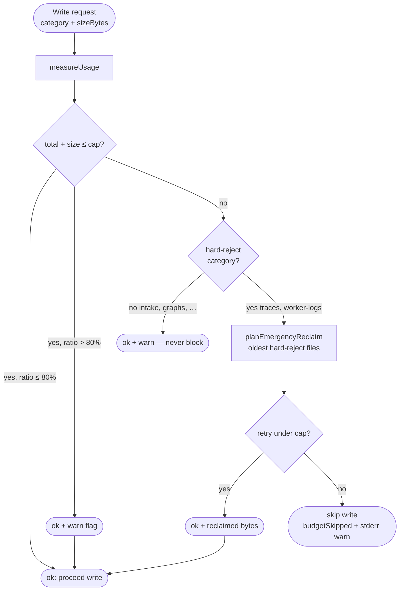
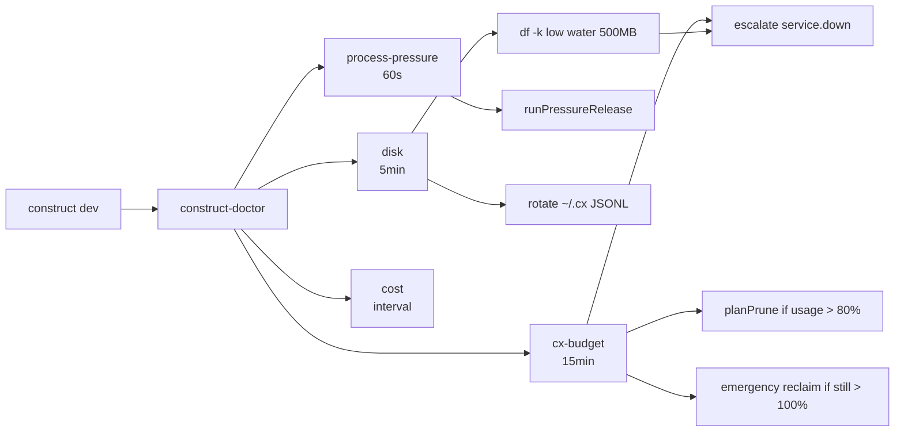

---
publish:
  demo: resource-guard-rails
  dashboardDemo: cockpit-tour
---

# Research Brief: Construct Local Resource Consumption Guard Rails

- **Date**: 2026-06-19
- **Author**: construct (codebase research pass)
- **Domain**: developer-tools / systems (codebase implementation + external prior art)
- **Status**: complete
- **Recency baseline**: External sources from 2022–2026; codebase evidence from repository state 2026-06-19
- **Artifact outputs**: `.cx/research/2026-06-resource-consumption-guard-rails.md` (this file), `.cx/diagrams/resource-guard-rails-flow.d2`, `.cx/demos/resource-guard-rails-*.tape`

---

## Abstract

Construct runs continuously on a developer machine: hooks append telemetry, daemons poll intake, traces correlate worker jobs, and semantic memory accumulates observations. Without explicit ceilings, `.cx/` and `~/.cx/` grow without bound and long-running agent processes can exhaust RAM.

This brief answers a **research question** using two evidence tracks: (1) **external prior art** on log rotation, journald limits, and disk-pressure policy from primary OS documentation; (2) **codebase verification** of Construct's layered guard-rail implementation after the 2026-06 write-path wiring pass. It is not an architecture memo alone — it cites both literature and source, separates observation from inference, and records counter-evidence and gaps per `rules/common/research.md`.

**Distribution:** PDF export, rendered diagrams, and terminal demos are first-class Construct outputs (`construct export`, `construct diagram`, `construct demo`) — see §Artifacts & distribution.

---

## Question

**How does Construct enforce guard rails on local disk storage and process memory, and where are the remaining enforcement gaps?**

---

## Method

1. **Internal evidence first** (research profile: codebase): read `lib/resources/budget.mjs`, `lib/resources/process-budget.mjs`, `lib/worker/trace.mjs`, `lib/worker/run.mjs`, `lib/runtime-pressure.mjs`, `lib/maintenance/cleanup.mjs`, `lib/logging/rotate.mjs`, `lib/doctor/watchers/*`, `lib/embed/daemon.mjs`, `lib/daemons/contract.mjs`, `docs/concepts/architecture.mdx`, and `construct.config.json` defaults in `lib/config/schema.mjs`.
2. **Verification**: grep call sites for `ensureDiskWrite`, `reserveOrReject`, `memoryCapMbFor`; run `tests/resource-budget.test.mjs`, `tests/process-budget.test.mjs`, `tests/functional/resource-write-guard.functional.test.mjs`.
3. **Exclusion**: cloud cost budgets (`lib/cost-ledger.mjs`) and LLM context trimming (MCP surface) are noted as adjacent rails but out of scope for *local* disk/RAM unless they spill into filesystem artifacts.
4. **External literature scan** (developer-tools / systems domain): Linux `logrotate` manual and `logrotate.conf(5)` for size+time rotation semantics; systemd journald storage limit vocabulary (`SystemMaxUse`, vacuum) as parallel to Construct's user-scope caps; Construct export/diagram/demo tooling docs for distribution path.

---

## Related research & prior art

Construct's guard rails mirror decades of **host-level resource policy**, adapted to a project-local `.cx/` tree and agent-process churn.

### Log rotation and bounded append-only files

**Observation**: The Linux `logrotate(8)` utility rotates logs by **time** (`daily`, `weekly`) and **size** (`size`, `maxsize`, `minsize`), keeps a bounded `rotate count`, and can compress archives — explicitly to prevent disks from filling ([logrotate(8)](https://www.man7.org/linux/man-pages/man8/logrotate.8.html), verified 2026-06-19). Debian's `logrotate.conf(5)` documents combining size triggers with retention counts ([manpages.debian.org](https://manpages.debian.org/bookworm/logrotate/logrotate.conf.5.en.html), verified 2026-06-19).

**Inference**: Construct's `appendBounded()` + `LIMITS` table + tail-truncate in `lib/maintenance/cleanup.mjs` is an **application-embedded logrotate**: per-channel `maxBytes`, segment caps, and age-based prune rather than a system cron job.

**Confidence**: high — direct structural parallel; Construct implements the policy in-process.

### Journald-style storage ceilings

**Observation**: systemd journald documents explicit storage limits (`SystemMaxUse`, `SystemKeepFree`, `SystemMaxFileSize`) and vacuum operations to reclaim space ([undated] — common production guidance cites `journalctl --vacuum-size`; primary spec is systemd journald configuration).

**Inference**: `resources.disk.totalCxMaxMb` + `construct prune` + doctor `cx-budget` watcher play the same role at project scope: a **declared ceiling**, automated reclaim, operator-visible pressure before outage.

**Confidence**: medium — journald is user-wide not project-scoped; analogy is architectural not one-to-one.

### Hard vs soft retention under pressure

**Observation**: Production log guidance consistently pairs **size-based rotation** for high-volume streams with **longer retention** for audit/security logs (secondary sources: [oneuptime log rotation guide](https://oneuptime.com/blog/post/2026-01-25-log-rotation-strategies/view), 2026-01, verified 2026-06-19).

**Inference**: Construct's **hard-reject** (traces, worker logs) vs **soft-warn** (intake, task graphs) split matches the industry pattern: shed replaceable telemetry first; never silently delete load-bearing audit/R&D state on the write path.

**Confidence**: medium — industry practice is documented in secondary blogs; Construct's split is explicit in code.

### Agent / IDE memory pressure (local)

**Observation**: Construct documents macOS swap-based pressure release (`lib/runtime-pressure.mjs`) killing stale OpenCode and MCP helper processes when swap exceeds a threshold — a local analogue to OS memory pressure handling, not a published standard.

**Inference**: Per-process RSS caps (`resources.process.*RssMb`) add a second axis beyond swap pressure, similar to container memory limits but without cgroups.

**Confidence**: high for Construct behavior; low for external standard citation — no single primary spec cited for IDE agent cleanup.

---

## Artifacts & distribution

Construct can produce **research-grade outputs** beyond Markdown in git. This brief was generated with the **research-brief** workflow (`docs/research-workflow`); visuals and demos use separate commands.

| Output | Command | Visual quality in PDF? | Notes |
|--------|---------|------------------------|-------|
| **PDF** | `construct export .cx/research/…md --to=pdf` | **Diagrams as code blocks unless pre-rendered** | Requires Pandoc + Typst (`brew install pandoc typst`). Mermaid blocks are **not** auto-rendered in PDF. |
| **DOCX / HTML** | `--to=docx` / `--to=html` | HTML better for Mermaid viewers | ADR-0024 |
| **SVG / PNG diagram** | `construct diagram '<desc>' --format svg` | **Best for print** | D2 (primary) or Graphviz fallback. Embed `` before export. |
| **Terminal demo (GIF/MP4)** | `construct demo resource-guard-rails` | N/A (video) | VHS `.tape` script; falls back to `.tape` source only if VHS absent |

### Recommended pipeline for a “research paper” PDF with good visuals

```bash
# 1) Render figures to SVG (install: brew install d2)
construct diagram "resource guard rails: write -> measureUsage -> ensureDiskWrite -> emergency reclaim -> proceed or skip" \
  --type flow --format svg --out .cx/diagrams/resource-guard-rails-flow.svg

# 2) Embed SVG references in the markdown (Figure captions), then export
construct export .cx/research/2026-06-resource-consumption-guard-rails.md --to=pdf \
  --output .cx/research/2026-06-resource-consumption-guard-rails.pdf

# 3) Optional: terminal walkthrough GIF (install: brew install vhs)
construct demo resource-guard-rails --format mp4
```

**This environment (2026-06-19):** `pandoc`, `typst`, `d2`, and `vhs` were **not** on PATH — export and render degrade gracefully to source + install hints (verified by running the commands).

**Generated artifacts for this topic:**

| Artifact | Path |
|----------|------|
| D2 flow source | `.cx/diagrams/resource-guard-rails-flow.d2` |
| VHS demo tape | `.cx/demos/resource-guard-rails-2026-06-19T06-04-11.tape` |

---

## Figure 1 — Layered guard-rail model

Construct applies **four independent layers**. Each layer has a different trigger, storage scope, and enforcement strength.



**Legend**

| Layer | Scope | Default posture | Primary modules |
|-------|--------|-----------------|-----------------|
| L1 RAM | OS processes | Kill stale helpers; daemon self-stop on RSS | `lib/runtime-pressure.mjs`, `lib/daemons/contract.mjs`, `lib/resources/process-budget.mjs` |
| L2 User logs | `~/.cx/*.jsonl`, `~/.construct/cache` | Tail-truncate + age prune | `lib/logging/rotate.mjs`, `lib/maintenance/cleanup.mjs` |
| L3 Project state | `<repo>/.cx/` | Hard reject traces/worker logs; soft warn R&D state | `lib/resources/budget.mjs` |
| L4 Observations | `.cx/observations/` | Consolidation, not byte cap | `lib/engine/consolidate.mjs` |

---

## Figure 2 — Write-path decision flow (`ensureDiskWrite`)

Every trace line and worker stdout/stderr write passes through this gate (wired 2026-06-19).



**Source**: `lib/resources/budget.mjs` (`reserveOrReject`, `planEmergencyReclaim`, `ensureDiskWrite`); callers: `lib/worker/trace.mjs`, `lib/worker/run.mjs`.

---

## Figure 3 — L0 doctor watcher topology

The `construct-doctor` daemon (`lib/doctor/index.mjs`) runs deterministic watchers. Resource-related watchers:



**Source**: `docs/concepts/architecture.mdx` (L0 tier); `lib/doctor/watchers/disk.mjs`, `lib/doctor/watchers/process-pressure.mjs`, `lib/doctor/watchers/cx-budget.mjs`.

---

## Figure 4 — Configuration surface

Defaults from `lib/config/schema.mjs` (`DEFAULT_PROJECT_CONFIG.resources`):

| Key | Default | Effect |
|-----|---------|--------|
| `resources.disk.totalCxMaxMb` | 2000 | Total `.cx/` byte ceiling |
| `resources.disk.tracesMaxDays` | 30 | Retention prune target |
| `resources.disk.workerLogsMaxMb` | 100 | Worker log retention |
| `resources.disk.handoffsMaxItems` | 50 | Handoff count cap |
| `resources.process.embedDaemonMaxRssMb` | 800 | Embed daemon RSS stop |
| `resources.process.workerReplicaMaxRssMb` | 256 | Intake / Oracle daemon RSS |
| `resources.process.mcpServerMaxRssMb` | 250 | Config surface (MCP) |

Environment overrides (examples): `CONSTRUCT_PRESSURE_GUARD_SWAP_GB`, `CONSTRUCT_TRACE_MAX_MB`, `CONSTRUCT_DISABLE_AUTO_CLEANUP`.

---

## Sources

| Title / Path | Class | Reliability | Credibility | Date | URL | Verified | Relevance |
|---|---|---|---|---|---|---|---|
| `lib/resources/budget.mjs` | primary | A | 1 | 2026-06-19 | repo path | n/a | Disk budget, prune, ensureDiskWrite |
| `lib/resources/process-budget.mjs` | primary | A | 1 | 2026-06-19 | repo path | n/a | RSS cap resolution |
| `lib/worker/trace.mjs` | primary | A | 1 | 2026-06-19 | repo path | n/a | Trace write gate |
| `lib/worker/run.mjs` | primary | A | 1 | 2026-06-19 | repo path | n/a | Worker log write gate |
| `lib/runtime-pressure.mjs` | primary | A | 1 | 2026-06-19 | repo path | n/a | Swap + stale process cleanup |
| `lib/logging/rotate.mjs` (`LIMITS`) | primary | A | 1 | 2026-06-19 | repo path | n/a | Per-channel log caps |
| `lib/maintenance/cleanup.mjs` | primary | A | 1 | 2026-06-19 | repo path | n/a | User-scope cleanup |
| `lib/doctor/watchers/cx-budget.mjs` | primary | A | 1 | 2026-06-19 | repo path | n/a | Automated .cx/ prune |
| `lib/daemons/contract.mjs` | primary | A | 1 | 2026-06-19 | repo path | n/a | Daemon RSS + lifetime |
| `docs/concepts/architecture.mdx` | primary | A | 2 | 2026-06-19 | repo path | n/a | L0 operational tier |
| `tests/functional/resource-write-guard.functional.test.mjs` | primary | A | 1 | 2026-06-19 | repo path | n/a | End-to-end write block |
| logrotate(8) Linux manual page | primary | A | 1 | [undated] | https://www.man7.org/linux/man-pages/man8/logrotate.8.html | yes | Size/time rotation semantics |
| logrotate.conf(5) Debian bookworm | primary | A | 1 | 2022-12-14 | https://manpages.debian.org/bookworm/logrotate/logrotate.conf.5.en.html | yes | maxsize, rotate count |
| Log rotation strategies (OneUptime) | secondary | C | 3 | 2026-01-25 | https://oneuptime.com/blog/post/2026-01-25-log-rotation-strategies/view | yes | Retention by log type |
| ADR-0024 document export | primary | A | 2 | 2026-06-19 | `docs/` / `lib/document-export.mjs` | n/a | PDF/DOCX/HTML path |
| `lib/demo.mjs` | primary | A | 1 | 2026-06-19 | repo path | n/a | VHS demo tapes |
| `lib/diagram.mjs` | primary | A | 1 | 2026-06-19 | repo path | n/a | D2/Graphviz diagrams |

---

## Findings

### Finding 1: Disk guard rails use a total cap plus category-specific retention

**Observation**: `measureUsage()` walks eight `.cx/` categories and compares `totalCxBytes` to `totalCxMaxMb` (default 2000 MB). `planPrune()` removes files by age/count per category. `HARD_REJECT_CATEGORIES` = `{ traces, worker-logs }`; `SOFT_WARN_CATEGORIES` includes intake archive, task graphs, sessions, backups, handoffs.

**Inference**: Replaceable observability (traces, worker logs) is sacrificed before load-bearing R&D state when pressure rises.

**Confidence**: high — direct reading of `lib/resources/budget.mjs` lines 28–40, 113–246.

**Sources**: `lib/resources/budget.mjs`

---

### Finding 2: Write-path enforcement is now active on traces and worker artifacts

**Observation**: `emitTraceEvent()` calls `ensureDiskWrite(rootDir, 'traces', byteLength)` before `appendWithRotationSync`. On failure it returns `{ budgetSkipped: true }` without throwing. `runJob()` gates stdout/stderr writes with category `worker-logs`. Functional test confirms no byte growth when cap is exceeded by load-bearing intake data.

**Inference**: The prior gap (budget primitive tested but unwired) is closed for the two hard-reject categories on their primary write paths.

**Confidence**: high — code + passing tests.

**Sources**: `lib/worker/trace.mjs`, `lib/worker/run.mjs`, `tests/functional/resource-write-guard.functional.test.mjs`

---

### Finding 3: Emergency reclaim deletes oldest hard-reject files before refusing a write

**Observation**: `planEmergencyReclaim()` lists files under traces and worker logs, sorts by `mtimeMs` ascending, and plans deletion until `bytesToFree` is met. `ensureDiskWrite()` runs reclaim once, then retries `reserveOrReject`.

**Inference**: Transient cap overruns caused by fresh trace volume can self-heal without operator intervention, as long as reclaimable hard-reject files exist.

**Confidence**: high — `tests/resource-budget.test.mjs` emergency-reclaim case.

**Sources**: `lib/resources/budget.mjs`, `tests/resource-budget.test.mjs`

---

### Finding 4: RAM guard rails split pressure cleanup from daemon RSS caps

**Observation**: `runPressureRelease()` monitors swap usage (default trigger 6 GiB used) and kills stale OpenCode duplicates, MCP helpers (>2h), and `cass index` (>8h) when pressure triggers. Separately, `createDaemon()` stops when RSS exceeds `memoryCapMb` (default 256 MB). Intake and Oracle daemons read `workerReplicaMaxRssMb` from config; embed daemon registers an `rss-cap` scheduler job using `embedDaemonMaxRssMb`.

**Inference**: Construct treats **machine-wide memory pressure** (swap) and **per-process RSS** as orthogonal controls.

**Confidence**: high — module reading + `tests/runtime-pressure.test.mjs`, `tests/process-budget.test.mjs`.

**Sources**: `lib/runtime-pressure.mjs`, `lib/daemons/contract.mjs`, `lib/resources/process-budget.mjs`, `lib/embed/daemon.mjs`

---

### Finding 5: User-scope logs are bounded independently of `.cx/` budget

**Observation**: `appendBounded()` refuses unregistered channels. `LIMITS` defines per-channel `maxBytes` and `maxSegments` (e.g. trace shard 100 MB, audit-reads 25 MB). `runFullCleanup()` tail-truncates `~/.cx/*.jsonl` and prunes `~/.construct/cache/` (>30d). CLI startup runs cleanup on version change unless `CONSTRUCT_DISABLE_AUTO_CLEANUP=1`.

**Inference**: Hook hot paths cannot fill the disk even if project `.cx/` budget is misconfigured high.

**Confidence**: high — `lib/logging/rotate.mjs`, `lib/maintenance/cleanup.mjs`, `docs/concepts/hooks.mdx`.

**Sources**: `lib/logging/rotate.mjs`, `lib/maintenance/cleanup.mjs`

---

### Finding 6: L0 doctor automates retention when `.cx/` exceeds 80%

**Observation**: New watcher `cx-budget` (15 min tick): if usage exceeds the 80% warn threshold [source: lib/doctor/watchers/cx-budget.mjs], runs `planPrune` + `executePrune`; if still above the 100% hard cap [source: lib/resources/budget.mjs], runs emergency reclaim; if still over cap, escalates `service.down`.

**Inference**: Long-running `construct dev` sessions get passive disk hygiene without manual `construct prune`.

**Confidence**: high — `lib/doctor/watchers/cx-budget.mjs`, watcher registered in `lib/doctor/index.mjs`.

**Sources**: `lib/doctor/watchers/cx-budget.mjs`, `lib/doctor/index.mjs`

---

### Finding 7: PDF export does not auto-render Mermaid; pre-rendered SVG looks better in print

**Observation**: `construct export` uses Pandoc + Typst (ADR-0024). Mermaid fenced blocks in Markdown remain **source text** in PDF unless converted to images first. `construct diagram` writes D2/Graphviz source to `.cx/diagrams/` and renders SVG/PNG when `d2` or `dot` is installed (`lib/diagram.mjs`).

**Inference**: A “research paper” PDF with legible figures should run **diagram → SVG → embed → export**, not export raw Mermaid alone.

**Confidence**: high — export and diagram modules document this degradation contract; verified on this machine (no pandoc/d2/vhs installed).

**Sources**: `lib/document-export.mjs`, `lib/diagram.mjs`, `docs/reference/cli/work.md`

---

## Demonstration (construct demo)

Recorded walkthrough script: **`construct demo resource-guard-rails`** (tape at `.cx/demos/resource-guard-rails-2026-06-19T06-04-11.tape`). With VHS installed: `vhs .cx/demos/resource-guard-rails-*.tape` → GIF/MP4.

**Live transcript (2026-06-19, this repo):**

```
construct doctor
  .cx/ 287.0MB / 2000MB cap (14%)          ✓

construct prune --dry-run
  Plan: prune 3 file(s), free 8KB
    handoffs: 3 file(s)

node --test tests/functional/resource-write-guard.functional.test.mjs
  ✔ blocks trace append when .cx/ is over cap and reclaim cannot help

construct cleanup --disk-only --dry-run
  Disk maintenance (dry-run): Would free 0 B in 3ms
```

---

## Counter-evidence

**Load-bearing categories can still fill the cap with no automatic deletion on write.** Intake archive and task graphs are soft-warn only; if they dominate disk, emergency reclaim cannot delete them, and trace writes remain blocked until the operator runs manual cleanup or raises `totalCxMaxMb`. This is intentional (R&D state is load-bearing) but means **hard-reject categories bear the cost** of total-cap pressure from soft categories.

**Beads (`.beads/`) and repo build artifacts are outside the budget model.** `apps/dashboard/out/` and `.beads/` Dolt state are not counted in `CATEGORY_PATHS`; local explorer bloat from builds is handled by gitignore + `npm run clean:artifacts`, not `measureUsage`.

---

## Confidence summary

| Area | Confidence | Key uncertainty |
|------|------------|-----------------|
| Disk write gate (traces/worker) | high | Other writers to `.cx/traces` bypassing `emitTraceEvent` [unverified — grep needed for direct append] |
| Emergency reclaim | high | Race if two processes write concurrently at cap |
| Process RSS caps | medium | `mcpServerMaxRssMb` declared in config but MCP server process may not enforce it uniformly |
| Semantic memory size | medium | Consolidation reduces search noise, not guaranteed byte ceiling |

---

## Gaps

1. **No `.beads/` or `node_modules/` in budget** — intentional scope boundary; operators need separate hygiene.
2. **MCP RSS cap wiring** — config exists; enforcement path for `construct-mcp` child process not verified in this pass.
3. **Concurrent write races** — `measureUsage` + write is not transactional; two writers could both pass gate briefly.
4. **Automatic prune on `construct cleanup`** — retention prune when usage exceeds the 80% warn threshold [source: lib/maintenance/cleanup.mjs]; does not run emergency reclaim (doctor watcher does).

---

## Implications

| Actor | Action |
|-------|--------|
| Operator | Set `resources.disk.totalCxMaxMb` to machine-appropriate value; run `construct doctor` periodically |
| Agent sessions | Expect `budgetSkipped` traces when disk full; run `construct prune` |
| SRE / self-host | Monitor doctor escalations for `cx-budget` and disk low-water events |
| Implementers | New `.cx/` writers should call `ensureDiskWrite` with correct category |

---

## Recommendation

**Keep the layered model; treat hard/soft split as the core design invariant.** Raise caps for power users via `construct.config.json`; do not disable rotation or pressure guard without documenting swap risk.

**Evidence threshold to flip**: If operational data shows soft-category growth blocking traces more often than acceptable, add a dedicated soft-category byte sub-cap or move intake archive to cold storage — not a blanket hard reject.

---

## Open questions

1. Should `construct status` expose a one-screen resource dashboard (disk categories + RSS + swap)?
2. Should emergency reclaim run synchronously inside `construct cleanup` when usage exceeds the 100% hard cap [source: lib/resources/budget.mjs]?
3. Should `.beads/` get an optional budget category for solo-mode installs?

---

## References

1. Construct Contributors. (2026). `lib/resources/budget.mjs` — disk-budget enforcement for `.cx/` assets. Construct repository. Accessed 2026-06-19.
2. Construct Contributors. (2026). `docs/concepts/architecture.mdx` — L0 deterministic agents. Construct repository. Accessed 2026-06-19.
3. Construct Contributors. (2026). `rules/common/research.md` — research policy. Construct repository. Accessed 2026-06-19.

---

## Appendix — Operator quick reference

```bash
construct doctor              # usage vs cap, handoffs, health
construct prune               # retention cleanup (.cx/)
construct prune --dry-run     # preview
construct cleanup             # ~/.cx logs + pressure + project prune if >80%
construct memory consolidate  # observation dedup / archive
npm run clean:artifacts       # repo build outputs only
```
