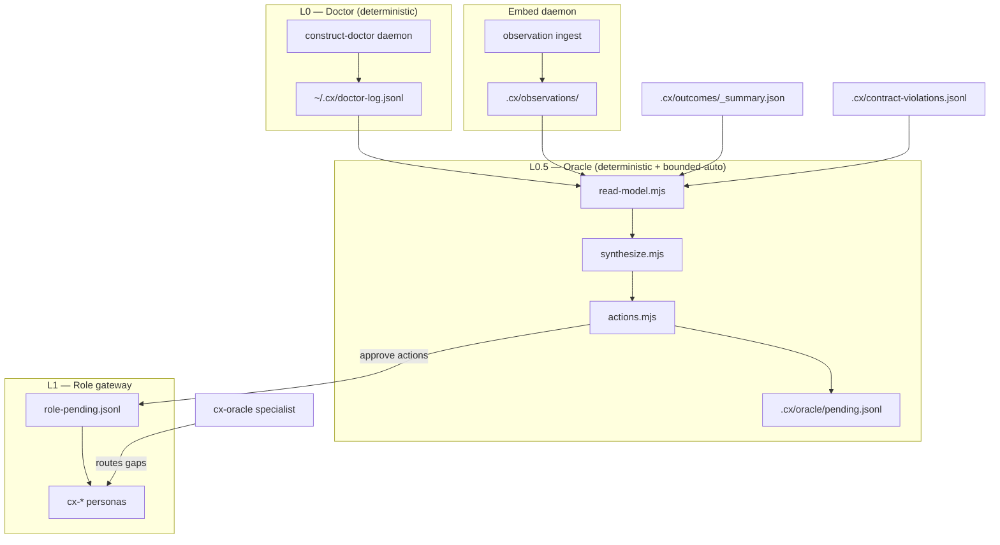

<!--
cx_doc_id and body_hash are stamped by construct on commit; omitted in this draft.
-->
# ADR-0043: Oracle meta-controller — bounded-auto system health review

- **Date**: 2026-06-18
- **Status**: accepted
- **Deciders**: Gerald Dagher (owner), Construct maintainers (cx-architect)
- **Relates to**: ADR-0035 (extend-not-rebuild), ADR-0039 (surface model), alignment program (Phase 0–3)

> **Note**: ADR-0042 covers LLM credential resolution. Oracle meta-controller is ADR-0043 to preserve monotonic ADR numbering.

## Problem

Construct operates three overlapping health layers that no single surface unifies:

1. **L0 doctor** (`lib/doctor/`) — deterministic watchers, auto-recovery, audit log at `~/.cx/doctor-log.jsonl`.
2. **Embed daemon** (`lib/embed/`) — continuous observation ingest and snapshot generation.
3. **L1 gateway** (`lib/roles/`) — event-driven persona invocations with rate limits and approval queues.

Operators and agents lack a **read-model → verdict → bounded action** loop that:

- Collects project-scoped signals (observations, outcomes, contract violations, parity, alignment census) without an LLM on the hot path.
- Synthesizes gaps deterministically before any specialist is dispatched.
- Executes only **safe, reversible** maintenance (census, registry validate, tool-repo adapter sync) automatically.
- Queues consequential remediation (specialist dispatch, doctor follow-up) for human approval.

Without this layer, alignment regressions and parity drift are discovered only during manual `construct doctor` runs or release gates — too late for continuous correction.

## Decision

Ship the **Oracle meta-controller** as a daemon-backed L0.5 layer:

| Component | Path | Responsibility |
|---|---|---|
| Read model | `lib/oracle/read-model.mjs` | Collect signals from `.cx/observations/`, `.cx/outcomes/_summary.json`, `.cx/contract-violations.jsonl`, `~/.cx/doctor-log.jsonl`, `audit-artifacts/alignment-census.json`, `checkProjectParity()` |
| Synthesis | `lib/oracle/synthesize.mjs` | Pure `synthesizeVerdict(readModel)` → `{ verdict, gaps, recommendedActions }` |
| Policy | `lib/oracle/policy.mjs` | `classifyAction(kind)` → `auto` \| `approve` \| `deny` |
| Actions | `lib/oracle/actions.mjs` | `runOracleTick()` executes auto actions; queues approve actions to `.cx/oracle/pending.jsonl` |
| Daemon | `lib/oracle/index.mjs` | `createDaemon` contract; killswitch `CONSTRUCT_ORACLE=off`; heartbeat `~/.cx/runtime/oracle/heartbeat.json` |
| CLI | `lib/oracle/cli.mjs` | `construct oracle start\|status\|review\|pending\|approve` |
| Specialist | `cx-oracle` | Routes gaps to owning specialists via `get_skill`; internal, reasoning tier |
| API | `GET /api/oracle`, `GET /api/oracle/pending` | Dashboard read surfaces |
| Capability | `oracle.meta-review` | Registry entry with functional verification |

### Bounded-auto policy

**Auto** (no approval):

- `census-run` — spawn `scripts/alignment/census.mjs`
- `registry-validate` — import `validateCapabilityRegistry`
- `adapters-sync` — `syncProjectAdapters` **only when** `isConstructPackageRepo(projectDir)`

**Approve** (append to `.cx/oracle/pending.jsonl`):

- Specialist dispatch (`specialist-review`, `trace-review`, `doctor-followup`, `outcomes-aggregate`, …)

**Deny** (never via Oracle):

- `git-push`, `git-commit`, destructive deletes, force sync

### Read/write contract

- **Read**: Oracle reads durable JSON/JSONL artifacts only. No MCP, no LLM, no network on the read-model path.
- **Write**: Oracle may append to `.cx/oracle/pending.jsonl`, write per-tick verdicts to `.cx/oracle/verdicts/<date>.json`, routing artifacts to `.cx/oracle/routing/`, idempotent beads issues via `lib/oracle/issues.mjs`, heartbeat/last-tick under `~/.cx/runtime/oracle/`, and spawn bounded maintenance subprocesses. Approve actions execute via `lib/oracle/execute.mjs` (L1 dispatch, outcomes aggregate). It does not mutate specialist prompts or git state autonomously.

### Relationship to doctor, embed, and L1 gateway

- **Doctor**: Oracle *reads* doctor audit lines; it does not replace doctor watchers. Doctor escalations become Oracle gaps routed to `cx-sre` / `cx-operations`.
- **Embed**: Oracle *reads* observation index counts; embed continues ingest independently.
- **L1 gateway**: Approve-queue actions may surface as role events; Oracle does not bypass gateway rate limits or fences.

## Consequences

**Positive**

- Continuous parity and alignment visibility without waiting for release gates.
- Clear separation: deterministic collection/synthesis vs LLM routing (cx-oracle).
- Bounded-auto reduces toil on the Construct tool repo (census, registry validate, adapters).

**Negative**

- Another daemon to monitor; mitigated by shared `createDaemon` contract and killswitch.
- False-positive gaps when outcomes summary is absent on greenfield projects; severities are tiered (`low` for missing summary).

**Neutral**

- `construct doctor` remains the operator-facing diagnostic; Oracle complements it with periodic synthesis and action queue.

## Verification

- `tests/functional/oracle-read-model.functional.test.mjs`
- `tests/functional/oracle-bounded-auto.functional.test.mjs`
- Capability registry entry `oracle.meta-review` with `humanGate: approve-only`
