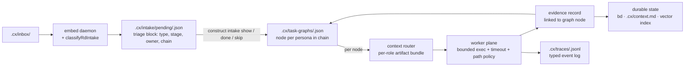
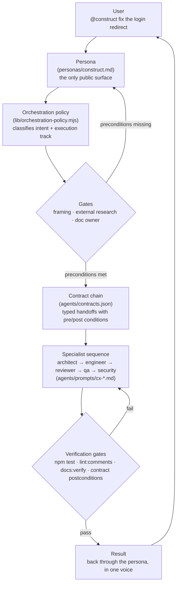

# Construct Architecture

> Required project state. All LLMs working in this repo, including Construct, should treat this as canonical architecture context and keep it current.

## A note before the diagrams

If you're walking in cold — including future me — this page is the bridge between *what Construct is supposed to do* and *how it's actually wired up*. The diagrams come first because they're the cheapest way to orient. The text after explains the same thing twice on purpose: once in plain language, once in code-base terms. Pick whichever flavor lands faster, then read the other to lock it in.

## The 30-second version

Construct is one front door (a persona) that you talk to in Claude Code or OpenCode. Behind that door is a team of specialists — architect, engineer, reviewer, security, QA, and friends — who challenge each other and ship verified work. A small CLI keeps the team installed, healthy, and aligned with your project state. The R&D loop turns signals into outcomes: anything dropped into `.cx/inbox/` is classified, owner-assigned, planned as a task graph, routed to the right persona with the right context, executed in a bounded worker, evidenced, evaluated, and persisted. That's the whole product. The rest of this page is wiring.

## R&D loop



The signal-to-memory path is deterministic where it should be (classification, routing, evidence) and LLM-driven where it must be (the agent in the user's editor does the actual analysis). Daemon code never calls an LLM.

## How a request moves through Construct



The loop is the differentiator. Other agent tools dispatch to specialists; Construct dispatches *and* gates *and* re-runs until verification passes or a real blocker surfaces.

## Where things live

```mermaid
graph LR
    subgraph core["core/ — orchestration brain"]
        CLI["bin/construct<br/>+ lib/cli-commands.mjs"]
        MCP["lib/mcp/<br/>MCP server + tools"]
        PolicyMod["lib/orchestration-policy.mjs<br/>routing"]
        Storage["lib/storage/<br/>file + SQL + vector"]
        Hooks["lib/hooks/<br/>session-start, audit, guards"]
    end
    subgraph providers["providers/ — external systems"]
        GitHub["GitHub"]
        Jira["Atlassian Jira"]
        Confluence["Atlassian Confluence"]
        Slack["Slack"]
        Salesforce["Salesforce"]
        Plugins["Custom plugins"]
    end
    subgraph runtime["runtime/ — keeps the lights on"]
        Embed["embed daemon<br/>+ supervisor"]
        Sched["scheduler"]
        Backup["backup<br/>(lib/storage/backup.mjs)"]
    end
    subgraph dashboard["dashboard/ — the web app"]
        Chat["chat (SSE)"]
        Approvals["approval queue"]
        Knowledge["knowledge panel"]
    end
    subgraph deploy["deploy/ — ship it"]
        Docker["multi-stage Dockerfile"]
        Terraform["Terraform modules<br/>(ECS, ALB, RDS+pgvector)"]
        Release["release.yml<br/>(SEA binaries, GHCR, npm)"]
    end

    core --> providers
    core --> runtime
    core --> dashboard
    runtime --> providers
    deploy --> dashboard
    deploy --> runtime
```



## In human terms

Picture a small company. **You are the founder.** You walk in and say "fix the login redirect" or "ship the customer portal." The **persona** is the chief of staff — the one person you actually talk to. They don't fix the login themselves; they walk down the hall and pull in the right people. The **architect** sketches the trade-offs. The **engineer** reads the code and writes the change. The **reviewer** pushes back on what the engineer didn't test. The **QA** runs the thing. The **security specialist** asks "what if someone's hostile?" Nothing leaves the building until the gates say it's done. Beads is the project tracker. The docs are the durable record of decisions. Memory is what the team remembers from yesterday. You never had to assign anything by name — the chief of staff did.

## In technical terms

A user request hits the Construct persona (`personas/construct.md`). The orchestration policy (`lib/orchestration-policy.mjs`) classifies the intent and resolves the execution track (`immediate`, `focused`, or `orchestrated`), the gate set (`framingChallenge`, `externalResearch`, `docAuthoring`), the contract chain (`agents/contracts.json` — typed producer→consumer handoffs with preconditions, postconditions, and input/output schemas validated at runtime by `lib/agent-contracts.mjs`), and the specialist sequence (`agents/prompts/cx-*.md`). Specialists dispatch through the MCP server (`lib/mcp/server.mjs`). Verification fires four hard gates locally before any commit (`npm test`, `lint:comments`, `docs:verify`, `docs:update --check`) plus contract postconditions on every handoff; failures get a chain-hashed JSONL entry in `~/.cx/contract-violations.jsonl`. Providers (`lib/providers/`) are stateless adapters with their own transport choice; durable state lives in `lib/storage/` and `~/.cx/`.

## Why it's built this way

- **One public surface.** The persona is the only thing the user talks to. Specialists can be reorganized, renamed, or replaced without breaking the user contract — they're implementation detail.
- **Stateless providers.** Providers never own durable state. Swapping GitHub for a custom Git provider, or adding Salesforce, doesn't migrate any data — Construct's stores stay put.
- **Mode-driven topology.** Deployment mode (`solo` | `team` | `enterprise`) selects the backends for the intake queue, memory, telemetry, and workers. Solo runs everything locally and degrades gracefully when an optional resource is missing. Team and enterprise promote the same primitives to shared Postgres, brokered MCP, and Docker worker pools. See [deployment model](/concepts/deployment-model).
- **Hard gates over soft hooks.** Comment policy, doc verification, template policy, and contract postconditions fail the build. They are not advisory. The default is "stop and fix"; CI is a backstop, not the primary check.
- **Specialists challenge each other.** Devil's advocate, reviewer, QA, security are peers, not rubber stamps. Agreement at every step is treated as a smell — if everyone always says yes, the gates aren't doing their job.

## System overview

Construct is an org-in-a-box: an AI orchestration system that can be pointed at external systems (repos, project trackers, messaging, knowledge bases), embedded as a continuous monitor, and deployed locally or to the cloud. It produces organizational intelligence — PRDs, RFCs, ADRs, health snapshots, recommendations — and manages work across connected systems through a transport-agnostic provider abstraction.

## Architecture layers

```
core/         — CLI, MCP server, orchestration, memory, sessions
providers/    — abstract provider interface + per-system implementations
runtime/      — Docker management, embed daemon, scheduler
dashboard/    — full web app: auth, chat, approvals, config
deploy/       — Dockerfile, Terraform modules, cloud configs
```

### Core

The foundation. Handles orchestration, specialist dispatch, memory, sessions, and the MCP server. Zero external npm dependencies.

- **CLI surface** — `bin/construct` and `lib/cli-commands.mjs`
- **MCP server** — `lib/mcp/server.mjs`, tools split across `lib/mcp/tools/`
- **Orchestration policy** — `lib/orchestration-policy.mjs` (intent classification, execution track selection, gate evaluation, contract-chain resolution)
- **Agent contracts** — `agents/contracts.json` and `lib/agent-contracts.mjs` (producer→consumer service contracts with preconditions, postconditions, input/output schemas)
- **Observation store** — `.cx/observations/` (role-scoped, vectorized, capped insights for continuous learning)
- **Session persistence** — `lib/session-store.mjs`, `.cx/sessions/` (distilled session records for resumption)
- **Hybrid search** — `lib/storage/` (file-state source, SQL store, vector index, hybrid query facade)
- **Plugin engine** — `lib/engine/` with six contracts (Embedder, Chunker, Indexer, Fuser, Reranker, Compressor). Each layer resolves to a built-in default unless overridden by `~/.construct/plugins.json`, `<project>/.cx/plugins.json`, or `CONSTRUCT_PLUGIN_<LAYER>` env. Failed overrides fall back to the default and surface in `construct doctor`. External git projects plug in by exporting a factory that satisfies the contract — `assertContract(layer, plugin)` runs at load time so the failure is loud, not silent.
- **Hooks / enforcement** — `lib/hooks/` (session-start, bash-output-logger, repeated-read-guard, context-watch, audit-trail)
- **Audit trail** — `lib/audit-trail.mjs`, `~/.cx/audit-trail.jsonl` with tamper-evidence chain
- **Doc stamps** — UUIDv7 front-matter on all generated `.md` files for identity, provenance, and tamper detection

### Providers

Transport-agnostic interface to external systems. Each provider implements a capability matrix and chooses its own transport (MCP, REST, GraphQL, SDK, CLI, webhooks). Core dispatches through the interface — it never knows the transport.

**Capability matrix:**

| Capability | Description |
|---|---|
| `read` | Fetch items, pages, messages, files from the external system |
| `write` | Create or update items (work items, messages, pages, PRs) |
| `search` | Query the external system's index |
| `watch` | Poll or subscribe for changes |
| `webhook` | Receive inbound events from the external system |

**Provider contract:**
- Providers are stateless adapters. Durable state lives in core stores.
- Auth is per-provider, configured in `.cx/providers.yaml` or environment.
- A provider may support any subset of capabilities; unsupported capabilities return a typed error.
- Provider implementations live in `providers/` with one directory per system.

**Shipped providers:**

| Provider | Transport | Capabilities |
|---|---|---|
| Git repo | git CLI | read, write, watch |
| Project tracker (Jira) | REST API v3 | read, write, search, webhook |
| Messaging (Slack) | Slack Web API | read, write, watch, webhook |
| Code host (GitHub) | gh CLI | read, write, search, webhook |
| Knowledge base (Confluence) | REST API v2 | read, write, search |

### Runtime

Docker service management, embed daemon, and scheduler.

- **Service manager** — `lib/service-manager.mjs` (container lifecycle for Postgres, memory)
- **Embed daemon** — scheduled or long-running process that monitors sources through providers, produces snapshots, manages approval queue. `construct embed supervise` installs a platform-native supervisor (launchd/systemd/Task Scheduler) for auto-restart on crash.
- **Scheduler** — cron-style or interval-based execution (local: in-process schedule; cloud: cron + webhook triggers)
- **Resource bootstrap** — `lib/bootstrap/resources.mjs` probes optional resources (Postgres, ONNX model, Docker, git). `lib/bootstrap/lazy-install.mjs` gates install on operator consent cached in `config.env`; `construct init` runs the full wizard.
- **Backup** — `lib/storage/backup.mjs` creates timestamped tar.gz archives covering observations, sessions, config.env (secrets redacted), registry snapshot, and Postgres dump. SHA-256 manifest for tamper detection. `construct backup create|verify|restore|list|prune`. `create` auto-prunes to `CONSTRUCT_BACKUP_RETAIN` (default 10) unless `--no-prune` is passed. Optional embed-daemon job `auto-backup` runs every `CONSTRUCT_AUTO_BACKUP_DAYS` days (off by default).

### Dashboard

Full web application shipped and running.

- **Auth** — Bearer token + session cookie. `CONSTRUCT_DASHBOARD_TOKEN` for single-token dev mode; `construct dashboard tokens issue` for multi-token production mode with per-token roles (admin/operator/viewer).
- **Security middleware** — CSRF double-submit cookie (`lib/server/csrf.mjs`), CORS origin allowlist (`lib/server/cors.mjs`, configured via `CONSTRUCT_DASHBOARD_ORIGINS`), token-bucket rate limiting (`lib/server/rate-limit.mjs`: 60/10/5 req/min by endpoint class), structured JSON-line logger (`lib/logger.mjs`).
- Chat interface — SSE-streaming Claude session; `/api/chat/stream`, `/api/chat`, `/api/chat/history`
- Approval queue — approve/reject high-risk actions queued by the embed daemon
- Config management — providers, embed settings, approval rules; reads/writes `config.env` and `embed.yaml`
- Models page — editable per-tier (reasoning/standard/fast) primary + fallback selection backed by `getProviderModelCatalog()`; persists via `POST /api/registry/models`. Credentials sub-block is fully editable via the shared `CredentialsCard` component (LLM kind).
- Providers page — lists built-in integration providers (`lib/providers/`) and operator overrides from `~/.construct/providers.json`. Add / edit / delete plugin overrides via `POST /api/providers/registry`; entries are validated by `validateProviderEntry()` (5s timeout) before persisting, and built-in IDs cannot be overridden. Credentials editor (integration kind) reuses the same `CredentialsCard`.
- Provider health classification — `GET /api/providers?probe=1` returns `status: 'healthy' | 'not_configured' | 'unhealthy'`. A provider whose required env vars are all unset is `not_configured` (gray dot, no degradation); `unhealthy` (red) only fires when env vars are set but the probe fails. Eliminates the prior false-positive where missing Jira/Slack/Salesforce creds read as broken.
- Credentials write path — `POST /api/providers/credentials` writes to `~/.construct/config.env` with mode 0600 via `writeEnvValues()`, hot-reloads `process.env`, and audit-logs `{ts, action, envVar}` (never the value) to `~/.cx/credential-audit.jsonl`. Allowlisted env vars only (central `CREDENTIAL_MAP`). Localhost binds rely on OS file permissions; non-localhost binds require `CONSTRUCT_DASHBOARD_TOKEN`.
- Snapshot viewer — health reports, risk analysis, recommendations
- Knowledge panel — Ask (RAG query), Trends (hot topics, patterns, risks, decision drift), Index (corpus breakdown)
- Infrastructure tab — Terraform editor with validate + output buttons
- Real-time updates — SSE for live status, new approvals, snapshot alerts

### Deploy

Infrastructure as code and container packaging.

- **Dockerfile** — multi-stage hardened image: builder stage (npm ci + global tools), runtime stage (no bash, no build tooling). Supports `--read-only` rootfs with `/data` volume. Target < 500 MB.
- **Terraform modules** — `deploy/terraform/` (VPC, ECS/Fargate, RDS+pgvector, Secrets Manager, ALB, IAM). ECS runs ≥ 2 tasks behind an ALB with sticky sessions and CPU/request-count auto-scaling. RDS parameter group loads `shared_preload_libraries = 'vector'`.
- **Release pipeline** — `.github/workflows/release.yml`: quality gate → parallel Node SEA binary builds (linux/darwin/windows × x64/arm64) → Docker push to GHCR + Trivy scan → GitHub Release with binaries → `npm publish --provenance`.
- Webhook ingestion endpoint for provider events

## Operating model: gates + contracts + specialists

Every request flows through three structural layers:

1. **Gates** (`routeRequest` returns `framingChallenge`, `externalResearch`, `docAuthoring`): preconditions that must hold before work begins. Frame the problem independent of tickets; route authorship to the owning specialist; cx-researcher returns primary sources first.
2. **Contract chain** (`routeRequest.contractChain`): ordered typed handoffs from `agents/contracts.json`. Each contract names a producer→consumer pair, required input fields, preconditions, expected output shape, and postconditions.
3. **Specialist sequence**: dispatch plan with ordering and parallel markers. Gate-required specialists (cx-devil-advocate, cx-researcher, doc owner) are auto-prepended.

## Construct on Construct

The goal is for Construct to run itself like a real organization — a department-style model where deterministic watchers handle the boring stuff and LLM personas are summoned only when judgment is needed. The user stays in the loop for novel decisions and explicit approval, not routine ops.

Three layers:

1. **L0 — Deterministic agents (non-LLM, always-on).** The `construct-doctor` daemon (`lib/doctor/`) runs alongside the dashboard, holding four watchers: process-pressure (extends `lib/runtime-pressure.mjs`), service-health (probes Postgres / dashboard / cm; auto-restarts docker services), disk (rotates `~/.cx/*.jsonl`, prunes `~/.construct/.runtime/`), and cost (per-persona daily token ledger; the gateway hard-stops invocations at the cap). Recoverable actions are auto-taken and audit-logged to `~/.cx/doctor-log.jsonl`. L0 escalates a `service.down` role event when deterministic rules can't resolve the problem (e.g., 2 failed restarts or repeated pressure churn).
2. **L1 — LLM personas (event-driven, fenced, rate-limited).** The role framework in `lib/roles/`. Events published by hooks or L0 are routed via `EVENT_OWNERSHIP` (in `lib/orchestration-policy.mjs` next to `DOC_OWNERSHIP`) to the owning persona declared in `agents/role-manifests.json`. The gateway applies threshold + cooldown + rate-ceiling, creates a bd issue, queues a pending invocation in `~/.cx/role-pending.jsonl`, and emits an SSE toast. Session-start drains the backlog (cap 5 per session) and surfaces invocations to Construct, which dispatches the persona via the existing Task path. Personas act inside a fence — allowed paths, allowed bd labels, `approvalRequired` list per role. Handoffs are recorded as `next:cx-<role>` bd labels.
3. **L2 — User.** Commits, pushes, novel decisions, budget overrides, kill switches. Approval-required actions per `rules/common/commit-approval.md` are always L2. The goal is to make L2 rare — not zero.

Kill switches throughout: `CONSTRUCT_ROLES=off` (global L1), `CONSTRUCT_ROLE_<NAME>=off` (per-persona L1). L0 watchers are individually toggleable when the doctor daemon ships.

## Modes of operation

| Mode | Description | Trigger |
|---|---|---|
| **Point-at** | Accept a target URI, produce analysis or artifact (PRD, RFC, ADR) | `construct analyze <uri>` |
| **Init** | Bootstrap a project with .cx/, shared memory, cross-agent configs | `construct init` |
| **Embed** | Continuous monitoring, snapshot production, work item management | `construct embed start` |
| **Self-host** | Construct manages its own development (this repo) | Always active in the construct repo |

### Embedded operating profile

Embed mode is governed by a config-backed operating profile, not just a list of watched sources. The profile is the daemon's bearing: mission, strategy, focal resources, authority boundaries, artifact responsibilities, and risk model.

Precedence is explicit: approval rules and tracker/doc ownership override profile preferences. The default profile is assistive and read-first:

- autonomous: read sources, summarize, identify gaps, generate snapshots, draft roadmaps/status/summaries/artifacts
- approval-queued: create or update issues, publish durable docs, post externally, write broadly to the repo
- focal resources: `plan.md`, `docs/architecture.md`, `.cx/knowledge/`, `.cx/roadmap.md`
- artifact obligations: roadmaps, PRDs, RFCs, ADRs, memos, status updates, summaries, wireframes, and risks

Every snapshot discloses the active operating profile and any operating gaps, such as missing focal resources, missing sources, source read failures, or missing outputs. Roadmaps include the same profile obligations so operators can tell whether Construct is only observing or also missing responsibilities.

## Project-state hierarchy

One source of truth per concern:

1. External tracker owns the durable backlog and issue lifecycle.
2. `plan.md` owns the current human-readable working plan, linked to tracker ids. It is local-only (gitignored) — never the system of record.
3. Memory (observation store via MCP) stores cross-session knowledge, not task state.
4. Single-writer rule: one active writer per file; others review, research, or wait.

## Approval model

Hybrid: autonomous for low-risk, human-gated for high-risk.

| Risk | Examples | Behavior |
|---|---|---|
| Low | Reading, analysis, draft generation, search | Autonomous |
| High | Work item creation, merge, doc publish, config changes | Queued for approval (dashboard or messaging provider) |

## Policy enforcement — three layers

Policy rules (comment convention, doc-update requirement, CI green before walk-away, branch hygiene) are enforced at three layers so violations cannot fall through the cracks. Every blocking layer has an explicit env-var bypass so legitimate exceptions leave an audit trail.

**Layer 1 — Real-time (write/edit time).** Catches at the source.

- `comment-lint.mjs` — PostToolUse Write/Edit/MultiEdit, **blocking**. Banned patterns and missing required headers exit 2. Bypass: `CONSTRUCT_SKIP_COMMENT_LINT=1`.
- `doc-coupling-check.mjs` — PostToolUse, advisory. Counts code-file edits per session, prints stderr nudge at 3/5/10 when no doc files touched. Soft predecessor to the commit gate.
- `ci-status-check.mjs` — UserPromptSubmit. Queries `gh run list` (60s cache) and injects red-CI status into agent observation.

**Layer 2 — Gate (commit/push time).** Catches at the boundary.

- `.beads/hooks/pre-commit` Construct policy section — calls `construct lint:comments --staged` and `construct docs:verify --staged`. Refuses commits with banned-pattern violations or code-without-docs. Bypasses: `CONSTRUCT_SKIP_GATES=1`, `CONSTRUCT_SKIP_DOCS=1`.
- `pre-push-gate.mjs` — refuses `claude/*` branch pushes (bypass `CONSTRUCT_ALLOW_CLAUDE_PUSH=1`); refuses push on red remote CI (bypass `CONSTRUCT_SKIP_PREPUSH=1`); runs `evals retrieval` and `docs:verify` in addition to project tests/build.

**Layer 3 — Safety net (CI + session end).** Catches escapees.

- `policy-engine.mjs` Stop handler (consolidated):
  - **red-CI block** — exits 2 when CI is red on the current branch and the agent edited code this session. Bypass: `CONSTRUCT_STOP_OK_RED_CI=1`.
  - **open-beads block** — exits 2 when `bd list --status in_progress` returns any issue. Bypass: `CONSTRUCT_STOP_OK_OPEN_BD=1`.
  - **drive criteria enforcement** — blocks Stop when drive mode is active and acceptance criteria lack evidence.
  - **drive-session advisory** — non-blocking surface of open `~/.cx/drive-session.json`.
- `construct doctor` — phantom-hook drift check; refuses to pass when `settings.template.json` registers a hook whose file is missing. Prevents the failure mode where defenses look wired up but silently no-op.

CI is the outermost safety net. Required status checks on `main` and `dev` (`retrieval evals`, `comment policy`, `docs drift check`, `dependency CVE audit`) prevent merges when any layer's escape made it to a PR.

## Context hygiene

Enforced via hooks, not advisory text:

- `bash-output-logger` — persists large outputs to disk, nudges grep over re-run
- `context-watch` — compaction guidance at 60%/80% of resolved context window
- Role skills loaded on demand via `get_skill`

## Session persistence

Distilled, not raw. Sessions store summary, decisions, files changed, open questions, and task snapshot. Full transcripts are ephemeral.

**Tiered injection at session start:**

| Tier | Behavior | Examples |
|---|---|---|
| 1 | Always injected | header, branch, status, approval reminder |
| 2 | When fresh and meaningful | context.md, skill-scope warnings, last-session resume |
| 3 | Hint pointing at MCP tool | prior observations → `memory_recent` |

## Learning loop

Observations (patterns, decisions, anti-patterns) are recorded per-role, vectorized for semantic search, and capped for bounded storage. Entities track recurring components, services, and dependencies. Session artifacts are captured automatically at session end.

## Doc auditability stamps

Every generated `.md` file carries UUIDv7 front-matter:

```yaml
---
cx_doc_id:   019dbb90-...          # UUIDv7, preserved across re-stamps
created_at:  2026-04-23T18:18:12Z  # Set at creation, never mutated
updated_at:  2026-04-23T19:00:00Z  # Updated on every re-stamp
generator:   construct/sync-agents # Which surface produced the file
body_hash:   sha256:<hex>          # SHA-256 of trimmed body
---
```

## Managed artifact directories

| Directory | Contents | Owner |
|---|---|---|
| `docs/prd/` | Product requirements documents | cx-product-manager |
| `docs/adr/` | Architecture decision records | cx-architect |
| `docs/rfc/` | Requests for comment | Varies by topic |

## Key invariants

- Construct is the only public surface. Specialists are implementation details.
- Provider implementations never leak transport details into core.
- External tracker state is canonical for durable work when present.
- Single-writer rule governs parallel editing.
- Mutations are traceable via audit trail with tamper-evidence chain.
- Domain overlays must not auto-promote into permanent capabilities.
- Deployment mode selects backends; the agent loop is identical across solo / team / enterprise.
- Classification runs deterministically in the daemon; the agent does the LLM analysis.
- Task graph nodes cannot transition to `done` without an evidence record.
- Every brokered tool call emits a `tool.called` trace event; denials are typed errors.

## Agent registry

<!-- AUTO:agents -->
| Agent | Tier | Purpose |
|---|---|---|
| `orchestrator` | — | Sees the whole board — orchestrates by assembling the right perspectives in the  |
| `rd-lead` | — | Slows the team down at the right moment — before architecture locks in assumptio |
| `product-manager` | — | Translates user reality into technical deliverables — skeptical of any requireme |
| `ux-researcher` | — | Brings user reality into the room — guards against assumptions built on internal |
| `operations` | — | The logistics mind who maps dependencies, sequences, and ownership — because hid |
| `researcher` | — | Never trusts recall alone — sources every claim with a primary reference and a d |
| `business-strategist` | — | Asks whether we're building the right thing for the right market at the right ti |
| `data-analyst` | — | Measures carefully because measurement shapes behavior — suspicious of metrics t |
| `evaluator` | — | Defines what 'better' means before the work is done — evaluations designed after |
| `ai-engineer` | — | Designs for failure before designing for success — 'it works in the demo' is the |
| `architect` | — | Makes trade-offs explicit before implementation locks them in — permanently susp |
| `engineer` | — | Reads before writing — understanding the existing pattern matters more than havi |
| `devil-advocate` | — | Makes the plan survive contact with reality — the person who was right about the |
| `reviewer` | — | Finds bugs by looking at the conditions the author didn't test for — happy path  |
| `security` | — | Thinks like an attacker — sees the attack surface the developer didn't know exis |
| `qa` | — | Asks whether the tests test what matters — coverage numbers are hypotheses about |
| `debugger` | — | Traces to root cause before proposing a fix — the real bug is always one layer d |
| `sre` | — | Plans for failure before it happens — reliability problems are designed in, not  |
| `platform-engineer` | — | Reduces the tax on the people doing the work — friction compounds, and platform  |
| `legal-compliance` | — | Catches compliance risk before the architecture locks — legal remediation after  |
| `release-manager` | — | Guards the gap between 'verified' and 'safe to ship' — rollback procedures that  |
| `docs-keeper` | — | Owns the record of why, not just what — undocumented decisions become tribal kno |
| `designer` | — | Treats visual decisions as interaction decisions — a design that only exists in  |
| `accessibility` | — | Tests with a screen reader and keyboard — accessibility is measured by using the |
| `explorer` | — | Reads before concluding — assumptions about code are wrong more often than assum |
| `trace-reviewer` | — | Tracks fleet-level performance patterns — stable median scores can hide high-var |
| `data-engineer` | — | Builds pipelines that can be trusted — trust requires idempotency, observability |
| `test-automation` | — | Knows that bad automation is worse than no automation — flaky tests teach teams  |
<!-- /AUTO:agents -->
