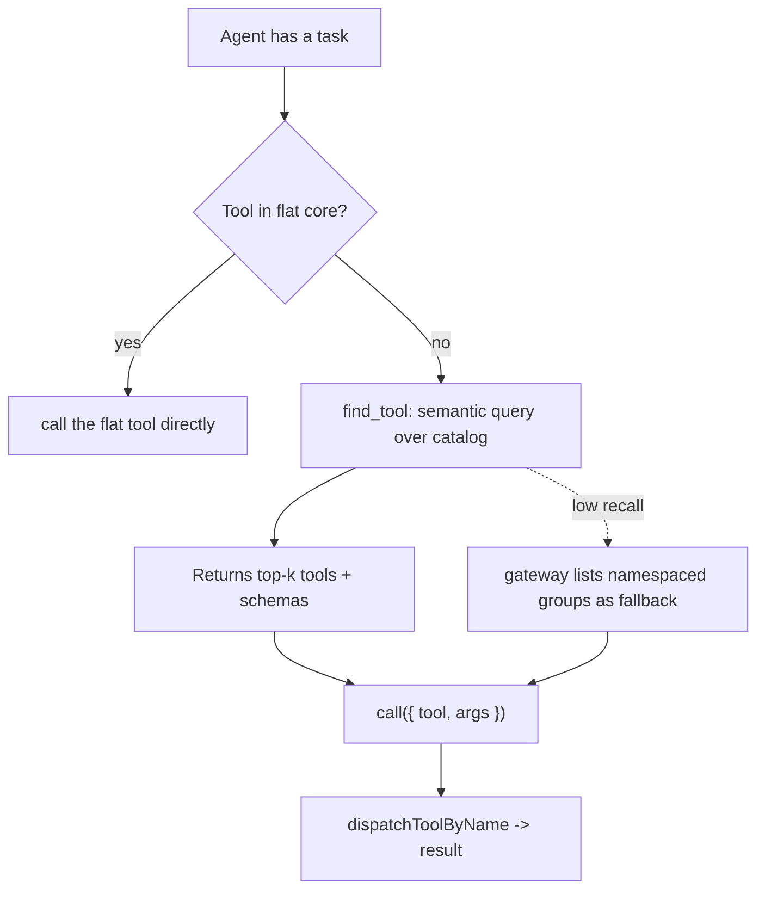

<!--
cx_doc_id and body_hash are stamped by construct on commit; omitted in this draft.
-->
# ADR-0048: Semantic tool discovery — intent-driven `find_tool` over a static gateway catalog

> **Current surface (Construct 2.0):** `find_tool` remains in the flat MCP core. The ADR-0039 promotion list that included `workflow_invoke` is historical — `workflow_invoke` is retired; Procedure planning is `procedure_invoke` (long-tail via `call`). Decider stamp `cx-architect` is historical. Body below is the original decision record.

- **Date**: 2026-06-27
- **Status**: accepted
- **Deciders**: Construct maintainers (cx-architect)
- **Supersedes**: none
- **Extends**: ADR-0039 tier (a) — the agent/MCP surface

<!-- Owning Worker Profile: architect (historical stamp: cx-architect). Steward bead construct-7d4vl. -->

## Problem

Construct's MCP server exposes 73 tools. To stay inside small context windows, `ListTools` advertises a curated flat core plus the `call` gateway, and the gateway's description enumerates the full long-tail catalog (~58 names with one-line summaries). Two rigidities follow, and they are the source of the agent-usability failures this surface keeps producing.

First, which tools are "core" is a static, hand-maintained decision. The 2026-06-27 promotion (ADR-0039 amendment) added six action tools by hand after watching agents fail flagship tasks — a manual judgement that does not scale, does not adapt to the task at hand, and re-litigates itself every time a new high-value tool lands. Second, the gateway pays a fixed token cost every session by dumping the catalog into one description, and the agent must scan a flat list to act. That is "progressive search" without the search.

The external evidence is consistent. Anthropic's *Writing tools for agents* warns that "more tools don't always lead to better outcomes," that overlapping tools distract agents, and recommends namespacing plus consolidation rather than breadth (`https://www.anthropic.com/engineering/writing-tools-for-agents`, accessed 2026-06-27). Anthropic's *Code execution with MCP* identifies upfront tool-definition loading as the core token problem and proposes on-demand discovery — a `search_tools` tool or code-as-API — citing a 150k→2k token reduction (`https://www.anthropic.com/engineering/code-execution-with-mcp`, accessed 2026-06-27). Speakeasy's dynamic-toolset benchmark measures static surfaces at 43k–405k initial tokens (exceeding a 200k window at 200–400 tools) versus semantic search at ~1.3k flat across 40–400 tools (`https://www.speakeasy.com/blog/100x-token-reduction-dynamic-toolsets`, accessed 2026-06-27). The Claude Code harness itself defers most tools and loads schemas through a semantic search rather than a static list — the same lever, proven in Anthropic's own agent runtime.

## Decision

Add a semantic `find_tool(query)` discovery tool and stop enumerating the full catalog in the `call` gateway.

- `find_tool(query, limit?)` returns the top-k tools whose name and description best match a natural-language query, each with its full input schema, reusing the embedding index that already powers `search_skills` — no new infrastructure.
- The always-flat core shrinks toward the genuinely universal entry points (`orchestration_policy`, `get_skill`, `find_tool`, `call`). High-frequency action tools may remain flat where evidence justifies it, but flat membership stops being the primary discovery mechanism.
- `call({ tool, args })` remains the executor, and the tolerant recovery layer (`lib/mcp/tool-recovery.mjs`) stays. The gateway description lists namespaced tool *groups* (`workflow_*`, `publish_*`, `document_*`, `artifact_*`) instead of every tool, preserving coarse visibility at near-zero cost.
- Tool-count consolidation (for example the `workflow_*` family) follows Anthropic's "build fewer tools" guidance and is tracked separately, not gated on this ADR.

## Rejected alternatives

- **Keep the static curated core + catalog-dump gateway.** Rejected: it is the rigidity this ADR addresses; hand-curation does not scale and the catalog cost is paid every session regardless of task.
- **Grow the flat core further.** Rejected: trades one fixed cost for a larger one, and Anthropic's evidence is that more advertised tools reduce selection accuracy.
- **Code-execution / filesystem tool loading.** Rejected for now: it depends on a host-provided code sandbox Construct cannot guarantee across opencode, Codex, and other hosts.
- **MCP `notifications/tools/list_changed` dynamic toolsets keyed to the task.** Deferred: host support is uneven; it can layer on top of `find_tool` once target hosts implement it reliably.
- **Progressive (hierarchical path) search instead of semantic.** Rejected as the primary mechanism: it costs extra round-trips; semantic retrieval captures intent in one call. Its one advantage — complete visibility — is preserved cheaply by the `call` tool-name `enum`, which keeps every valid name listed at ≈1 token each.

## Consequences

Positive: initial token cost is flat regardless of tool count; discovery becomes intent-driven rather than a maintained list, so the brittle "which tool is core" judgement largely dissolves; the change is host-agnostic and reuses the existing embedding/ranking layer with no new infrastructure and no persistent index; the surface can grow to hundreds of tools without breaching small windows.

Negative and risks:

- Semantic retrieval has less complete coverage than a full enumeration, so a poorly phrased query can miss a relevant tool. The fallback is the `call` tool-name `enum`, which keeps every valid name visible (≈1 token each) — there is no separate "list group" tool; the enum is the complete-visibility layer.
- "Stop enumerating" applies to the verbose per-tool **descriptions** the `call` description dumped (~3–4k chars), not the cheap name `enum`, which stays for host-side validation and complete visibility — a deliberate trade-off. Dropping the enum entirely is a possible follow-up once `find_tool` adoption is proven.
- The embedding model is loaded lazily on the first `find_tool` call and degrades to BM25-only when it is unavailable, so no runtime model is strictly required. `search_skills` is lexical (`rg`/`grep`) and shares none of this — the ADR's original "reuse the search_skills index" framing was wrong (see the implementation note).
- A capable model may skip `find_tool` and call a tool by a guessed name; the `enum` constrains names to the real catalog, and tolerant dispatch plus `recordToolNameMiss` (`lib/mcp/tool-recovery.mjs`) recover or record anything outside it.
- This ADR is high-risk for agent behaviour change and therefore requires cx-devil-advocate and cx-reviewer sign-off before acceptance, per the ADR release gate.

## Reversibility

High. `find_tool` is purely additive; `call` and the full dispatch table are unchanged, so every tool stays invokable exactly as today. Reverting means deleting `find_tool` and restoring the full catalog in the gateway description — a single-file change with no data migration and no host-contract break, since `find_tool` is just another tool a host either lists or does not.

## Implementation note (2026-06-27)

Two corrections to the Decision as built, from grounding it in the code:

- **Reuse target.** `search_skills` is `rg`/`grep` (lexical), not semantic, and no prebuilt tool embedding index exists. `find_tool` instead reuses the ranking layer in `lib/storage/embeddings.mjs` (`rankByBm25`, `cosineSimilarity`) and the embedding engine in `lib/storage/embeddings-engine.mjs` (`embedText`, `embedBatch`, default offline Xenova ONNX 384d), merging cosine over normalized BM25 — the pattern proven in `lib/entity-store.mjs` and `lib/session-store.mjs`. The engine degrades to hashing when the model is unavailable; `find_tool` detects the `degraded` flag and falls back to BM25-only so it stays useful offline. The corpus is the 73 tool name+description strings, ranked in-memory per call (no persistent index).
- **Gateway and core.** The `call` description stops enumerating the catalog (now a namespaced-group list plus a `find_tool` pointer, ~588 chars vs ~3–4k) but **keeps the name `enum`** — ≈1 token per name, which preserves complete-visibility and host-side validation. The high-value action tools promoted in the ADR-0039 amendment **stay flat** (proven high-frequency); `find_tool` is added to the core as the discovery entry point. Implemented in `lib/mcp/tools/find-tool.mjs`.

Status moved to **accepted** after cx-devil-advocate (FMEA) and cx-reviewer passes; all findings addressed (the agent log records both verdicts).

## Amendment (2026-06-30) — `orchestration_run` joins the flat core

`orchestration_run` is promoted into `CORE_TOOL_NAMES`, invoking the carve-out above ("high-frequency action tools may remain flat where evidence justifies it"). The evidence: the orchestrator's contract is one atomic two-step — `orchestration_policy` (classify) then `orchestration_run` (dispatch the routed chain) — and the orchestrator persona prompt names both directly on every non-trivial request. Leaving only the first half flat was an oversight: `orchestration_run` was reachable on no host except through the `call` gateway, so the prompt's "call `orchestration_run`" named a tool no host advertised, and the orchestrator silently failed to dispatch (it refused user requests rather than routing them). Promoting it makes the existing prompt literally valid on Claude, OpenCode, and Codex at once. This is the bounded exception the carve-out anticipates — the natural pair of an already-core universal entry point — not a reversal of "do not grow the flat core"; net flat surface is 17 names + the `call` gateway, still well under the small-window token budget (`tests/functional/opencode-tool-gateway.functional.test.mjs`).
