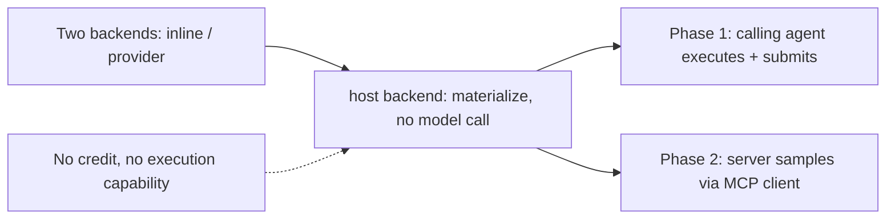

<!--
cx_doc_id and body_hash are stamped by construct on commit; omitted in this draft.
-->
# ADR-0063: Execution seats — host-subscription execution (pickup + sampling)

- **Date**: 2026-07-05
- **Status**: accepted
- **Deciders**: Gerald Dagher (owner)
- **Supersedes**: none
- **Relates to**: ADR-0021 (worker-backend extension shape this decision follows), ADR-0042 (subscription-execution precedent this decision extends with a third backend)

<!-- Owning specialist: cx-architect. -->

## Problem

The orchestration runtime offers exactly two worker backends: `inline` (no execution — a specialist task is prepared, never run) and `provider` (execution against a configured API key, billed per call). Neither backend can spend a subscription a caller is already paying for and already running inside. A host session on a Claude Max or GitHub Copilot subscription — a fully capable model, mid-conversation, with no additional cost to run one more specialist turn — has no way to lend that capacity to Construct's orchestration engine. The only paths to real specialist execution either cost nothing but never execute (`inline`) or execute but require a second, separate credential and a second bill (`provider`). A user who hits "Anthropic credit balance too low" while running inside a fully capable, already-paid-for Claude Code session is being told to pay twice for the same model access — the runtime has no seat for the execution capability that is, in that moment, sitting right there.

## Context

The architecture already anticipated a third seat without building one: the runtime's own semantics string describes a prepared task as "ready for a worker backend **or host** to execute" — aspirational language with no mechanism behind it until now. ADR-0050's web-capability model already has a `host-delegated` grant mode for the same reason (some capability belongs to the host, not to Construct's own network calls). ADR-0042 established that a subscription-authenticated model family (`github-copilot`, device-flow auth) can serve as a worker backend's execution target — proof that "the credential is a subscription, not an API key" is not a new shape for this runtime, just not yet extended to the calling host's *own* session. ADR-0021 sanctions new worker backends as the extension mechanism for this kind of gap (never bending `inline`'s prepare-only boundary to add execution by stealth). Separately, Anthropic's terms restrict third-party harnesses from spending Pro/Max subscription quota through the API directly — a policy boundary a `provider`-shaped backend could never satisfy for a subscription session, no matter how it authenticated.

## Decision

Add a third worker backend, `host`, in two phases that share one materialization and one recording path.

**Materialization.** `lib/orchestration/worker.mjs` exports `materializeTaskPrompt`, hoisting the persona/user-turn/provenance resolution the `provider` backend already performed inline — the same function both backends call, so a `host`-backend task and a `provider`-backend task resolve byte-identical prompts for the same task. The `host` backend never calls a model itself: it materializes the prompt onto `task.hostPrompt` and provenance fields, marks the task `awaiting-host`, and — once every task in the run reaches that state — the run itself stands at `status: 'awaiting-host'`, a real, non-terminal, honestly-rendered status (never collapsed into `completed`, `completed-prepare-only`, or `degraded`).

**Phase 1 (pickup).** The calling MCP host executes each materialized prompt in its own model session and reports the result back through a new self-registered tool, `orchestration_task_result`. `submitHostTaskResult` (`lib/orchestration/runtime.mjs`) validates the target task is `awaiting-host` and the run is not already terminal, records the result tagged `provenanceSource: 'host-reported'` and `executor: 'host:<hostRole>'`, and — when every task is terminal — finalizes the run through the exact same terminal-status computation (`finalizeRun`) the synchronous `executeRun` path already uses, so `completed` vs. `completed-with-failures` is decided once, not twice.

**Phase 2 (sampling).** When the connected MCP client declared the `sampling` capability at initialize time, construct-mcp drives the same `awaiting-host` loop itself via `server.createMessage` (`lib/orchestration/host-sampling.mjs`), recording each result through the identical `submitHostTaskResult` path — sampling only changes *who* executes each prompt (the client's model, invoked by the server) never how the result is recorded. `orchestration.hostExecution` (`auto` default / `pickup` / `sampling`) selects the loop; `auto` prefers sampling when the client capability is present, falling back to pickup otherwise.

**The MCP default flips.** `orchestration_run`, reached only via MCP, defaults `worker_backend` to `host` when neither the tool argument nor `construct.config.json`'s `orchestration.workerBackend` is set — the zero-config MCP path now executes real specialist reasoning at zero API cost instead of silently staying prepare-only. The CLI's own default is untouched (`inline`): a bare CLI invocation has no attached host session to execute a `host`-backend run against, so `construct orchestrate run --worker-backend=host` fails loud with remediation rather than producing a run stranded at `awaiting-host` forever.

**Abandonment is visible, not silent.** A run left `awaiting-host` past a configurable staleness window (default 30 minutes, `CONSTRUCT_AWAITING_HOST_STALE_MS`) is flagged by the `orchestration-runs` doctor watcher as an advisory finding, never a hard failure.

## Rationale

A third backend, not a mode bent onto one of the existing two, keeps ADR-0020's `inline` prepare-only boundary and ADR-0021's `provider` execution boundary both intact — each backend still means exactly one thing, and a reader never has to disambiguate "executed" from "prepared" by any signal other than the backend name and the resulting task/run status. Sharing `materializeTaskPrompt` between `provider` and `host` is not an implementation convenience: it is the load-bearing proof that a host-executed task ran under the identical specialist prompt a provider-executed task would have — the artifact a host receives is provably the same artifact Construct would have sent to a paid API. Sharing `finalizeRun` between the synchronous (`executeRun`) and asynchronous (`submitHostTaskResult`) completion paths is the same discipline applied to the terminal-status taxonomy: one honest computation, reused, not two computations that could quietly diverge. Policy-cleanliness is a first-order reason for the pickup design specifically: the host executes the materialized prompt as its own subagent turn, in its own session, under its own subscription terms — identical in kind to Claude Code running any other subagent, and nothing like a third-party harness spending API-metered quota against a subscription credential.

## Rejected alternatives

- **Bend the `inline` backend to optionally execute.** Rejected: it would erase the one signal (`inline` = never executes) every existing prepare-only test and every reader of `run.workerBackend` depends on. A new backend name is strictly cheaper than an ambiguous existing one.
- **Route host execution through the `provider` backend with a synthetic "host" provider id.** Rejected: `provider` already means "Construct called an API with a credential it resolved" — collapsing "the host executed this in its own session" into that shape would make a self-reported, unverified host result indistinguishable from a provider call Construct can vouch for. The distinct `provenanceSource: 'host-reported'` marker only works because the backend itself is distinct.
- **Make `orchestration_run` block until the host finishes, rather than returning `awaiting-host` and a follow-up tool.** Rejected: MCP tool calls have no mechanism for the server to pause mid-response waiting on the calling agent's own reasoning turn — the agent that would execute the prompt is the same agent waiting on the tool call. A standing state plus a follow-up submission tool is the only shape that fits the protocol.
- **Skip Phase 2 (sampling) as premature.** Rejected: the installed SDK (`@modelcontextprotocol/sdk@1.29.0`) already exposes `Server#createMessage` and `Server#getClientCapabilities`, verified directly against `node_modules/@modelcontextprotocol/sdk/dist/esm/server/index.js` — the mechanism exists today, and a client that declares sampling (VS Code is the expected surface; Claude Code's own support is unconfirmed) gets a run that completes in one call instead of a manual round-trip.
- **Require Postgres row-locking for concurrent task-result submissions before shipping.** Deferred, not rejected: `submitHostTaskResult` uses the same read-modify-write `store.saveRun` single-writer posture `executeRun` already has. Team-mode concurrent submitters racing the same run is a real gap this ADR does not close — it is an explicit follow-up, not a silently-assumed non-issue.

## Consequences

A user on a Claude Max, ChatGPT Plus, or GitHub Copilot subscription reaches real multi-specialist execution through the MCP surface with zero additional API spend, closing the exact failure this ADR was written from ("Anthropic credit balance too low" inside an already-paid-for session). `awaiting-host` becomes a new, permanent entry in the run-status taxonomy every future terminal-status reader (`shapeRun`, `hostAdapterMetadata`, doctor, CLI text output) must treat as non-terminal. A run can now be abandoned mid-flight (the host disconnects before submitting every result) — visible via the doctor watcher rather than invisible, but genuinely possible in a way `inline`/`provider` runs, which never straddle two separate tool calls, are not. Team-mode concurrent-writer safety for `submitHostTaskResult` remains an open follow-up.

## Reversibility

Two-way door. The `host` backend is additive: removing it leaves `inline` and `provider` exactly as ADR-0021 left them, and the MCP default reverting to `inline` is a one-line change in `orchestration_run`'s backend resolution. Phase 2 (sampling) is additive on top of Phase 1 (pickup) — disabling `orchestration.hostExecution=sampling` (or a client that never declares the capability) always falls back to the pickup loop, so Phase 2 can be pulled without touching Phase 1's contract.

## References

- `lib/orchestration/worker.mjs` (`materializeTaskPrompt`), `lib/orchestration/runtime.mjs` (`prepareTaskForHost`, `submitHostTaskResult`, `finalizeRun`), `lib/orchestration/host-sampling.mjs`
- `lib/mcp/tools/orchestration-task-result.tool.mjs`, `lib/mcp/tools/orchestration-run.mjs` (`resolveMcpDefaultBackend`, `shapeRun`)
- `lib/doctor/watchers/orchestration-runs.mjs`, `lib/orchestration/readiness.mjs`
- `tests/orchestration-worker.test.mjs`, `tests/orchestration-runtime.test.mjs`, `tests/functional/host-execution-pickup.functional.test.mjs`, `tests/functional/host-execution-sampling.functional.test.mjs`, `tests/functional/honest-terminal-states.functional.test.mjs`
- ADR-0020 (local orchestration runtime; prepare-only inline boundary), ADR-0021 (provider worker backend as the extension shape), ADR-0042 (LLM credential resolution; subscription-authenticated model family precedent), ADR-0050 (host-delegated web capability grant mode)
