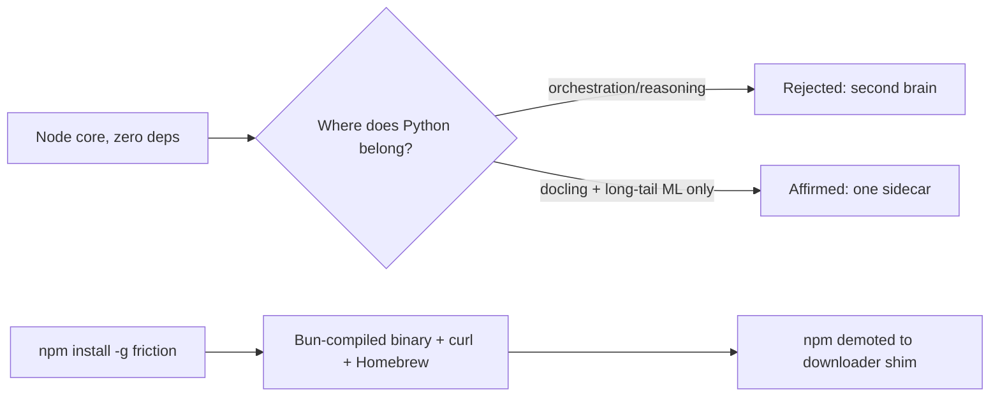

<!--
cx_doc_id and body_hash are stamped by construct on commit; omitted in this draft.
-->
# ADR-0064: Language & runtime strategy — Node core, Bun-compiled distribution, Python confined to one sidecar

- **Date**: 2026-07-05
- **Status**: accepted
- **Deciders**: Gerald Dagher (owner)
- **Supersedes**: the implicit npm-only distribution model (no ADR previously recorded it)
- **Relates to**: ADR-0001 (zero-npm-dependency core, extended here to the distribution question), ADR-0059 (dependency-intent rubric, extended by the sidecar contract), ADR-0036 (docling sidecar, formalized here as the sole Python limb)

<!-- Owning specialist: cx-architect. -->

## Problem

An installed local agent control plane has to answer two questions that pull in opposite directions: what language should the reasoning-and-orchestration core be written in, and how does a piece of software like this reach a machine without asking the person running it to already have a working developer toolchain. Python's agent-framework ecosystem is large and it is tempting to fold orchestration logic into it; Node's own distribution story — `npm install -g` — is the single most common first-run failure for CLI tools with no permissions story of their own (global installs land in root-owned directories, PATH is wrong, the system Node is too old). Neither pressure resolves on its own: adopting Python for orchestration would require running a second, heavier language runtime for logic that Node already expresses, and staying on Node without fixing distribution keeps a maintainability win in the runtime while leaving the two most common install failures — permission errors and version mismatches — unaddressed for exactly the non-developer audience this product needs to reach.

## Context

The zero-npm-dependency Node core (ADR-0001) is a solo-maintainer asset: no dependency-confusion surface, no lockfile drift, no supply-chain audit burden scaling with a framework's transitive tree. A Python core large enough to replace it would drag in a torch-class dependency tree the moment document extraction (`docling`) or any long-tail ML capability is touched — the opposite of what ADR-0001 bought.

Distribution has moved past the point where npm is the default answer for this category. Every peer product occupying the same niche — an installed, local, agent-driven control plane — ships as a compiled binary, not an npm package: Claude Code compiles to a Bun executable and deprecated its own npm channel in January 2026 (code.claude.com/docs/en/setup); OpenCode builds with `bun --compile` across twelve platform targets (deepwiki.com/sst/opencode/10.1-build-system-and-monorepo); Codex CLI was rewritten from Node to Rust specifically to ship as a native binary, with npm demoted to an install shim (infoq.com/news/2025/06/codex-cli-rust-native-rewrite/). None of them is Python. Anthropic acquired Bun in late 2025 explicitly because Claude Code's distribution depends on it (anthropic.com/news/anthropic-acquires-bun-as-claude-code-reaches-usd1b-milestone) — evidence that a model provider with every incentive to control its own CLI's runtime chose Bun-compiled-binary over any interpreted-language package manager, npm included.

The protocol surface points the same direction: the MCP TypeScript SDK is the reference implementation leading the 2026-07-28 stateless/MRTR spec revision (blog.modelcontextprotocol.io/posts/sdk-betas-2026-07-28/), and Construct's primary host targets (OpenCode, Claude Code) are themselves TS/Bun. A Python core would sit one translation layer further from the protocol its own host ecosystem is defining.

Python's genuine wins for this product are narrow and already served: document extraction (`docling`) and long-tail ML work neither belong in, nor benefit from, a hand-rolled Node reimplementation. ADR-0036 already put `docling` behind a subprocess sidecar rather than in-process; `uv` already provisions that sidecar's venv (`lib/embed/config.mjs`). The open question this ADR closes is whether that pattern stays a single quarantined limb or becomes precedent for pulling more logic into Python — and whether distribution keeps riding npm or moves to a compiled binary.

## Decision

The core stays Node, ES modules, zero npm runtime dependencies (ADR-0001 affirmed, not reopened). Python is confined to a single `uv`-managed, version-pinned sidecar process speaking a narrow JSON-RPC contract to the core — the existing `docling` extraction sidecar formalized as the pattern's only instance, doctor-checked, lazily provisioned on first use, degraded-not-failed when absent. No orchestration, reasoning, or control-flow logic runs in Python; a second sidecar is justified only if a future capability has the same shape as `docling` — a heavy, ML-class dependency tree with no acceptable pure-JS equivalent — and none currently qualifies.

Distribution moves to a Bun-compiled single binary (`bun build --compile`) for macOS arm64/x64 and Linux x64/arm64, installed via a curl script and a Homebrew formula; the existing npm package is demoted to a thin downloader shim rather than removed. Node's Single Executable Application feature (`--build-sea`, Node 25.5) is the recorded fallback if Bun's native-module compatibility fails for either of the core's two native surfaces — LanceDB's N-API bindings or the MCP SDK.

## Rationale

The distribution failure this closes is concrete and specific to this product's stated non-developer goal: `npm install -g` fails on EACCES permission errors, PATH misconfiguration, and Node-version mismatches often enough that Anthropic — the one actor with maximum incentive to keep its own CLI on the ecosystem's default package manager — deprecated its own npm channel over it. A compiled binary behind a curl script removes all three failure classes at once because there is no npm, no global install directory, and no Node-version dependency to mismatch. Keeping npm as a shim rather than deleting it costs nothing (it becomes a thin downloader) and preserves the one install path some users already have muscle memory for.

Confining Python to one sidecar rather than adopting it for orchestration preserves the actual asset ADR-0001 secured — a dependency tree a solo maintainer can audit end to end — while still capturing Python's real advantage (a mature extraction/ML ecosystem) for the one capability that needs it. The alternative, letting `docling`'s presence be read as license for more Python, would trade a bounded, audited core for the same unbounded-dependency risk ADR-0001 exists to prevent, in exchange for no capability Node doesn't already have for orchestration logic.

## Rejected alternatives

- **Move orchestration/reasoning logic to Python to align with the broader agent-framework ecosystem.** Rejected: none of the peer products in this exact category (installed local agent control plane) made this choice — they moved away from interpreted-language distribution complexity, not toward it. Python's ecosystem advantage is real for ML workloads, not for control-flow and orchestration code Node already expresses without a dependency-tree cost.
- **Keep npm as the sole distribution channel and try to fix EACCES/PATH friction with better documentation or a preflight script.** Rejected: the failure mode is structural to global npm installs, not a documentation gap — the actor most equipped to fix it with docs and tooling (Anthropic, for its own CLI) chose to leave the channel instead.
- **Adopt Rust for the core, matching Codex CLI's path.** Rejected: a full rewrite abandons the existing Node investment for a distribution-only win the Bun-compile path already achieves without a language migration; nothing in the evidence base suggests Rust solves a problem Bun-compiled Node/TS does not.
- **Add a second Python sidecar preemptively for anticipated future ML capabilities.** Rejected: no current capability meets the bar (heavy ML dependency tree, no pure-JS equivalent) that justified the `docling` sidecar; adding one without a concrete need reopens the unbounded-dependency risk this decision closes.

## Consequences

The core's dependency-audit surface stays bounded to one Python limb with a narrow, doctor-checked contract, instead of growing with every future capability that happens to have a Python library. Distribution work is now real, scoped engineering: `bun build --compile` targets for four platform/arch combinations, a curl installer, a Homebrew formula, and CI-produced checksummed binaries (tracked as construct-rf26.19) — none of which existed before this decision. The MCP SDK and LanceDB's N-API bindings become load-bearing compatibility surfaces under Bun; if either breaks, the fallback is Node SEA, not a rewrite, but that fallback path itself needs to be exercised at least once before it can be trusted. npm users are not stranded — the shim keeps `npm install -g` working — but it is no longer the primary documented path.

## Reversibility

Two-way door on distribution: the npm shim keeps the old install path alive, and reverting to "npm is primary" is a docs and messaging change, not a code change. One-way-leaning on the sidecar boundary: once orchestration code is written against Node's own primitives (as it already is), moving any of it into Python later would mean rewriting it, not just re-enabling a flag — the cost of reversal grows with every module built on the Node-only assumption this ADR affirms.

## References

- `lib/embed/config.mjs` (existing `uv`-provisioned docling sidecar), ADR-0036 (docling sidecar architecture), ADR-0059 (dependency-intent rubric)
- code.claude.com/docs/en/setup (Claude Code Bun-compiled distribution, npm channel deprecated)
- deepwiki.com/sst/opencode/10.1-build-system-and-monorepo (OpenCode `bun --compile`, 12 targets)
- infoq.com/news/2025/06/codex-cli-rust-native-rewrite/ (Codex CLI Node→Rust rewrite, npm as shim)
- anthropic.com/news/anthropic-acquires-bun-as-claude-code-reaches-usd1b-milestone (Bun acquisition rationale)
- blog.modelcontextprotocol.io/posts/sdk-betas-2026-07-28/ (MCP TS SDK leading the stateless/MRTR spec revision)
- ADR-0001 (zero npm dependencies in core)
