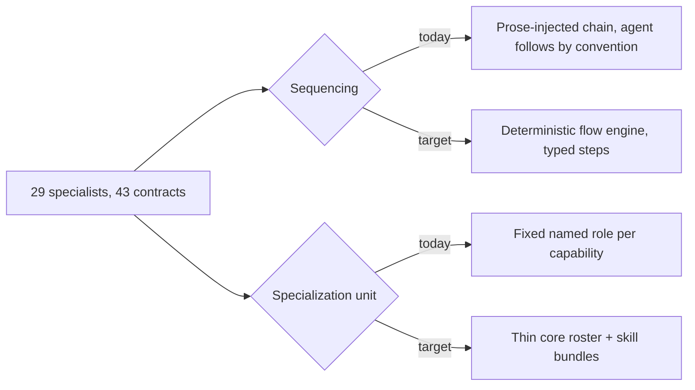

<!--
cx_doc_id and body_hash are stamped by construct on commit; omitted in this draft.
-->
# ADR-0065: Orchestrator-worker consolidation — from a fixed persona org to a thin core roster

> **Current surface (Construct 2.0):** The thin roster landed as **12 Worker Profiles** under `registry/worker-profiles/` (`construct worker-profile list`). Skill overlays live in `skills/perspectives/`. Invocation/planning uses **Procedures** (`registry/procedures/`, `construct procedure invoke`, MCP `procedure_invoke`) and the flow engine (`lib/flows/`). Paths `specialists/org/**`, `cx-*` ids, and CLI `construct specialist create` / `construct team create` are **retired** (unknown-command → `worker-profile`). Body below is the original decision record — "current shape" language in Context is as-of 2026-07-05. See `docs/obsolete/legacy-surface-register.md` and [appendix-0065](./appendix-0065-roster-mapping.md).

- **Date**: 2026-07-05
- **Status**: accepted
- **Deciders**: Gerald Dagher (owner)
- **Supersedes**: none
- **Relates to**: ADR-0015 (hybrid markdown + enforcement — its core soft/hard split is affirmed and not reopened here; only the org-shape portions it audits, the 29-persona/43-contract org chart, are superseded by this decision), ADR-0043 (oracle meta-controller), ADR-0063 (host-subscription execution, one flow-step execution backend)

<!-- Owning Worker Profile: architect (historical stamp: cx-architect). Steward bead construct-7d4vl. -->

## Problem

A multi-agent system that models its specialization as a fixed cast of named roles faces a structural tension: every new capability either forces a new named role into an already-large org, or gets awkwardly folded into a role whose name no longer describes what it does. The org grows, but the actual coordination problem — deciding which perspective sees a given piece of work next, and in what order — is left to whichever agent happens to be reasoning at dispatch time, guided by prose instructions rather than a mechanism that guarantees the sequence it describes. As the corpus of roles and their handoff agreements grows, the coordination logic becomes harder to verify (does this handoff actually run, or does it just say it should?) at the same rate the org becomes harder to navigate (which of these many similarly-scoped roles is the right one for this task?).

## Context

Construct's current shape is 29 specialist definitions (`specialists/org/specialists/`) connected by 43 handoff contracts (`specialists/org/contracts/`), with the sequencing logic — which contract chain applies to a given piece of work — resolved by `lib/orchestration-policy.mjs` (1,131 lines) and injected into an agent's context as prose for the agent itself to follow. Nothing in that path guarantees the sequence executes as written; a contract's postconditions are themselves mostly prose (`specialists/org/contracts/*.json`: of 20 files carrying a `postconditions` block, only 11 use the mechanically-checkable `"check"` shape, the rest are advisory text) — a gap ADR-0015 already named as its highest-priority follow-up.

The published evidence on this exact tension has converged since ADR-0015 was written. Anthropic's own account of building a production multi-agent system (anthropic.com/engineering/multi-agent-research-system) states multi-agent decomposition wins only for breadth-first, parallelizable, read-heavy work, costs roughly 15× the tokens of a single agent, and that "most coding tasks involve fewer truly parallelizable tasks than research" — a direct statement that a fixed-role crew is the wrong default shape for most of what Construct's roster does today. Cognition's "Don't Build Multi-Agents" (cognition.ai/blog/dont-build-multi-agents) documents the specific failure this produces: parallel agents making independent decisions on shared context produce conflicting work, and a single-threaded agent with full context is the safer default. The Berkeley MAST taxonomy (arXiv:2503.13657) catalogs 14 recurring failure modes in multi-agent systems, several of which — inter-agent misalignment, incomplete verification, premature termination of a handoff — describe exactly the shape of risk a fixed, prose-sequenced org chart is prone to. CrewAI, the framework whose role/goal/backstory persona model Construct's own specialist definitions most resemble, has itself moved its recommended production architecture to deterministic Flows that invoke small crews only where parallelism is warranted, with an official crew-to-flow migration path (docs.crewai.com/en/quickstart, 1.14.5 release notes) — the same organization that popularized the fixed-crew pattern no longer recommends it as the default.

None of this indicts what ADR-0015 actually affirmed: the hybrid split between human-authored markdown guidance and code-enforced hard gates, executable contracts, evidence-required completion, and deterministic intent classification are Construct's stated differentiator (STRATEGY.md Bet 1 — "the product is the loop, not the agents") and are not in question here. What the evidence argues against is specifically the *shape* of specialization — a large, fixed cast of named roles with prose-sequenced handoffs between them — not the enforcement discipline wrapped around it.

## Decision

Replace the fixed 29-role org with an orchestrator plus a small core roster (target 8–12 thin roles, mapped in construct-rf26.11's appendix to this ADR). Skills (`skills/**`) become the unit of specialization: a role's actual expertise on a given task comes from the skill bundle it loads, not from a uniquely-named persona per capability. Sequencing moves from prose injected into an agent's context to a deterministic flow engine (ADR-0067) with typed state, explicit steps, and checkpoint/resume — replacing `lib/orchestration-policy.mjs`'s contract-chain resolution. Parallel fan-out is permitted only for read-only, breadth-first work (research, search) — the one regime the evidence actually supports — and always requires a synthesis step. Handoff contracts become delegation specs attached to flow steps (objective, output shape, boundaries), with mechanically-checkable postconditions converted to executable checks in `lib/contracts/validate.mjs` and the remainder explicitly marked advisory or removed, closing ADR-0015's gap #2 as a scheduled deliverable rather than a standing gap. Custom specialists and teams become first-class: a declarative, schema-validated authoring path (`construct specialist create`, `construct team create`) so a smaller built-in roster is offset by easier user-authored specialization, not by less capability overall.

ADR-0015's hybrid soft/hard architecture verdict — markdown for judgment, code for guarantees — is explicitly affirmed and carried forward unchanged; this decision supersedes only the org-chart shape ADR-0015's completeness audit was measuring, not the enforcement model itself. ADR-0043's oracle meta-controller rides on the same flow engine as its dispatch mechanism instead of bespoke sequencing. ADR-0063's host-subscription execution backend becomes one of the flow engine's step-execution backends, unchanged in its own contract.

## Rationale

The evidence base is specific about *when* multi-agent decomposition earns its cost (breadth-first, parallelizable, read-only work) and Construct's actual usage — specialist prompts doing sequential, context-dependent, often-mutating work — is mostly the regime the evidence says a single-threaded default handles better. A thin roster with skill bundles keeps the genuine value of specialization (a role that has loaded the right skill knows things a generic agent doesn't) without paying the coordination cost of 29 named identities whose actual differentiation is often just which skills they happen to load. Moving sequencing from prose-injected context to a typed flow engine converts "the agent is instructed to call these contracts in this order" into "the engine calls them in this order" — the same category of upgrade ADR-0015's own hard-gate layer already made for tool-call safety, applied to orchestration sequencing. Converting checkable prose postconditions to executable checks is not new scope invented here; it is ADR-0015's own highest-priority gap, now scheduled rather than deferred.

## Rejected alternatives

- **Keep the 29-role org and only fix the sequencing (add a flow engine on top, roles unchanged).** Rejected: this would leave the actual driver of the evidence's objection — a large fixed cast whose differentiation is often nominal — in place, while adding engine complexity around it. The roster size itself is the thing the MAST taxonomy and Cognition's writeup identify as the risk surface, not merely how the roles are sequenced.
- **Move to a single generalist agent with no role specialization at all.** Rejected: this discards the genuine benefit ADR-0015 already verified — role fences, skill-scoped expertise, and evidence-required handoffs catch classes of error a single undifferentiated agent has no structural reason to catch. The evidence argues against a *large fixed* cast, not against specialization as a concept.
- **Adopt CrewAI itself (Python, its Flows engine, its persona model) rather than building an in-repo flow engine.** Rejected by ADR-0064: Construct's zero-npm-dependency Node core is a solo-maintainer asset a Python framework dependency would forfeit, and CrewAI's Flows concept (typed state, steps, routers, checkpointing) is adoptable as a pattern without adopting its runtime or language.
- **Increase parallel fan-out rather than reduce role count, on the theory that more agents in parallel compensates for coordination cost.** Rejected: Anthropic's own published finding is the opposite — parallel decomposition costs roughly 15× the tokens and only pays off for the narrow breadth-first regime; applying it more broadly compounds the cost the evidence warns against rather than solving the coordination problem.

## Consequences

Every existing specialist definition, contract, and orchestration-policy code path needs a migration decision (map to a core role, become a skill bundle, or retire) — tracked as construct-rf26.11 and .12, not resolved by this ADR alone. The flow engine becomes a new piece of core infrastructure with its own correctness burden (construct-rf26.6–.9); until it lands, this ADR's sequencing decision is aspirational for existing chains. Custom-specialist authoring becomes a supported, documented capability rather than an internal-only mechanism, raising the bar on schema validation and hot-reload correctness (construct-rf26.13). Contract count is no longer pinned to the old 29-role graph — the delegation-spec model can produce fewer or more specs depending on the roster, which changes what "coverage" means for contract enforcement and requires the w2-contract-enforcement functional test to be rewritten against the new shape, not just re-run.

## Reversibility

One-way-leaning. The 29-specialist/43-contract org chart is not preserved anywhere as a parallel path — per the no-backwards-compat mandate governing this refit, retired specialist prompts are deleted, not archived behind a flag. Reversing this decision after the roster migration lands would mean re-authoring the fixed-role org from the mapping doc (construct-rf26.11's appendix) rather than flipping a switch. The flow engine itself is additive and two-way: it can be built and proven out before any existing contract chain is retired, since `lib/orchestration-policy.mjs` continues to serve the current chains until construct-rf26.9 explicitly ports them over and deletes the prompt-injection path.

## References

- `specialists/org/specialists/` (29 specialist definitions, verified count), `specialists/org/contracts/` (43 contract files, verified count; 11 of 20 postcondition-bearing contracts use the executable `"check"` shape)
- `lib/orchestration-policy.mjs` (1,131 lines, verified), `lib/mcp/server.mjs` (2,027 lines, verified)
- anthropic.com/engineering/multi-agent-research-system (multi-agent cost/benefit regime)
- cognition.ai/blog/dont-build-multi-agents (shared-context single-threaded default)
- arXiv:2503.13657 (MAST — 14 multi-agent failure modes)
- docs.crewai.com/en/quickstart and CrewAI 1.14.5 release notes (Flows-first production guidance, crew→flow migration path)
- ADR-0015 (hybrid architecture, core affirmed; org-shape audit superseded here), ADR-0043 (oracle meta-controller), ADR-0063 (host-subscription execution backend)
- STRATEGY.md Bet 1 ("the product is the loop, not the agents")

## Amendment (2026-07-22) — Construct 2.0 cutover of roster nouns

Steward pass (`construct-7d4vl`). The Decision's org-shape commitment (thin roster + skills as specialization + deterministic sequencing) stands. Operator-facing nouns changed after cutover:

- **Roster unit:** Worker Profiles (`registry/worker-profiles/`, 12 ids) — not `specialists/org/specialists/` or `cx-*` files.
- **Overlays:** `skills/perspectives/` — not `skills/roles/`.
- **Custom authoring CLI:** `construct specialist create` / `construct team create` are retired; do not treat the Decision's "custom specialists and teams become first-class" sentence as a live CLI contract. Workspace Presets + Worker Profile overlays are the supported extension path.
- **Sequencing substrate:** Procedures + `lib/flows/` (ADR-0067) — prose-injected `lib/orchestration-policy.mjs` chain resolution is not the operator runbook.

Historical Decision/Context text above is retained unchanged (Nygard/Fowler: do not rewrite accepted Decision prose into fiction).
