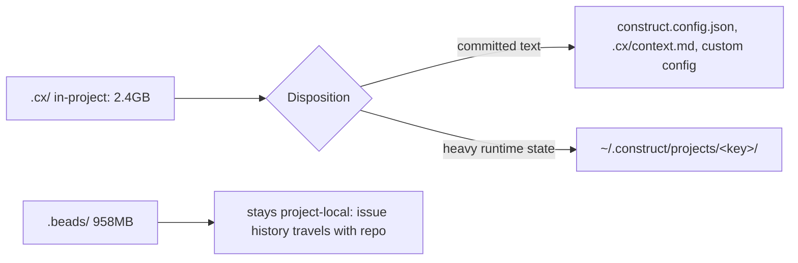

<!--
cx_doc_id and body_hash are stamped by construct on commit; omitted in this draft.
-->
# ADR-0066: Config-layer project footprint — machine-scoped heavy state

- **Date**: 2026-07-05
- **Status**: accepted
- **Deciders**: Gerald Dagher (owner)
- **Supersedes**: none
- **Relates to**: ADR-0027 (host/project footprint contract this decision extends — its non-destructive marker-block discipline and disposition-table mechanism are affirmed and reused; only its in-project heavy-state disposition is superseded here), ADR-0013 (skills on-disk layout), ADR-0036 (docling sidecar, whose venv this decision relocates)

<!-- Owning specialist: cx-architect. -->

## Problem

A tool that embeds itself into a user's repository has to decide what belongs to the project and travels with it in git, versus what belongs to the machine running the tool and should never be committed at all. Get this wrong in one direction and every clone of the repository inherits gigabytes of another machine's runtime state; get it wrong in the other direction and a second project on the same machine re-provisions everything the first project already built, multiplying disk cost with no benefit. The tension sharpens for a tool whose value depends on accumulating history — traces, embeddings, prior observations — because that accumulation is exactly the kind of state that should persist per machine, not fork per clone.

## Context

Construct's current project footprint is measured, not estimated: `.cx/` on a working project directory is 2.4 GB (`.cx/runtime/` 1.1 GB — the per-project docling venv; `.cx/traces/` 824 MB; `.cx/lancedb/` 306 MB; smaller categories below that), and `.beads/`'s Dolt-backed issue database is a further 958 MB. All of it sits inside the project directory today, gitignored (ADR-0027 already established that `.cx/` is machine-specific and never committed) but still tied to that one checkout — a second clone of the same repository, or a second machine working the same project, starts this accumulation over from zero rather than sharing it.

The category of tool this most needs to resemble has already converged on an answer: config-layer standard-setters — `AGENTS.md`, Claude Code's skills/plugins model — leave only committed text in a consumer repository and keep every byte of runtime state elsewhere. ADR-0027 already built the mechanism this decision needs: an explicit per-artifact disposition (`tracked` / `ignored` / `asked-before-modify` recorded in `.construct-manifest`) and a non-destructive marker-block injector for files the user owns. What ADR-0027 did not yet do is apply machine-scoping to the *heavy* categories — it addressed which adapter directories get committed versus gitignored, not where the gitignored state physically lives. `.beads/` is a deliberate exception to this whole question: issue history is meant to travel with the repository, so it stays project-local regardless of size.

## Decision

A project directory keeps committed text only: `construct.config.json`, `.cx/context.md`, user-authored custom specialists/teams/templates, and ADR-0027's marker blocks. Everything else currently under `.cx/` — traces, observations, the LanceDB vector index, task graphs, runtime state, and the per-project docling venv — moves to a machine-scoped root at `~/.construct/projects/<key>/`, keyed by a derivation stable across clones of the same remote (so two checkouts of the same repository on one machine share state; a fresh clone on a new machine starts clean, which is correct — there is no runtime state to inherit from git). The docling venv collapses from one per project to one shared machine-wide venv (construct-rf26.16). `.beads/` is the deliberate exception: it stays project-local because issue history is content that belongs in the repository, not machine state. This is a clean break: `construct init` establishes the new layout directly, and `construct doctor` flags any legacy in-project heavy state it finds for manual deletion — there is no dual-read of both locations and no migration shim, per the refit's no-backwards-compat mandate.

## Rationale

ADR-0027 already proved the right mechanism for the *committed* side of this boundary (explicit disposition, marker-block injection); this decision extends that same discipline to the *heavy* side by adding a second location, not a second mechanism. Machine-scoping is the only way a shared docling venv (construct-rf26.16) or a shared vector-index cache makes sense at all — provisioning either per-project multiplies a genuinely large cost (the venv alone is 1.1 GB) for no benefit, since neither is project-specific content. Keeping `.beads/` project-local despite its own size is not an inconsistency: issue history is exactly the kind of content ADR-0026 (beads git-native sync) already established should travel with the repository, unlike traces or a vector index that describe *how this machine ran the tool*, not what the project is.

## Rejected alternatives

- **Leave everything in `.cx/` and just document the size.** Rejected: a 2.4 GB gitignored directory per checkout means every additional clone or worktree on the same machine re-pays that cost in full — the measured footprint is not a documentation problem, it is a structural one.
- **Move `.beads/` to machine scope alongside the rest of `.cx/`.** Rejected: issue history is the one category here that is genuinely project content, not machine state — ADR-0026 already committed to beads traveling with the repo via git-native sync, and moving it off-repo would break that guarantee for no footprint benefit (`.beads/`'s size is dominated by Dolt's own storage format, not by anything machine-specific).
- **Provide a dual-read migration path (check machine scope, fall back to legacy in-project paths) instead of a clean break.** Rejected: the refit's governing mandate is no backwards-compat shims; a dual-read path is exactly the kind of permanent complexity that mandate exists to prevent, and `construct doctor` flagging legacy state for manual deletion is a one-time, visible cost instead of an indefinite one.
- **Key the machine-scoped root by absolute project path instead of a remote-derived project key.** Rejected: path-keying would not let two clones of the same repository (e.g. a primary checkout and a worktree) share accumulated state, defeating the main reason to machine-scope in the first place.

## Consequences

Every `.cx/` consumer in the codebase needs to resolve state through a new root-resolution function rather than assuming `.cx/` is always project-relative (construct-rf26.15) — a mechanical but wide-reaching change. The shared docling venv (construct-rf26.16) and lazy/TTL-bounded vector index (construct-rf26.17) both become possible only once this root exists, so they are sequenced after it. `construct init`, `doctor`, and `sync` all need their footprint assumptions reworked (construct-rf26.18), including a new "legacy in-project heavy state" detection category for `doctor`. A fresh `construct init` after this lands produces a project tree containing only text files — verifiable directly by listing the tree, not by trusting this description of it.

## Reversibility

Two-way door on the mechanism (a root-resolution function can point back at `.cx/` by changing one default), but one-way in practice once adopted: any project that has run under the machine-scoped layout has its traces, observations, and vector index accumulated at `~/.construct/projects/<key>/`, and reverting would mean either abandoning that history or writing the exact migration shim this decision deliberately declines to build. Revisit only if machine-scoping proves to fragment state undesirably in a specific deployment mode (e.g. ephemeral CI containers with no persistent `$HOME`), which would need its own resolution rather than reverting the whole project.

## References

- Measured footprint (this session, `du -sh`): `.cx/` 2.4 GB (`runtime/` 1.1 GB, `traces/` 824 MB, `lancedb/` 306 MB, `knowledge/` 56 MB), `.beads/` 958 MB
- ADR-0027 (host/project footprint contract — disposition table and marker-block injector, extended here), ADR-0026 (beads git-native sync — why `.beads/` stays project-local), ADR-0013 (skills on-disk layout), ADR-0036 (docling sidecar — venv relocated by construct-rf26.16)
- config-layer precedent: AGENTS.md (agents.md), Claude Code skills/plugins model (committed-text-only host footprint)
