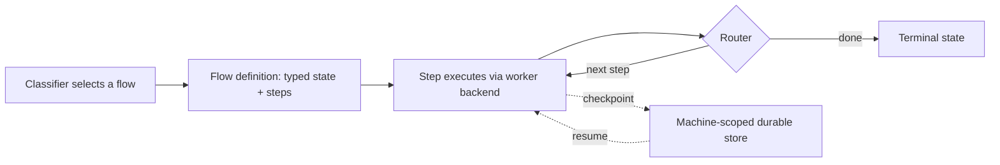

<!--
cx_doc_id and body_hash are stamped by construct on commit; omitted in this draft.
-->
# ADR-0067: Deterministic flow engine — typed-state flows replace prompt-injected sequencing

- **Date**: 2026-07-05
- **Status**: accepted
- **Deciders**: Gerald Dagher (owner)
- **Supersedes**: the contract-chain-resolution role of `lib/orchestration-policy.mjs` (the module's other responsibilities — intent classification, gate evaluation — are unaffected and untouched by this ADR)
- **Relates to**: ADR-0020 (local orchestration runtime — task/run lifecycle this engine sequences), ADR-0021 / ADR-0063 (worker backends — execution targets a flow step delegates to), ADR-0052 (manifest architecture — flow definitions register as manifests), ADR-0053 (living graph — flow definitions render as graph nodes), ADR-0065 (orchestrator-worker consolidation — the roster this engine sequences)

<!-- Owning specialist: cx-architect. -->

## Problem

A system that decides "what happens next" by handing an agent a description of the sequence and trusting it to follow that description has no way to distinguish a sequence that was actually followed from one that was merely read. The sequence exists as prose in the agent's context, not as a structure the runtime itself walks — so nothing can inspect, checkpoint, resume, or bound the cost of a specific step independent of the agent's own judgment about whether to honor what it was told. This becomes a hard limit exactly where it matters most: a long-running, multi-step piece of work that gets interrupted (a process restart, a context compaction, a session boundary) has nowhere to resume from except the beginning, because there was never a durable representation of "which step comes next" separate from the conversation that described it.

## Context

`lib/orchestration-policy.mjs` (1,131 lines) currently performs this sequencing by resolving a contract chain for a classified request and injecting the resolved chain into an agent's context as instructions to follow. The instructions describe a correct sequence; nothing enforces that the sequence executes as described, and nothing survives a restart mid-chain — there is no typed, external representation of "step 3 of 7 is done, step 4 is next" that anything but the agent's own attention holds. ADR-0065 already establishes that sequencing needs to move from prose to a mechanism the runtime itself drives; this ADR specifies that mechanism.

The existing orchestration runtime (ADR-0020) already has half of what a flow needs: a durable, filesystem-backed run/task store with a task lifecycle (`queued → running → prepared`) and pluggable worker backends that execute a prepared task (`inline`, `provider`, `host` — ADR-0021, ADR-0063). What it does not have is a typed definition of *which tasks exist and in what order*, decided by a data structure instead of by the classifier handing an agent a resolved chain to narrate. CrewAI's own migration away from fixed crews toward "Flows" (cited in ADR-0065) is instructive for what such a structure needs, without requiring adoption of CrewAI's runtime or language (foreclosed by ADR-0064): typed state passed between steps, explicit step definitions, conditional routing, and checkpoint/resume — the state-machine parts, not the Python.

Two constraints from prior ADRs bound the design directly. ADR-0001's zero-npm-dependency mandate means the engine is Node built-ins only — no state-machine or workflow library dependency, however small. Anthropic's own published finding (cited in ADR-0065: multi-agent parallelism wins only for breadth-first, read-only work, at roughly 15× token cost) means the engine's parallel fan-out primitive cannot be a general-purpose concurrency mechanism — it needs a shape that structurally prevents the failure mode the evidence warns about, not just documentation advising against it.

## Decision

Add a zero-dependency flow engine (`lib/flows/`) with the following public surface:

- **Flow definition.** A flow is a JSON or JS module declaring: a state schema (validated on every transition), an ordered or graph-shaped set of named steps, and a starting step. Flow definitions register through the unified manifest architecture (ADR-0052) — a flow is one more manifest `kind`, discoverable the same way providers and tools already are.
- **Steps.** Each step declares its inputs (a subset of the typed state), the worker backend it delegates execution to (`inline` / `provider` / `host`, unchanged from ADR-0020/0021/0063 — the flow engine sequences, it does not re-implement execution), an optional per-step effort budget, and a result shape that gets merged back into state.
- **Routers.** A step's completion is followed by a router function — pure, synchronous, given the current typed state — that returns the name of the next step, a set of next steps (for and/or join semantics), or a terminal marker. Routing decisions are deterministic: the same state always produces the same routing decision, with no LLM call inside the engine itself.
- **Fan-out.** A step may declare `fanOut: true` only if every backend it delegates to is read-only (no mutating worker backend permitted on a fan-out step — construct-rf26.8 enforces this at validation time, not by convention) and only if it declares a synthesis step that all fan-out branches join into before the flow proceeds.
- **Checkpoint/resume.** After every step completes, the engine persists the current typed state and the next-step pointer to the machine-scoped project store (ADR-0066's `~/.construct/projects/<key>/`). `construct flow resume <run-id>` reloads the last checkpoint and continues; a step is re-entered idempotently (a step's own logic, not the engine, is responsible for not double-applying a side effect on re-entry, matching the existing single-writer discipline in `submitHostTaskResult`).
- **Effort budgets.** A step's budget field is a tool-call or token ceiling; exhausting it produces a typed, non-silent result (`budget-exhausted`) that a router can branch on, never a silent truncation.
- **Artifact passing.** Steps pass data to each other by filesystem reference (a path into the project's durable store), never by embedding artifact content in the state object itself or in a message payload — keeping typed state small and inspectable regardless of how large an intermediate artifact is.

The classifier (`lib/intake/classify.mjs`, unaffected by this ADR) continues to deterministically select *which* flow applies to a request; what changes is that the selected flow is a typed structure the engine walks, not a chain description handed to an agent. A specialist persona, when it is a flow step's executor, receives only that step's delegation spec (ADR-0065) — never the whole chain — matching the progressive-disclosure discipline ADR-0015 already established for skills.

## Rationale

A typed state object with schema validation on every transition is what makes "step 3 of 7" a fact the runtime can check, rather than a claim only the agent's own narration supports — this is the specific gap prose-injected sequencing cannot close no matter how well-written the prose is. Checkpointing to the machine-scoped store (rather than to the project itself) follows directly from ADR-0066: run state is machine state, not project content. Restricting fan-out to read-only backends with a mandatory synthesis join is not an arbitrary conservatism; it is Anthropic's own published regime for when parallel decomposition earns its cost, encoded as a validation rule instead of left as guidance an agent could deprioritize under pressure. Passing artifacts by filesystem reference keeps the typed state object itself small and diffable regardless of how large a generated document or research corpus gets — a state object that embeds artifact content would defeat the purpose of having a small, inspectable, checkpointable state in the first place.

## Rejected alternatives

- **Adopt an existing workflow-engine library (even a small one) rather than building in-repo.** Rejected: ADR-0001's zero-npm-dependency mandate applies to the core regardless of a library's size; a workflow library is exactly the kind of dependency-surface growth that mandate exists to prevent, for a state machine simple enough to implement directly on Node built-ins.
- **Keep sequencing as agent-followed prose, and add only checkpointing (persist "here's what the agent was told") without a typed engine.** Rejected: persisting the prose does not make the sequence enforceable — a resumed run would still depend on an agent re-reading and correctly re-following a description, which is the exact failure mode this ADR closes, not a partial fix to it.
- **Allow fan-out for any step type and rely on documentation to discourage mutating parallel fan-out.** Rejected: ADR-0065 already establishes that this specific failure (parallel agents making independent decisions against shared/mutating state) is well-documented and recurring; a validation-time restriction is strictly more reliable than guidance, and costs nothing an engine author would otherwise need.
- **Embed artifact content directly in flow state for simplicity.** Rejected: this would re-introduce the same context-bloat failure mode progressive disclosure (ADR-0015) exists to prevent, and would make checkpoints grow unboundedly with artifact size rather than staying a small, fast-to-persist structure.
- **Give routers access to call an LLM to decide the next step, for flexibility.** Rejected: a router that can reason non-deterministically reintroduces the exact problem this ADR closes — the same state no longer guarantees the same routing decision, so resumability and auditability both regress. Judgment calls belong inside a step's own execution (where a specialist persona reasons), not inside the deterministic routing layer between steps.

## Consequences

`lib/orchestration-policy.mjs`'s chain-resolution responsibility is retired once existing chains are ported to flow definitions (construct-rf26.9) — its classification and gate-evaluation responsibilities are untouched and continue to live wherever construct-rf26.10's monolith split lands them. Every existing contract chain needs an explicit port to a flow definition; there is no automatic translation, so this is real, scoped migration work, not a config flip. Flow definitions become a new manifest kind and a new graph node type (ADR-0053), so both the manifest loader and the graph builder need extension. The `awaiting-host` non-terminal status and `submitHostTaskResult` path from ADR-0063 become one concrete instance of a flow step whose worker backend is `host` — that ADR's contract is unchanged, just now reachable through a flow step rather than only through direct `orchestration_run` calls.

## Reversibility

Two-way door at the mechanism level: the flow engine is additive infrastructure that can exist alongside `lib/orchestration-policy.mjs`'s current chain-resolution path until construct-rf26.9 explicitly retires it — nothing forces an all-at-once cutover. One-way once a given contract chain is ported and its prompt-injection equivalent deleted (per the refit's no-backwards-compat mandate): reversing a specific ported flow back to prose-sequencing would mean re-writing the chain-injection code construct-rf26.9 removes, not flipping a flag.

## References

- `lib/orchestration-policy.mjs` (1,131 lines, current chain-resolution implementation), `lib/orchestration/runtime.mjs`, `lib/orchestration/worker.mjs`, `lib/orchestration/host-sampling.mjs` (existing task/run lifecycle and worker backends this engine sequences, unchanged)
- ADR-0020 (local orchestration runtime), ADR-0021 (provider worker backend), ADR-0063 (host-subscription execution — `submitHostTaskResult` single-writer precedent for idempotent step re-entry)
- ADR-0052 (unified manifest architecture — flow definitions register as a manifest kind), ADR-0053 (living graph — flow definitions as graph nodes)
- ADR-0065 (orchestrator-worker consolidation — CrewAI Flows migration precedent, fan-out evidence base), ADR-0066 (config-layer footprint — checkpoint storage location), ADR-0015 (progressive disclosure — delegation-spec-only step context)
- ADR-0001 (zero npm dependencies — engine built on Node built-ins only)
