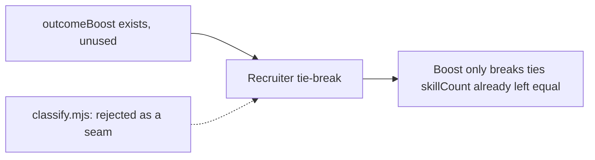

# ADR-0076: Outcome-aware recruitment tie-breaker

- **Date**: 2026-07-11
- **Status**: accepted
- **Deciders**: Gerald Dagher
- **Supersedes**: none

## Problem

The recruiter (`lib/orchestration/recruiter.mjs`) picks which specialist fills a signal-dimension slot by declared-skill count alone: the candidate with the fewest declared skills wins, ties broken alphabetically. Declared skills are a static, author-time signal — they say nothing about whether a candidate has actually performed well recently. Two specialists can tie on skill count while one has been failing its last ten dispatches and the other succeeding every time; the recruiter has no way to prefer the one that is currently working. Every dispatched specialist's outcome is already captured (`lib/outcomes/record.mjs`, per-role JSONL) and rolled up into a 30-day success rate (`lib/outcomes/aggregate.mjs`), but nothing reads it at recruitment time — the signal is collected and thrown away.

## Context

`lib/outcomes/aggregate.mjs` already exposes `outcomeBoost(cwd, role)`, a function returning a value in `[-0.05, 0.05]` derived from a role's rolling 30-day success rate, built specifically as a bounded tie-breaker rather than a primary ranking signal. It was written with the intake classifier in mind, but `lib/intake/classify.mjs`'s header explicitly refuses to consult it: classification must be a pure, deterministic function of file content so the same signal always classifies the same way, and cached success-rate history would break that. The function has sat with zero production callers since. The recruiter is a different kind of decision — repeated, request-scoped participant selection, not one-shot deterministic triage — and does not carry the same purity requirement.

## Decision

`recruit()`'s candidate ranking becomes: declared-skill count ascending, then `outcomeBoost` descending, then specialist id alphabetically — the boost activates only between candidates the specialization signal already ranked equal, and is capped at ±0.05 so it can never promote a broader generalist over a narrower specialist. The behavior is gated by `orchestration.outcomeRouting` (`'on'` default, `'off'` disables it), a `construct.config.json` field rather than an environment variable.

## Rationale

Tie-breaking is the correct scope: skill-count specialization is the primary, author-declared signal and stays authoritative; outcome history only decides between candidates already judged equally specialized, so a losing streak can never make a broad generalist beat a narrow specialist. The recruiter already reads `_summary.json`-shaped data conceptually (it queries the registry, an author-time structure) and adding one more read at the same layer keeps the seam narrow — the classifier stays untouched and its determinism guarantee is undisturbed. Capping at ±0.05 mirrors the value `aggregate.mjs` already committed to for exactly this purpose. Gating through project config rather than an environment variable follows the repo's standing rule that quality/behavior gates are not bypassed by ad hoc `CONSTRUCT_*` flags — a persistent, auditable, git-tracked setting is the right shape for a routing-behavior toggle.

## Rejected alternatives

**Consult `outcomeBoost` in `lib/intake/classify.mjs`.** This was the seam `aggregate.mjs`'s original docstring assumed. Rejected because `classify.mjs`'s header states its determinism contract explicitly: the same file must classify identically on every run, and cached success-rate history would make that untrue across runs as the cache changes — a correctness bug, not a quality trade-off. The recruiter has no such contract; a specialist pick is scoped to one orchestration run and is expected to reflect current state.

**Unbounded score-based ranking (drop skill-count as primary, rank by a blended specialization+outcome score).** Rejected because it inverts the signal hierarchy the recruiter was built on: "most-specialized-wins" is a deliberate design decision (recorded in `recruiter.mjs`'s own header) that a narrow, matching skill set is a stronger claim to the work than a broad one. A blended score lets enough accumulated success push a generalist ahead of a specialist it has no business displacing.

**Environment-variable off-switch (e.g. `CONSTRUCT_OUTCOME_ROUTING=off`).** Rejected on the same basis as every other quality-gate bypass in this repo: an env var is invisible in code review, doesn't survive a fresh shell, and isn't attributable to a decision anyone made on purpose. `orchestration.outcomeRouting` in `construct.config.json` is git-tracked, shows up in diffs, and follows the same pattern as `orchestration.workerBackend` and the other fields already in that block.

## Consequences

Recruitment becomes marginally non-deterministic across time for tied candidates — the same request can recruit a different specialist today than it would have a week ago, as outcome history shifts. This is intentional: it is the entire point of the change. It also means recruitment now has an implicit read dependency on `.construct/outcomes/_summary.json`; a corrupt or missing summary must degrade to the pre-existing alphabetical behavior rather than error, which the implementation guarantees (best-effort read, exceptions swallowed to a zero boost). `lib/hooks/agent-tracker.mjs`'s A3 outcome-capture block gains a summary-refresh step so the boost reflects outcomes from the current session rather than only a stale snapshot from whenever a previous session last aggregated; that refresh debounces per-role to avoid a full rebuild on every single dispatch.

## Reversibility

Two-way door. Setting `orchestration.outcomeRouting: "off"` in `construct.config.json` reverts to the exact prior alphabetical tie-break with no other code path affected — the flag is checked before any boost lookup runs, not layered on top of it. Removing the feature entirely means reverting the sort comparator and the config field; no data migration is needed since `_summary.json` and the underlying outcome JSONL files are unaffected either way.

## References

- `lib/orchestration/recruiter.mjs` — `specialistsMatchingPatterns`, `recruit()`
- `lib/outcomes/aggregate.mjs` — `outcomeBoost`, `aggregateOutcomes`, `readSummary`
- `lib/intake/classify.mjs` — the determinism contract this decision deliberately does not cross
- `lib/hooks/agent-tracker.mjs` — A3 outcome capture + summary-refresh debounce
- `docs/guides/concepts/learning-loops.mdx` — A3 (specialist outcome capture) loop description
