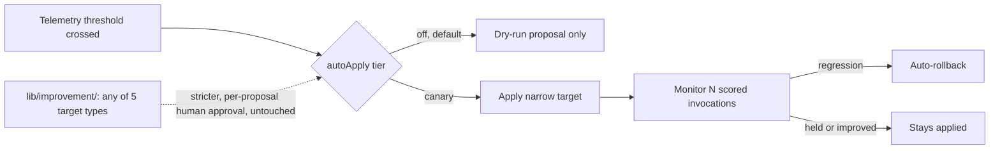

# ADR-0077: Opt-in auto-apply tier for prompt optimization

- **Date**: 2026-07-11
- **Status**: proposed
- **Deciders**: Gerald Dagher
- **Supersedes**: none

## Problem

`construct optimize <agent>` (`scripts/optimize.mjs`) diagnoses an underperforming specialist's recent failures and proposes a prompt patch, but every automated cadence that can trigger it — the weekly `optimize-loop` scheduled job, the session-end hook — runs dry-run only; the diagnosis surfaces, and then nothing happens until a human notices the output and re-runs the command with `--apply`. In practice that means a specialist can sit degraded indefinitely: the system already computed the fix, but no automated path exists to land it, monitor whether it actually helped, and back it out if it did not. The gap is not that mutation is gated — it is that there is no bounded, reversible way to close the loop faster than "someone happens to read the CLI output."

## Context

The human gate on prompt mutation is not an oversight; it is enforced deliberately in three separate places already: `lib/scheduler/index.mjs`'s `optimize-loop` job throws if its argv ever carries `--apply` ("scheduled optimize must never auto-apply"), `lib/hooks/session-optimize.mjs` only ever schedules a detached dry-run, and — discovered while drafting this ADR — a wholly separate, stricter governance system already exists for this exact domain: `lib/improvement/` (`controller.mjs` + `specialist-loop.mjs`, construct-6zga.1.5/.1.7). `SPECIALIST_TARGETS` there includes `'prompt'` among five target types (prompt, skill, role-flavor, routing-rule, contract); its controller "admits only versioned artifacts... refuses any candidate that lacks provenance, lacks held-out evaluation evidence, failed a deterministic gate, [or] names an unknown approver," and states plainly: "the controller never applies a change itself... the final mutation boundary requires an explicit human approval act, recorded with the approver identity and timestamp." That system requires a per-proposal, per-approver sign-off (`requireApproval`) — there is no config toggle that stands in for it.

`scripts/optimize.mjs`'s existing `--apply` already has real guardrails to build on: a 7-day per-agent rate limit, a capped `.bak` backup history, a JSONL audit trail at `~/.cx/prompt-history/<agent>.jsonl`, and (as of `construct-lqxda`) a structural integrity check plus `construct sync` as the composition gate.

## Decision

Add an opt-in `orchestration.promptOptimization` config block — `autoApply: 'off' | 'canary' | 'full'` (default `'off'`), `minLowScoreTraces` (default 5), `canaryScoredInvocations` (default 20) — read by the same code path `construct optimize` already runs. When `autoApply` is `'canary'` or `'full'` and a diagnosis cites at least `minLowScoreTraces` low-scoring traces, the scheduled job (and only the scheduled job — the session-end hook stays dry-run-only) may apply the patch itself, subject to guardrails below. `'canary'` additionally monitors the next `canaryScoredInvocations` scored invocations via the existing `construct review` pipeline and auto-rolls back through the existing `rollbackToLatestBackup` if the average score drops versus the pre-apply baseline; `'full'` applies without the monitoring window. Every automated apply and rollback is recorded as both an observation and a beads issue, so the audit trail a human reviewing later finds is identical in shape to a manually-applied change, just tagged with its automated origin.

## Rationale

The blast radius this tier can touch is deliberately narrow enough to be a materially different risk than what `lib/improvement/`'s stricter governance protects: it can only ever write to `skills/roles/*.md` (never `personas/construct.md`, never any `specialists/org/**` manifest), one file per apply, rate-limited to once per agent per 7 days, with every apply already backed up and every apply/rollback logged. `lib/improvement/`'s formal proposal system covers five target types including routing rules and contracts — a strictly larger blast radius with no built-in file scope or rate limit — which is exactly why it requires per-proposal, per-approver sign-off; this narrower, config-gated automation does not weaken that system's guarantees for its own scope, because it never touches that scope. The "explicit human approval act" the existing governance requires is satisfied here at a different grain: an operator setting `autoApply: 'canary'` in a git-tracked, code-reviewed `construct.config.json` is itself a deliberate, attributable, reversible act — the same pattern already trusted elsewhere in this repo (`orchestration.workerBackend`, `orchestration.outcomeRouting` from ADR-0076) where a standing config decision governs many subsequent automated actions rather than requiring a click per action. The canary window exists so that even within this narrow scope, a bad patch does not sit in production silently — it is measured against the same quality signal that triggered it and reversed automatically if it regresses.

## Rejected alternatives

**Default-on autonomy (`autoApply: 'canary'` as the shipped default).** Rejected because it would silently change behavior for every existing installation on upgrade — a specialist's prompt could start mutating itself without anyone having decided that should happen. Opt-in-only means the feature has zero effect until an operator makes the choice explicitly.

**Environment-variable opt-in (`CONSTRUCT_PROMPT_AUTO_APPLY=canary`).** Rejected on the same basis as every other quality-gate bypass in this repo (see ADR-0076's identical rejection for `outcomeRouting`): an env var is invisible in code review, does not survive a fresh shell, and is not attributable to a decision anyone made on purpose. The config field is git-tracked and shows up in diffs.

**Route auto-apply entirely through `lib/improvement/`'s existing `governProposal`/`requireApproval` pipeline instead of building a parallel canary mechanism.** This was seriously considered — reusing a system that already models attribution, held-out evaluation, and provenance is appealing. Rejected for this narrow use case because that pipeline's own design intentionally requires a human approver identity per proposal (`requireApproval`), which is precisely the friction this ADR exists to reduce for the bounded, low-stakes case of "reapply a rate-limited patch to one skill file." Routing through it would mean either weakening its per-proposal approval guarantee (unacceptable — that guarantee protects a strictly larger blast radius including routing rules and contracts) or building a second unattended-approval concept inside it that does not exist today, which is a larger and riskier change than adding a narrower, purpose-built canary tier next to it. `lib/improvement/` remains the correct, and only, path for any specialist-improvement targeting skill/role-flavor/routing-rule/contract, or for a prompt change an operator wants held-out-evaluated rather than telemetry-canaried.

**LLM-judged rollback (ask a model whether the canary period "looks better").** Rejected as a non-deterministic gate: the whole point of the canary window is an auto-rollback a human can trust without re-reviewing every decision, and that trust requires a deterministic comparison (average quality score before vs. after) rather than a second LLM's opinion, which could itself drift or be manipulated by the same failure modes that caused the original degradation.

**Unbounded canary window / no `canaryScoredInvocations` cap.** Rejected because an unbounded monitoring period means a regressed prompt could stay applied indefinitely if scored invocations are infrequent for that agent — the fixed window forces a decision (keep or roll back) on a predictable cadence.

## Consequences

Once an operator opts in, a specialist's prompt can change without a human reading a diff first — that is the entire point, and it is also the primary new risk: a plausible-looking patch that happens to game the quality-score signal (rather than genuinely improve behavior) could apply and, under `'full'`, stay applied with no automatic check. The `'canary'` tier mitigates this by tying survival to the same score the trigger used, but a scoring function with a systematic blind spot would blind the canary too — this tier does not replace periodic human review of `construct review` output, it only removes the requirement that a human be the one to type `--apply`. Every automated mutation still produces the same rollback path a manual one does, so the operational cost of a bad automated apply is bounded to "run `--rollback`," not "diagnose from scratch." The scheduled job becomes the only place this fires from; the session-end hook's dry-run-only behavior is unchanged, so a session in progress can never trigger an unattended write mid-session.

## Reversibility

Two-way door, and the safer direction by default. Setting `autoApply: 'off'` (or omitting the config block, since that is the default) fully reverts to today's manual-only behavior with zero code path affected — the guardrail check runs before anything else in the automated-apply branch. An operator who enabled `'canary'` or `'full'` and wants out simply flips the config value back; nothing about the already-applied patches needs to be undone, since they carry the same `.bak`/history trail as a manual apply and can be rolled back the same way at any time regardless of the current config value.

## References

- `scripts/optimize.mjs` — dry-run/`--apply`/`--rollback`, rate limit, backup history (construct-lqxda)
- `lib/scheduler/index.mjs` — `optimize-loop` job, the `--apply` throw
- `lib/hooks/session-optimize.mjs` — session-end dry-run scheduling
- `lib/improvement/controller.mjs`, `lib/improvement/specialist-loop.mjs` — the stricter, per-proposal governed improvement pipeline this ADR deliberately does not route through
- `docs/decisions/adr/0076-outcome-aware-recruitment-tiebreaker.md` — the config-field-over-env-var precedent this ADR follows
- `docs/guides/concepts/learning-loops.mdx` — A4 (prompt improvement) loop description
