# RFC-0004: Team-First Orchestration, Policy, and Handoff Integration

- **Date**: 2026-06-24
- **Status**: accepted (all 6 phases complete as of 2026-06-24)
- **Deciders**: cx-architect, cx-orchestrator, cx-oracle
- **Supersedes**: docs/guides/concepts/teams.md (parts; the concept doc lives on as user-facing reference)

## Status Summary

RFC-0004 is **accepted and deployed**. All six implementation phases are complete:

1. ✅ **Phase 1** (Week 1) — Unified registry foundation, migration script, validator
2. ✅ **Phase 2** (Week 2) — Team-aware orchestration routing
3. ✅ **Phase 3** (Week 2–3) — Contract team boundaries and handoff approval gates
4. ✅ **Phase 4** (Week 3) — Policy ownership and team-level fence intersection
5. ✅ **Phase 5** (Week 4) — Oracle team health oversight and governance signals
6. ✅ **Phase 6** (Week 4) — CLI tooling (`registry diff/prune`, `team add/remove`, `specialist add/remove`) and user documentation

See §Implementation Phases for phase-specific acceptance criteria.

## Problem

Construct has a team model in `specialists/teams-registry.json` and a workflow-template model in `specialists/teams.json`, but neither is wired into the surfaces that actually dispatch work, enforce boundaries, or route handoffs today.

The orchestration policy (`lib/orchestration-policy.mjs`) classifies requests and routes them directly to individual specialists. It has no concept of "which team owns this work." The decision matrix in `teams-registry.json` — who may veto what, who must approve before a decision proceeds — is not consulted during routing. Forbidden decisions are logged by `lib/roles/gateway.mjs` but not actively blocked in the dispatch path. Escalation paths exist in JSON but are not traversed by the orchestrator when a team hits a boundary.

The contract chain in `specialists/contracts.json` encodes producer→consumer handoffs between individual specialists. It does not encode team boundaries, decision rights, or escalation requirements. A contract can nominate `cx-engineer → cx-reviewer` without checking whether that handoff crosses a team boundary that requires an approval gate.

The policy inventory in `specialists/policy-inventory.json` lists 24 policies, but none reference teams. The role manifests in `specialists/role-manifests.json` define per-role fences, events, and handoff candidates — not per-team fences. A QA specialist and an Engineer specialist may be on the same quality-group team, but the fence system sees them as separate role entries with no shared team scope.

The registry surface is fragmented across five files:
1. `specialists/teams.json` — workflow templates (incident, release, discovery)
2. `specialists/teams-registry.json` — organizational teams with decision rights
3. `specialists/registry.json` — individual specialist definitions
4. `specialists/role-manifests.json` — per-role events, fences, commands
5. `specialists/contracts.json` — inter-specialist handoff contracts

Adding a new team requires editing `teams.json` and `teams-registry.json` and ensuring `role-manifests.json` fences do not contradict the team's charter. Removing a specialist requires confirming no contract references them. There is no single validation pass that guarantees consistency across all five files.

The Oracle (`cx-oracle`) oversees parity drift, contract violations, and alignment census staleness from a read-model perspective. It does not oversee team health: whether teams are understaffed (roles present but no specialists assigned), whether escalation paths are broken (owner role has no specialist), or whether teams are making decisions outside their rights (governance gap).

## Context

Construct's core purpose is to be an executive-aligned, control-plane workflow: one entry point that owns the outcome from strategy to production, dispatching specialists autonomously under hard gates. Teams, specialists, policies, contracts, and handoffs are all instruments of that purpose. If they are not integrated, the control plane is fragmented and Construct cannot enforce the decisions it makes about who does what.

The teams model in `teams-registry.json` was designed to replace the profile-based department aggregates with explicit accountability. It succeeded at definition but not at enforcement. The orchestration layer, the fence layer, the contract layer, and the policy layer each evolved independently, and the seams between them are the source of the current gap.

The Oracle was designed to watch the fleet from above, routing systemic gaps to owning specialists. It has the right altitude to oversee teams, but its prompt and its read model do not yet include team health signals.

```mermaid
flowchart TB
  subgraph Current["Current State (Fragmented)"]
    A[User Request] --> B[Orchestration Policy]
    B --> C[Specialist A]
    C --> D[Contract Handoff]
    D --> E[Specialist B]
    E --> F[Fence Check]
    F --> G[Policy Gate]
    G --> H[Done / Blocked]
    I[Teams Registry] -.not consulted.-> B
    I -.not consulted.-> D
    I -.not consulted.-> F
    I -.not consulted.-> G
    J[Oracle] -.watches parity.-> I
    J -.does not watch.-> I
  end

  subgraph Target["Target State (Integrated)"]
    A2[User Request] --> B2[Orchestration Policy]
    B2 --> T[Team Router]
    T --> C2[Specialist A]
    C2 --> D2[Team-Aware Contract]
    D2 --> E2[Specialist B]
    E2 --> F2[Team Fence]
    F2 --> G2[Policy Gate]
    G2 --> H2[Done / Blocked / Escalated]
    I2[Unified Registry] --> B2
    I2 --> D2
    I2 --> F2
    I2 --> G2
    J2[Oracle] --> I2
    J2 --> K2[Team Health Dashboard]
  end
```



## Decision

We will consolidate the five fragmented registries into a single **Unified Registry** (`specialists/unified-registry.json`) that is the single source of truth for teams, specialists, roles, fences, skills, and contracts. We will then rewire orchestration policy, contract handoffs, fence checks, and policy gates to read from this unified registry. The Oracle's scope will expand to include team-level governance oversight. Teams and specialists will become first-class routing primitives. Addition or removal of a team or specialist will require edits to exactly one file plus validation by a deterministic registry validator.

## Rationale

The current architecture has five registries because they were built at different times for different purposes. Over time they have accumulated implicit assumptions that are only discoverable by reading all five files simultaneously. A single registry with explicit cross-references eliminates the implicit-contract problem and makes validation possible.

The orchestration layer already classifies intent and assigns specialists. Adding a team-aware routing layer does not change the classification logic; it adds a second-order routing decision: "given the intent, which team is the natural owner, and which specialist within that team should execute?" This is a small addition with large architectural payoff.

The Oracle is already designed to watch systemic health from above. Expanding its scope to team governance is a natural extension of its existing mandate. It already emits verdicts, gap lists, and routing recommendations. Team health gaps fit the same shape.

The alternative — wiring teams into each existing surface independently — would preserve the five-file fragmentation and create even more implicit cross-file dependencies. Consolidation is cheaper in the long run than incremental wiring.

## Rejected alternatives

**Alternative: Keep five files, add consistency checks only.**
A validator that ensures `teams-registry.json` and `registry.json` and `role-manifests.json` stay in sync would reduce drift but would not solve the deeper problem: the orchestration and enforcement layers would still need to read from multiple files. The validator itself would become a source of truth, creating a sixth file. This was rejected because it increases complexity without reducing it.

**Alternative: Make teams an overlay on the existing registry, not a primary routing primitive.**
Teams could be derived from roles and specialists rather than being declared explicitly. This was rejected because it would make team decision rights and escalation paths emergent properties rather than explicit contracts. Construct's purpose is to enforce control-plane decisions; emergent properties are harder to enforce than declared ones.

**Alternative: Remove teams entirely and route by role only.**
The pre-existing role-based model already works for most requests. This was rejected because the team model was introduced precisely because roles lacked explicit accountability, decision rights, and escalation paths. Removing teams would regress to the problem the team model was designed to solve.

## Consequences

**What becomes easier:**
- Adding a new team requires one file edit plus validation, not five.
- Removing a specialist is mechanistically safe because all references are explicit.
- The orchestration policy can enforce team boundaries at dispatch time, not just log them after the fact.
- The Oracle can watch team health as a first-class signal, alongside parity and contract violations.
- Policy gates can be expressed as team-level constraints ("Quality Group must approve before Engineering Group merges") rather than role-level approximations.

**What becomes harder:**
- The unified registry is a larger file; schema validation is more important.
- Existing overlays in `.cx/specialists/` and `.cx/profiles/` must be migrated.
- The migration is a breaking change for any external code that reads the old five-file layout.

**What is now locked in:**
- Teams are a first-class primitive in Construct's routing and enforcement.
- The unified registry is the single source of truth; no other file may declare a team, specialist, or contract independently.

## Reversibility

This is a two-way door for the architecture but a one-way door for the file layout. If we reverse, we would need to re-split the unified registry back into five files. That is possible but laborious. We would revisit this decision if:
- The unified registry file becomes too large to version-control effectively (>5 MB)
- A legitimate use case arises for a surface that genuinely needs only a subset of the registry (we would expose filtered views, not separate files)

---

## Detailed Design

### 1. Unified Registry (`specialists/unified-registry.json`)

Consolidates teams, specialists, roles, fences, skills, and contracts into one schema-validated document.

```json
{
  "version": 2,
  "teams": {
    "product-group": {
      "name": "Product Group",
      "owner": "product-manager",
      "roles": ["product-manager", "ux-researcher", "designer"],
      "decisionRights": ["intake-triage", "design-approval"],
      "forbiddenDecisions": ["deployment", "security-override"],
      "escalationPath": ["product-manager", "rd-lead", "orchestrator"],
      "charter": "...",
      "contact": { "slack": "#product", "email": "product@example.com" }
    }
  },
  "specialists": {
    "cx-product-manager": {
      "name": "product-manager",
      "displayName": "Product Manager",
      "team": "product-group",
      "role": "owner",
      "skills": ["docs/prd-workflow", "docs/product-intelligence-workflow"],
      "modelTier": "reasoning",
      "events": ["backlog.stale", "prd.requested"],
      "fence": {
        "allowedPaths": ["docs/**", "profiles/**"],
        "allowedCommands": ["bd create", "bd note"],
        "approvalRequired": ["commit", "push"]
      },
      "docArtifacts": ["prd", "meta-prd", "prfaq"],
      "watchConditions": ["high-ambiguity-deep-work"]
    }
  },
  "contracts": {
    "user-to-construct": { ... },
    "construct-to-orchestrator": { ... }
  },
  "policies": {
    "release-gates": {
      "owner": "operations-group",
      "requiresApproval": ["quality-group", "governance-group"]
    }
  }
}
```

**Key invariants enforced by the validator:**
- Every specialist declares exactly one team.
- Every team has at least one specialist.
- Every team owner is a role that has at least one specialist.
- Every decision right listed in a team appears in at least one policy entry.
- Every contract's producer and consumer exist in the specialists map.
- No specialist name collision across teams.
- No circular escalation path.

**Overlays:** Projects can drop `.cx/unified-registry.json` which deep-merges over the canonical registry. The validator runs against the merged result. This replaces `.cx/specialists/` and `.cx/profiles/` overlays.

### 2. Team-Aware Orchestration Policy

The `orchestrationPolicy` MCP tool currently returns `{ track, specialists, dispatchPlan, gates, contractChain }`. It will gain a new top-level field:

```json
{
  "teamRouting": {
    "primaryTeam": "engineering-group",
    "involvedTeams": ["engineering-group", "quality-group"],
    "requiredApprovals": ["quality-group"],
    "escalationPath": ["architect", "rd-lead", "orchestrator"]
  }
}
```

**Routing algorithm (addition to existing intent classification):**
1. Classify intent as today (research, implementation, investigation, evaluation, fix).
2. Map intent to primary team via a new `INTENT_TO_TEAM` table:
   - `research` → strategy-group or product-group (depending on domain)
   - `implementation` → engineering-group
   - `investigation` → engineering-group or operations-group
   - `evaluation` → quality-group
   - `fix` → engineering-group or operations-group
3. Map primary team to specialist via existing flavor classifiers (architect-flavor, engineer-flavor, etc.), but constrained to specialists on that team.
4. Compute `involvedTeams` and `requiredApprovals` from the decision matrix for the work category.
5. If the primary team cannot make the decision (forbidden), return `BLOCKED` with escalation path.

**Impact on `construct` persona prompt:** The prompt already instructs the persona to call `orchestration_policy` before acting. It already honors the returned `track`, `specialists`, and `contractChain`. It will now also honor `teamRouting.primaryTeam` and `teamRouting.requiredApprovals`. If `primaryTeam` is present, the persona must mention it in the dispatch plan. If `requiredApprovals` is non-empty, the persona must route to the approval team before marking done.

### 3. Team-Aware Contract Handoffs

The contract chain in `specialists/contracts.json` is currently producer→consumer. It will gain three optional fields:

```json
{
  "teamBoundary": {
    "producerTeam": "engineering-group",
    "consumerTeam": "quality-group",
    "approvalRequired": true,
    "escalationOnRejection": ["reviewer", "rd-lead"]
  }
}
```

When `approvalRequired` is true, the handoff is not considered complete until the consumer team's owner has reviewed the output. If the consumer team rejects, the escalation path is invoked. The contract validation tool (`lib/contracts/validate.mjs`) will check team existence and escalation path validity.

**Impact on existing contracts:** All existing contracts will default to `approvalRequired: false` and no `teamBoundary`, preserving current behavior. New contracts that cross team boundaries must explicitly declare the boundary.

### 4. Team-Aware Policy Gates

The policy inventory in `specialists/policy-inventory.json` will gain a `teamOwner` field replacing or augmenting the current `source` field where appropriate. Policies like `deployment`, `release-gates`, and `security-approval` will explicitly name the owning team and required approver teams.

```json
{
  "id": "release-gates",
  "teamOwner": "operations-group",
  "requiresApprovalFrom": ["quality-group", "governance-group"],
  "enforcement": "lib/hooks/pre-push-gate.mjs",
  "mode": "deterministic"
}
```

The pre-push gate will refuse to allow a push if:
- The owning team is not active (zero specialists assigned).
- A required approver team has an open BLOCKED finding on the current branch.

This makes the policy inventory the single source of truth for which team owns which gate.

### 5. Team-Aware Fences

The fence system (`lib/roles/fence.mjs`) will gain a team-level check. A team fence is the union of all its specialists' fences. A specialist fence can narrow the team fence but cannot expand it. For example, if the Engineering Group team fence allows `lib/**`, an individual Engineer specialist on that team can be fenced to `lib/api/**`, but cannot be allowed to touch `docs/**` unless the team fence also allows it.

**Impact:** `lib/roles/fence.mjs#checkAction` will first look up the specialist's team, load the team fence, then intersect with the specialist fence. The narrower permission wins. This prevents a specialist from accidentally being given broader access than their team's charter allows.

### 6. Oracle Oversight Model

The Oracle (`cx-oracle`) will gain a **team governance** watch domain alongside its existing parity, contract, doctor, outcomes, and census domains.

**New team health signals:**
- `team-understaffed`: A team has fewer than 2 specialists.
- `escalation-path-broken`: A role in the escalation path has no specialist assigned.
- `team-decision-violation`: A team made a decision outside its rights (detected from `team-decisions.jsonl` audit log).
- `team-policy-stale`: A policy owned by a team has no specialist with the matching skill.
- `cross-team-handoff-blocked`: A contract with `teamBoundary.approvalRequired` has been pending approval longer than the team's SLA.

**Oracle routing table additions:**

| Gap signal | Primary specialist | Secondary |
|---|---|---|
| `team-understaffed` | cx-orchestrator | cx-rd-lead |
| `escalation-path-broken` | cx-platform-engineer | cx-docs-keeper |
| `team-decision-violation` | cx-governance | cx-security |
| `cross-team-handoff-blocked` | cx-orchestrator | cx-reviewer |

**Oracle prompt update:** The cx-oracle prompt will gain a "Team Governance" section that instructs it to call `get_skill("roles-orchestrator")` or `list_teams` when a team health signal is involved, and to route `team-decision-violation` to the governance group before any remediation.

**Oracle read model update:** `lib/orchestration/health.mjs` (or wherever the read model is assembled) will query `team-decisions.jsonl` and the unified registry to compute the team health signals.

### 7. Specialist Lifecycle: Easy Add / Remove

**Adding a specialist:**
1. Edit `specialists/unified-registry.json`. Add the specialist under `specialists` with a `team` reference.
2. Optionally add a prompt file at `specialists/prompts/cx-{name}.md`.
3. Optionally add skill definitions under `skills/`.
4. Run the validator: `node bin/construct registry:validate`.
5. The validator checks: team exists, no name collision, escalation paths remain valid, contracts continue to resolve, skills exist.

**Removing a specialist:**
1. Remove the specialist from `specialists/unified-registry.json`.
2. Run the validator.
3. If the specialist was the last on their team, the validator warns (does not block) that the team is now understaffed. If the specialist was an owner role, the validator warns that the team has no owner.
4. If the specialist was a party to any contract, the validator fails because contracts must reference existing specialists.
5. If the specialist authored prompts or skills, those files are not deleted automatically; a `--prune` flag on the validator offers to delete orphaned files after confirmation.

**Adding a team:**
1. Edit `specialists/unified-registry.json`. Add the team under `teams`.
2. Immediately add at least two specialists to the team (the validator enforces this).
3. Run the validator.
4. Add a team charter to the registry; no separate markdown file required unless the charter is longer than 500 characters.

**Removing a team:**
1. Remove the team and all its specialists from the registry.
2. The validator fails if any policy still references the team as an owner or required approver.
3. The validator fails if any contract still references the team in a `teamBoundary`.
4. The user must either reassign the policies/contracts first, or pass `--force` (which orphans the references and logs a warning).

### 8. Validation and Tooling

New CLI commands:

```bash
construct registry validate    # Validates unified-registry.json + overlays
construct registry diff        # Shows what changed against last committed version
construct registry prune       # Lists orphaned prompts/skills after a removal
construct team add <id>      # Guided wizard: prompts for charter, owner, roles
construct team remove <id>   # Checks dependencies, fails if unsafe
construct specialist add <id> --team <team> # Guided wizard
construct specialist remove <id> # Checks dependencies
```

These are thin wrappers over the validator library; they do not edit the JSON directly (the user still edits the file), but they provide safety rails.

### 9. Backward Compatibility

- The old five-file layout (`teams.json`, `teams-registry.json`, `registry.json`, `role-manifests.json`, contracts.json) remains readable for one minor release cycle.
- A migration script (`scripts/migrate-unified-registry.mjs`) reads the five files and writes `unified-registry.json`.
- The validator issues deprecation warnings when it sees the old files in the same project.
- Overlays: `.cx/specialists/` and `.cx/profiles/` are deprecated. A migration script moves `.cx/specialists/*.json` into `.cx/unified-registry.json`.
- The MCP tools `listTeams` and `getTeam` will read from the unified registry but return the same shape they do today.

---

## Implementation Phases

### Phase 1: Foundation (Week 1)
- Write `schemas/unified-registry.schema.json`.
- Write the migration script.
- Migrate the canonical Construct repo itself.
- Write `lib/registry/validator.mjs` with all invariants.
- Run validator in CI.

### Phase 2: Orchestration Integration (Week 2)
- Add `teamRouting` to `orchestrationPolicy` output.
- Update `lib/orchestration-policy.mjs` intent→team mapping.
- Update `construct` persona prompt to honor `teamRouting`.
- Update routing-tables.mjs to resolve from unified registry.
- Add tests for team-aware routing.

### Phase 3: Contract Integration (Week 2–3)
- Add `teamBoundary` to contract schema and `specialists/contracts.json`.
- Update `lib/contracts/validate.mjs` to validate team boundaries.
- Update `agentContract` MCP tool to surface team boundaries.
- Add tests for cross-team contract handoffs.

### Phase 4: Policy and Fence Integration (Week 3)
- Add `teamOwner` and `requiresApprovalFrom` to `policy-inventory.json`.
- Update `lib/roles/fence.mjs` with team-level intersection.
- Update `lib/hooks/policy-engine.mjs` with team policy checks.
- Add tests for team fence violation.

### Phase 5: Oracle Integration (Week 4)
- Add team health signals to Oracle read model.
- Update `cx-oracle` prompt with team governance section.
- Add team-level routing table entries for Oracle.
- Add tests for Oracle team oversight.

### Phase 6: Tooling and Documentation (Week 4)
- Implement `construct registry validate`, `diff`, `prune`.
- Implement `construct team add/remove` and `construct specialist add/remove`.
- Update `docs/guides/concepts/teams.md`.
- Mark old files as deprecated in CHANGELOG.

---

## Acceptance Criteria

1. **Unified Registry** — `specialists/unified-registry.json` exists, validates without errors, and contains all teams, specialists, roles, fences, skills, and contracts from the old five files.
2. **Team Routing** — Calling `orchestration_policy` on a build feature request returns `teamRouting.primaryTeam: "engineering-group"`.
3. **Approval Gate** — Calling `orchestration_policy` on a release request returns `teamRouting.requiredApprovals: ["quality-group", "governance-group"]`.
4. **Forbidden Block** — Calling `orchestration_policy` on a security-policy change with `cx-engineer` as the primary specialist returns `BLOCKED` because engineering-group cannot make security-policy decisions.
5. **Contract Boundary** — A contract with `teamBoundary.approvalRequired: true` between engineering-group and quality-group is validated successfully by `lib/contracts/validate.mjs`.
6. **Fence Intersection** — A specialist on the engineering-group team with `allowedPaths: ["lib/api/**"]` is blocked from touching `lib/core/**` because the team fence is `allowedPaths: ["lib/api/**", "bin/**"]` and the path is outside both.
7. **Oracle Signal** — After removing the last reviewer from the quality-group team, the Oracle emits `team-understaffed` with remediation route `cx-orchestrator`.
8. **Add Specialist** — Adding `cx-new-specialist` to `engineering-group` in the unified registry and running `construct registry validate` passes with zero errors.
9. **Remove Specialist** — Removing `cx-engineer` from the unified registry fails validation if `cx-engineer` is a party to any contract, protecting contract integrity.
10. **CI** — `npm test` passes including new tests for each acceptance criterion.

---

## References

- `docs/guides/concepts/teams.md` — existing team model concept doc
- `specialists/teams.json` — workflow templates (to be migrated)
- `specialists/teams-registry.json` — organizational teams (to be migrated)
- `specialists/registry.json` — specialist definitions (to be migrated)
- `specialists/role-manifests.json` — per-role events and fences (to be migrated)
- `specialists/contracts.json` — producer→consumer contracts (to be migrated)
- `specialists/policy-inventory.json` — policy gate definitions (to be augmented)
- `lib/orchestration-policy.mjs` — current routing logic
- `lib/orchestration/routing-tables.mjs` — event/doc/watcher routing
- `lib/roles/gateway.mjs` — team escalation functions
- `lib/roles/fence.mjs` — action approval and path scoping
- `specialists/prompts/cx-oracle.md` — Oracle persona prompt
- RFC-0043 — Oracle Meta-Controller (prior art on Oracle design)
