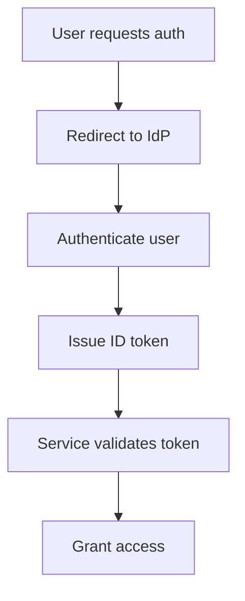

# OIDC Platform PRD

## Problem
Current authentication workflows are fragmented, lacking standardization and interoperability between systems. This leads to increased security risks, user friction, and maintenance overhead. [unverified]

## Goals and Non-Goals
### Goals
- Implement OpenID Connect (OIDC) to standardize authentication processes
- Enable single sign-on (SSO) across services
- Centralize identity management
- Improve security posture through standardized token flows
[unverified]

### Non-Goals
- Replace existing MFA mechanisms
- Remove support for legacy authentication protocols
- [unverified]

## Success Metrics
- 100% deployment across target services
- 99.9% uptime for identity endpoints
- Reduction in authentication latency to <500ms
- [unverified]

## Risks and Mitigations
| Risk                          | Mitigation                          |
|-------------------------------|-------------------------------------|
| Incompatible OIDC provider    | Pre-select vetted providers         |
| Single-point-of-failure      | Multi-region identity service       |
| Token leakage                 | Enforce short token lifetimes       |
| [unverified]                  | [unverified]                        |

### Mermaid Flowchart

### Metrics Table
| Metric               | Baseline | Target        |
|----------------------|----------|---------------|
| Auth latency (ms)    | 800      | <500 [unverified]|
| Token refresh rate   | 3000/hr  | 5000/hr [unverified]|
| SSO success rate     | 98%      | 99.9% [unverified]|
