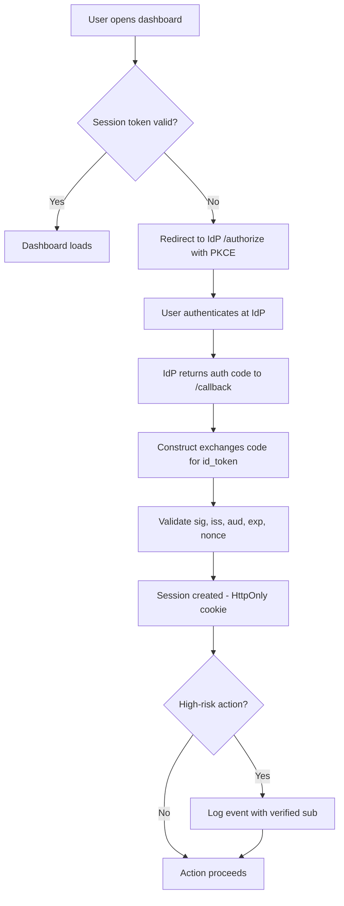
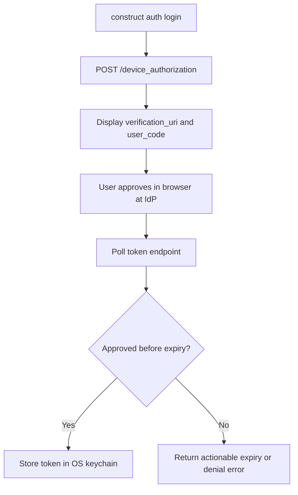
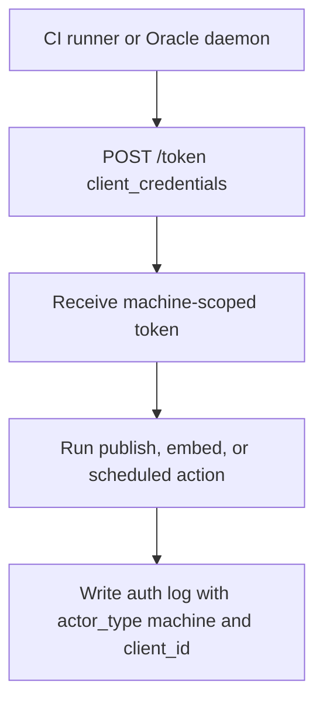

# Platform PRD: OIDC Authentication for Construct

- **Date**: 2026-07-09
- **Owner**: cx-product-manager
- **Status**: draft

---

## Problem

Construct has no first-class identity layer. Dashboard access is unrestricted to any local user. Provider credentials are stored per-machine in `~/.config/construct/config.env` and `auth/*.json` — plaintext at file mode `0600` (hardened under construct-trxz.8), with no per-identity scoping and no OS-keychain backing. The OS-keychain storage and short-lived scoped tokens described in this PRD are Phase-2 targets, not current behavior. High-risk approval-queue actions (merge, publish, config change) are attributed to a machine hostname at best, with no verified actor record. CLI sessions in shared environments share a single credential context. This blocks three functional requirements from reaching production readiness: FR-7 (cloud deployment), FR-8 (dashboard auth), and FR-11 (hybrid approval), and it directly gates the Phase 4 team-mode milestone in `STRATEGY.md` — *"a second human, on a different machine, using the same Postgres-backed memory and shared queue, with separate auth, for at least a week."*

The problem is not only missing login UI. The missing primitive is a verified, short-lived identity token that every Construct subsystem (dashboard middleware, CLI commands, Oracle daemon, CI runners) can present and every gate can check. Without it, multi-user deployment is unsafe and the `construct-m7k2-auth-primitives` bead (`plan.md` §Execution order, step 4) cannot close.

Sources: `docs/specs/prd/0001-construct-org-in-a-box.md` OQ-2; `STRATEGY.md` Phase 4; `plan.md` §Key decisions auth-once contract; `README.md` §Enterprise.

---

## Platform actors

| Actor | Role | Current workaround | Scale |
|---|---|---|---|
| **Construct administrator** | Configures IdP, manages `cx/auth.yaml`, rotates secrets | Manually edits `.env`; no enforcement | 1 per deployment |
| **Dashboard user** | Authenticates to the web dashboard; triggers approval-queue actions | No auth; any local user has full access | 1–50 per team deployment |
| **Operator** | Runs `construct sync`, `construct publish`, and `construct embed`, then works through OpenCode or another supported host | Shared env-var credentials; no per-user token | 1–10 per team deployment |
| **CI runner / Oracle daemon** | Headless; performs scheduled actions without a human in the loop | Static long-lived tokens in CI secrets | N runners per pipeline |
| **Security admin** | Audits auth events, exports logs, enforces retention | No structured auth log exists | 1 per enterprise deployment |

Evidence: `README.md` §Enterprise ("RBAC and ABAC scaffolding, signed MCP allowlists, mandatory audit"); `STRATEGY.md` Phase 4; `specialists/prompts/cx-security.md` §Auth/authorization audit.

---

## Goals and non-goals

### Goals

- **G1**: Replace the dashboard's absent auth gate with OIDC Authorization Code + PKCE so every dashboard session is tied to a verified identity. (`STRATEGY.md` Phase 4 exit condition; `docs/specs/prd/0001-construct-org-in-a-box.md` FR-8.)
- **G2**: Add Device Authorization Grant to the CLI so `construct auth login` works without a browser redirect, consistent with the `gh auth login` pattern already used in the project.
- **G3**: Issue short-lived, scoped access tokens so provider credentials are never stored in plaintext for multi-user deployments. (`plan.md` "Auth-once contract: single `secret-resolver` path".)
- **G4**: Produce a structured auth event log (login, token refresh, logout, approval action with verified `sub`) that satisfies enterprise compliance requirements.
- **G5**: Support at least three external IdPs (GitHub, Google, Okta / generic OIDC) via the existing provider abstraction (FR-4), with no provider-specific code in core.

### Non-goals

This PRD does not add SAML 2.0, fine-grained RBAC, a custom IdP or user directory, or social-login flows for solo-tier use. GitHub Device Flow continues to cover the solo developer path. IdP-push back-channel logout is also deferred to Phase 3 or a follow-on once the core relying-party contract is proven.

---

## Platform flow

The platform has three distinct auth paths with different constraints. The dashboard flow is interactive and session-oriented, the CLI flow is user-approved but browser-independent, and the CI / Oracle flow is machine-scoped and non-user-bearing. Splitting them keeps each figure legible in the published artifact while preserving one end-to-end narrative.

### Dashboard login flow

The dashboard path is the highest-scrutiny human flow because it gates web access and approval-queue actions. It therefore carries PKCE, nonce validation, cookie hardening, and actor-attributed audit logging in the same sequence shown below.

### CLI device flow

The CLI flow deliberately avoids a localhost callback requirement. It matches the `gh auth login` ergonomics users already understand while still producing a short-lived token that never lands in plaintext project state.

### CI and Oracle machine flow

The machine path is intentionally simpler because it carries no human identity claims. The contract here is strict scoping, short lifetime, and auditability, not interactive approval.

---

## API and interface contract

| Contract | Interface | Requirement |
|---|---|---|
| C-1 | `GET /.well-known/openid-configuration` | Construct discovers IdP endpoints from the provider's discovery document at startup. No provider-specific URLs are hardcoded in core. |
| C-2 | `GET /api/auth/status` | Returns `{ authenticated: bool, sub?, email?, expires_at?, iss? }`. Already stubbed in `Dockerfile` health-check (`curl -fs http://localhost:4242/api/auth/status`). |
| C-3 | `GET /api/auth/callback` | Receives the auth code from the IdP, performs token exchange, and sets the session cookie. |
| C-4 | `POST /api/auth/logout` | Clears the session cookie and optionally revokes the token at the IdP revocation endpoint. |
| C-5 | `cx/auth.yaml` | Admin config file with `discovery_url`, `client_id`, `client_secret` (or `client_secret_ref` for `op://` resolution per FR-14), `allowed_domains`, and `session_ttl_seconds`. |
| C-6 | `.cx/logs/auth-events.jsonl` | Append-only auth event log with `event`, `timestamp`, `sub`, `iss`, `session_id`, and `actor_type`. Raw token bytes are never written. |
| C-7 | `construct/auth/<issuer>` | OS keychain entry that stores access and refresh tokens, with no plaintext copy in `.cx/`. |

---

## Functional requirements

### Phase 1 — Dashboard OIDC Login (Authorization Code + PKCE)

- **FR-1.1**: Unauthenticated requests to the dashboard must redirect to the IdP's `/authorize` endpoint using Authorization Code + PKCE (S256 code challenge method).
  Acceptance: `GET /` without a session cookie returns HTTP 302 to the IdP. A tampered `code_challenge` causes token exchange to fail with 400.
- **FR-1.2**: Construct must validate the `id_token` JWT: JWKS signature, `iss`, `aud`, `exp`, and `nonce` claims.
  Acceptance: An expired `exp` is rejected. An unknown signing key is rejected. A replayed nonce is rejected.
- **FR-1.3**: `cx/auth.yaml` must accept `discovery_url`, `client_id`, `client_secret` (or `client_secret_ref`), and `allowed_domains`.
  Acceptance: Pointing `discovery_url` at a mock OIDC server routes auth correctly without code changes.
- **FR-1.4**: Session tokens must be short-lived (default: 1 hour) and stored in an HttpOnly, Secure, SameSite=Strict cookie.
  Acceptance: Cookie is absent from `document.cookie`. A token past TTL triggers re-auth.
- **FR-1.5**: Auth events (login, validation failure, logout) must be appended to C-6 (`.cx/logs/auth-events.jsonl`).
  Acceptance: Successful login writes `{ event: "login", sub, iss, session_id, timestamp }`. No `id_token` bytes present.

### Phase 2 — CLI Device Authorization Grant

- **FR-2.1**: `construct auth login` must initiate RFC 8628: print `verification_uri` and `user_code`; poll the token endpoint until authorised or expired.
  Acceptance: Against a mock IdP, displays URL+code and resolves to a stored token on approval.
- **FR-2.2**: Resulting tokens must be stored in the OS keychain (C-7), absent from any `.cx/` plaintext file.
  Acceptance: `grep -r "access_token" .cx/` returns empty after `construct auth login`.
- **FR-2.3**: `construct auth logout` must delete the keychain entry and call the IdP revocation endpoint if advertised.
  Acceptance: Keychain entry gone; revocation request logged by mock IdP.
- **FR-2.4**: `construct auth status` must print `sub`, `email` (if present), `expires_at`, and `iss`; no raw token bytes.
  Acceptance: Output matches schema; raw token bytes absent.
- **FR-2.5**: CLI commands that require auth must fail with an actionable error when no valid token exists.
  Acceptance: `construct publish` exits 1 with `No valid session. Run: construct auth login`.

### Phase 3 — Client Credentials for CI and Oracle

- **FR-3.1**: Construct must support OAuth 2.0 Client Credentials for headless contexts. `client_id` and `client_secret` must be resolvable from env vars or `op://` references (FR-14).
  Acceptance: A CI job with `CX_CLIENT_ID` and `CX_CLIENT_SECRET` authenticates; `construct publish` runs without a device-flow prompt.
- **FR-3.2**: Client-Credentials tokens must carry no user identity claims; approval log entries must include `actor_type: machine` and `client_id`.
  Acceptance: Log entry contains `actor_type: machine`; no `sub` claim.
- **FR-3.3**: Token rotation must be automatic — re-authenticate silently when within 60 seconds of expiry.
  Acceptance: A long-running `construct embed` session does not fail after the initial token TTL expires.

---

## Non-functional requirements

| ID | Requirement | Target |
|---|---|---|
| NFR-1 | PKCE code verifier entropy | ≥ 256 bits (`crypto.randomBytes(32)`); no `Math.random()` in auth path |
| NFR-2 | JWKS validation latency (cache hit) | ≤ 5 ms p99 |
| NFR-3 | JWKS key rotation resilience | One background refresh on validation failure before hard-reject; no user-visible error |
| NFR-4 | Device flow polling interval | `max(interval_from_server, 5s)`; no faster polling |
| NFR-5 | Device flow timeout | 5 minutes; clear expiry message |
| NFR-6 | Client-secret confidentiality | Never in argv, structured logs, or `.cx/` files; static-analysis gate in CI |
| NFR-7 | Token refresh retry | Exponential backoff; max 3 attempts before session invalid |
| NFR-8 | Zero new core CLI npm dependencies | Node built-in `crypto` + `https` for the validation path; keychain library permitted in bounded `auth` module only |
| NFR-9 | Auth event log immutability | Append-only; no edit or delete surface exposed by any CLI command |

---

## Backwards compatibility and versioning

This is a **new contract** — no existing authenticated surface exists. The `/api/auth/status` endpoint is already stubbed (`Dockerfile` health-check) and will be completed in Phase 1 without a breaking change to the health-check contract.

`cx/auth.yaml` is a new file. Deployments without it remain in the current unauthenticated state for Phase 1 (fail-open for solo mode; fail-closed once `auth.yaml` is present). This preserves the local-first solo developer path described in `STRATEGY.md` Bet 2.

CLI token storage moves from plaintext `.cx/` config to OS keychain in Phase 2. Existing plaintext tokens are not migrated automatically; users must run `construct auth login` after the upgrade.

---

## Migration and rollout

1. **Phase 1 (dashboard)**: Administrator creates `cx/auth.yaml` pointing at their IdP. Existing unauthenticated sessions are terminated on next request. No data migration required.
2. **Phase 2 (CLI)**: Users run `construct auth login` once. Old plaintext token files in `.cx/` can be deleted; `construct auth login` will print a notice if a legacy credential file is detected.
3. **Phase 3 (CI)**: CI pipelines replace long-lived static tokens with `CX_CLIENT_ID` + `CX_CLIENT_SECRET` env vars (resolvable via `op://`). Oracle daemon config updated to include a `client_credentials` stanza.

Coordination required: dashboard team (Phase 1 middleware), platform engineer (Phase 2 keychain library selection), CI/Oracle owner (Phase 3 interface contract).

---

## Operational requirements

The auth event log at `.cx/logs/auth-events.jsonl` must stay structured, append-only, and queryable via `construct logs auth` if that command lands in Phase 1.

The JWKS cache persists at `.cx/auth-cache.json`, refreshes on validation failure, and defaults to a one-hour TTL.

Failure handling follows three explicit branches:

1. If the IdP discovery document is unavailable at startup, Construct caches the last-known document, fails open for reads, and fails closed for writes.
2. If JWKS keys rotate, Construct performs a silent background refresh before surfacing an auth failure.
3. If a headless token expires, Construct refreshes automatically under the FR-3.3 retry policy.

Phase 2 admin controls include `construct auth revoke --sub ` to invalidate all sessions for a given identity. Audit diagnostics via `construct auth status --verbose` print issuer, expiry, and last JWKS refresh time without exposing token bytes.

---

## Acceptance criteria

1. An unauthenticated `GET /` to the dashboard returns HTTP 302 to the configured IdP (Phase 1).
2. A forged or expired `id_token` is rejected with a 401 and an auth-event log entry (Phase 1).
3. `construct auth login` completes the device flow against a mock IdP and stores a token in the OS keychain (Phase 2).
4. `grep -r "access_token" .cx/` returns empty after `construct auth login` (Phase 2).
5. A CI job with `CX_CLIENT_ID` + `CX_CLIENT_SECRET` runs `construct publish` without a device-flow prompt (Phase 3).
6. Every approval-queue action taken post-Phase 1 has a `sub` claim (human) or `client_id` (machine) in the auth event log (Phase 1 + 3).
7. Rotating IdP JWKS keys mid-session does not cause a user-visible auth failure (NFR-3).
8. `construct auth status` prints sub, expiry, and issuer without raw token bytes (Phase 2).

---

## Success metrics

| Metric | Baseline | Target |
|---|---|---|
| Dashboard sessions with verified identity | 0% (no auth today) | 100% after Phase 1 ships |
| Approval-queue actions with auditable identity provenance | 0% | 100% after Phase 1 ships |
| CLI tokens stored in OS keychain (not plaintext) | 0% | 100% after Phase 2 ships |
| Mean time to silent re-auth after token expiry (CI/Oracle) | n/a | 0 — silent refresh |
| JWKS validation latency p99 (cache hit) | n/a | ≤ 5 ms |
| Auth-related support incidents (shared credential leaks) | unknown | 0 post-Phase 2 |

---

## Risks and mitigations

| Risk | Likelihood | Impact | Mitigation |
|---|---|---|---|
| IdP discovery document unavailable at startup | low | high | Cache to `.cx/auth-cache.json`; fail open on read, closed on write |
| JWKS key rotation causes mass re-auth | low | med | Silent background JWKS refresh on validation failure (NFR-3) |
| Client secret leaks via debug logging | med | high | Static-analysis gate in CI; structured log schema enforces `redacted` for credential fields (NFR-6) |
| Device flow user ignores verification prompt | med | med | CLI polls for full `expires_in` window; reminder printed every 30 s |
| Token extracted from compromised keychain | low | high | Short TTL (1 hour default) limits blast radius; refresh token rotated on each use (RFC 6749 §10.4) |
| OIDC library CVEs | med | high | Node built-ins for validation path; dependency audit gate in CI |
| Solo users locked out if `cx/auth.yaml` misconfigured | med | med | `construct auth debug` command prints discovery document and validation result against mock token before enabling auth |

---

## Consumer impact

- **Solo developers** (no `cx/auth.yaml`): no change. Auth is opt-in until `cx/auth.yaml` is present.
- **Team deployments**: existing unauthenticated dashboard sessions end on Phase 1 rollout. Users must log in via IdP.
- **CI pipelines**: must replace static tokens with Client Credentials in Phase 3. Long-lived static tokens will stop working once `cx/auth.yaml` is active.
- **Existing `.cx/` credential files**: not migrated; users re-authenticate via `construct auth login`.

---

## Dependencies

| Dependency | Owner | Risk | Ready by |
|---|---|---|---|
| Dashboard web server (FR-8) baseline — Phase 1 adds middleware on top | Dashboard team | Medium — Phase 1 gates on dashboard existence | Before Phase 1 start |
| OS keychain cross-platform library (`@napi-rs/keyring` preferred over archived `keytar`) | Platform engineer | Low | Before Phase 2 start |
| Mock OIDC server for integration tests (`node-oidc-provider`) | QA | Low | Before Phase 1 test suite |
| `op://` credential resolution (FR-14) for Client Credentials secret injection | Already shipped | None | Available now |
| Oracle meta-controller (ADR-0043) must accept a token-based auth context | Architect | Medium — interface contract TBD | Before Phase 3 start |
| `construct-m7k2-auth-primitives` bead close | `plan.md` step 4 | High — gates single `secret-resolver` path | Before Phase 2 start |

---

## Open questions

| Question | Owner | Decision needed by |
|---|---|---|
| Should Construct act as an OIDC Relying Party only, or also issue tokens as a lightweight OP for downstream tool access? | Architect | Phase 1 design review |
| Which keychain library: archived `keytar` or `@napi-rs/keyring`? | Platform engineer | Before Phase 2 sprint start |
| Should `allowed_domains` in `cx/auth.yaml` support wildcard subdomain matching? | Product | Phase 1 FR-1.3 implementation |
| Back-Channel Logout (IdP-push session revocation): required for enterprise tier or deferred? | Security | Phase 3 planning |
| Should auth events be queryable via `construct logs auth` or is raw JSONL sufficient for Phase 1? | Product | Phase 1 acceptance |
| Should solo mode require `cx/auth.yaml` to exist before enforcing auth, or should Phase 1 ship with a default-deny posture for all modes? | Product + Security | Before Phase 1 implementation start |

---

## References

1. `docs/specs/prd/0001-construct-org-in-a-box.md` — FR-4 (provider abstraction), FR-7 (cloud deployment), FR-8 (dashboard), FR-11 (hybrid approval), FR-14 (credential resolution), OQ-2 (auth provider choice)
2. `plan.md` — `construct-m7k2-auth-primitives` bead; auth-once contract; `secret-resolver` path
3. `STRATEGY.md` — Phase 4 (team mode with separate auth); Bet 2 (local-first, real path to multi-user)
4. `README.md` — Enterprise tier: RBAC/ABAC scaffolding, signed MCP allowlists, mandatory audit
5. `Dockerfile` — existing `/api/auth/status` health-check stub
6. `specialists/prompts/cx-security.md` — auth/JWT/session audit checklist
7. `skills/roles/architect.enterprise.md` — SSO, RBAC, audit, tenant isolation checklist
8. OpenID Connect Core 1.0 — https://openid.net/specs/openid-connect-core-1_0.html
9. RFC 7636: PKCE — https://datatracker.ietf.org/doc/html/rfc7636
10. RFC 8628: Device Authorization Grant — https://datatracker.ietf.org/doc/html/rfc8628
11. RFC 6749: OAuth 2.0 — https://datatracker.ietf.org/doc/html/rfc6749
