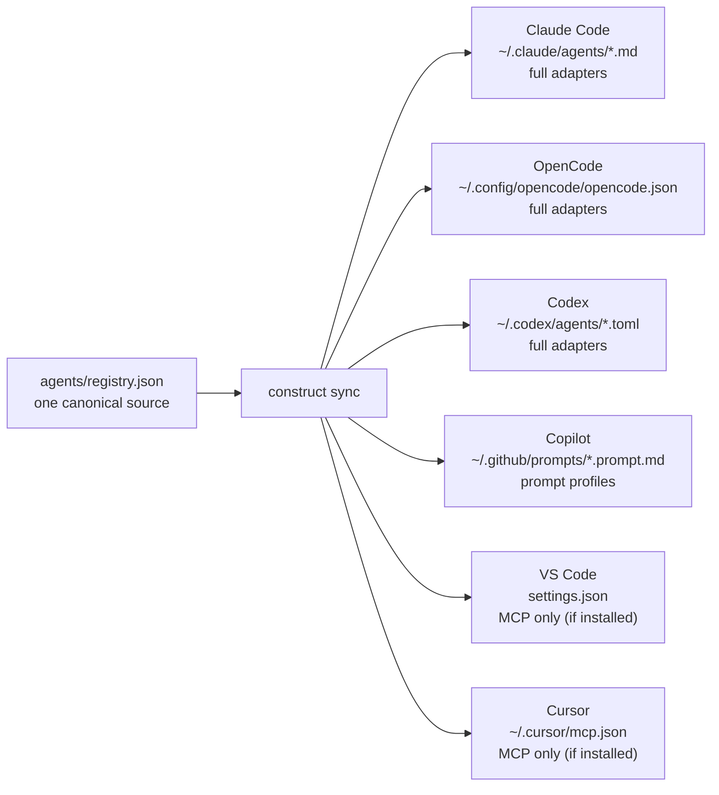

`construct sync` keeps one canonical registry and writes the right host-specific shape for each supported tool. Full agent adapters exist on Claude Code, OpenCode, and Codex. Copilot gets prompt profiles. VS Code and Cursor get MCP registrations when their config files already exist.



## Claude Code

Construct writes:

- `~/.claude/agents/*.md` — one file per persona/specialist
- `.claude/settings.json` (per-project, via `construct sync --project`) — hooks for pre-tool-use policy, post-tool-use formatters
- `~/.claude/CLAUDE.md` — Construct-managed block appended to your global Claude instructions

In Claude Code, address the persona with `@construct` from any session. The same prefix works for specialists: `@cx-engineer`, `@cx-security`, `@cx-architect`.

## OpenCode

Construct merges into `~/.config/opencode/opencode.json`, preserving existing provider auth where possible while adding Construct agents, MCP entries, and runtime plugins. In OpenCode, agents appear in the agent picker.

## Codex (CLI)

Construct writes `~/.codex/agents/*.toml` and updates the Construct-managed blocks in `~/.codex/config.toml` for agents and MCP servers.

## Copilot

Construct writes reusable prompt profiles under `~/.github/prompts/*.prompt.md` and maintains a Construct-owned block in `~/.github/copilot-instructions.md`.

## VS Code

If VS Code already has a user `settings.json`, Construct adds managed entries under `github.copilot.mcpServers` so Copilot Chat can reach the same MCP tools.

VS Code user settings paths by platform:
- macOS: `~/Library/Application Support/Code/User/settings.json`
- Linux: `~/.config/Code/User/settings.json`
- Windows (WSL): `/mnt/c/Users/<username>/AppData/Roaming/Code/User/settings.json`

## Cursor

If Cursor already has `~/.cursor/mcp.json`, Construct merges the managed MCP registrations there. Cursor agent profile files are not generated today.

## Cross-surface parity

`construct doctor` includes a parity check that diffs your registry against every installed editor's adapter state. If you add a specialist and forget to `sync`, doctor reports the drift.

```bash
construct doctor
# ... look for "Cross-surface adapter parity"
```

Healthy output might look like:

```
Cross-surface adapter parity (claude: ok (29/29 agents) · opencode: ok (29/29 agents) · codex: ok (29/29 agents) · copilot: ok (29/29 prompts) · vscode: ok (6/6 mcps) · cursor: ok (6/6 mcps)) ✓
```

Drift looks like:

```
claude: drift — missing: cx-newrole; opencode: ok (29/29 agents); codex: drift — missing: cx-newrole; cursor: not installed
```

Fix with `construct sync`.

Next: [what next →](/start/what-next)
