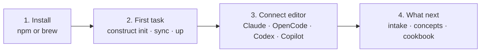

By the end of this section you will have:

1. Construct installed globally on your machine.
2. A working project with `.cx/` scaffolding, agent adapters synced to your editor, and the local services running.
3. Dispatched your first task to the construct persona and watched it run end-to-end.

If anything goes wrong, jump to [troubleshooting](/operations/troubleshooting).

## The four steps

| # | Step | Time |
|---|---|---|
| 1 | [Install](/start/install) | 2 min |
| 2 | [Your first task](/start/first-task) | 3 min |
| 3 | [Connect your editor](/start/connect-your-editor) | 1 min |
| 4 | [What next](/start/what-next) | — |

## What you're installing

- A CLI (`construct`) that bootstraps and operates the system locally.
- A set of host adapters that get written into your editor's config: full agent adapters for Claude Code, OpenCode, Codex, and Copilot prompt profiles; MCP registrations for VS Code/Copilot and Cursor when those configs already exist.
- Optional local Postgres + pgvector for retrieval, managed via Docker if available. Trace capture writes local `.cx/traces/*.jsonl` by default; remote export is optional.

You install in `solo` mode by default — everything runs locally, the intake queue is the filesystem under `.cx/intake/`, and there's no Construct cloud account. Two other deployment modes (`team` and `enterprise`) promote the queue and memory to shared Postgres and route MCP through a broker — see [deployment model](/concepts/deployment-model).

## Platform support

| Platform | Install | Hooks | Local Postgres |
|---|---|---|---|
| macOS | Homebrew or npm | Full | Docker (recommended) or Homebrew postgres |
| Linux | npm (global or project) | Full | Docker (recommended) or native postgres |
| Windows | npm via WSL | WSL required for hooks | Docker Desktop with WSL backend |

On Linux: `npm install -g @geraldmaron/construct` works without Homebrew. Run `construct init` after install — it detects Docker and sets up local Postgres automatically.

On Windows: install WSL2, then install Construct inside WSL using the Linux path. Native Windows hook execution is not supported; hooks use bash-style path expansion.
