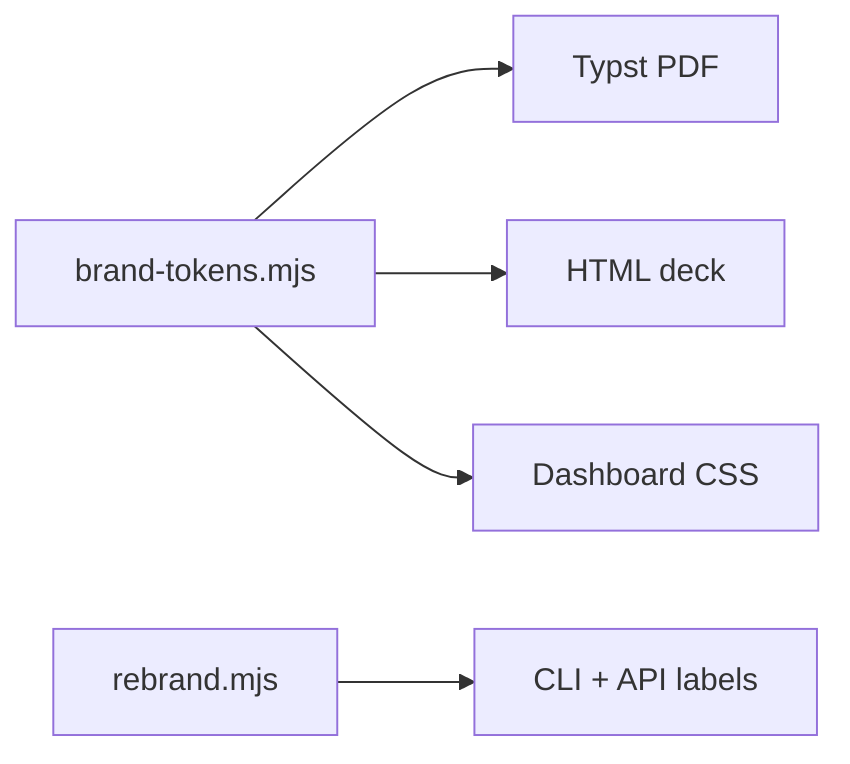

# ADR-0044: Centralize Construct brand tokens for all export surfaces

- **Date**: 2026-06-22
- **Status**: accepted
- **Deciders**: cx-architect, cx-docs-keeper
- **Supersedes**: none

## Problem

Distribution exports (PDF, HTML, deck, PPTX) and interactive host surfaces drifted when typography moved from retired font families to Plus Jakarta Sans and JetBrains Mono. Docs and templates cited stale names; some apps still declared unused npm font packages. Operators could not tell which file was canonical for brand behavior.

## Context

Construct ships a field-notebook ink ramp and bundled OFL fonts under `templates/distribution/fonts/`. Published artifacts and interactive hosts consume the same tokens via `lib/brand-tokens.mjs`. Profile-specific intake terminology flows through `lib/scopes/rebrand.mjs`.



```d2
direction: right

tokens: brand-tokens.mjs {
  shape: document
}

pdf: PDF export
html: HTML export
dash: Dashboard

tokens -> pdf
tokens -> html
tokens -> dash
```

## Decision

Adopt `lib/brand-tokens.mjs` as the single source of truth for visual brand primitives. Document naming, voice, tone, and profile rebrand in `docs/guides/reference/branding.md`. Enforce retired-font drift with `scripts/audit/03d-brand.mjs` in the audit ratchet.

## Rationale

One token module prevents PDF and web surfaces from diverging when typography changes. A human-facing branding index reduces stale references in cookbooks. Mechanical audit catches Plus Jakarta / Geist regressions without blocking every Write hook.

Evidence: Construct's own publish pipeline already routes Typst templates through `construct-brand.typ`, which imports numeric Plus Jakarta Sans weights only — see `templates/distribution/construct-brand.typ`.

## Rejected alternatives

**Per-surface CSS only.** Rejected because PPTX and Typst cannot read dashboard CSS variables; duplication would return on the next rebrand.

**Blocking PostToolUse brand hook.** Rejected as too noisy; the audit ratchet pattern matches existing `03b-naming` enforcement.

## Consequences

Easier: onboarding maintainers, regenerating distribution examples, CI drift detection.

Harder: any new surface must import tokens or fail `03d-brand`.

Locked in: Plus Jakarta Sans + JetBrains Mono until an explicit ADR supersedes this one.

## Reversibility

Two-way door for documentation and audit scope; one-way for shipped PDFs already distributed to customers (they retain the font embedded at export time).

| Field | Value |
|---|---|
| Door type | two-way (docs/audit); one-way for already-shipped PDFs |
| Cost to reverse | low for docs; high for redistributed binaries |
| Revisit triggers | New primary typeface ADR; OFL license change |

## Adversarial challenge

| Challenge | Severity | Response |
|---|---|---|
| Token module becomes a dumping ground for non-visual config | med | Scope ADR to visual primitives only; rebrand stays in `rebrand.mjs` |

## Open questions

| Question | Owner | Decision needed by |
|---|---|---|
| Whether PPTX embed path should fail closed without bundled fonts | architect | unknown |

## References

- `docs/guides/reference/branding.md`
- `lib/brand-tokens.mjs`
- https://fonts.google.com/specimen/Plus+Jakarta+Sans (accessed 2026-06-22)
