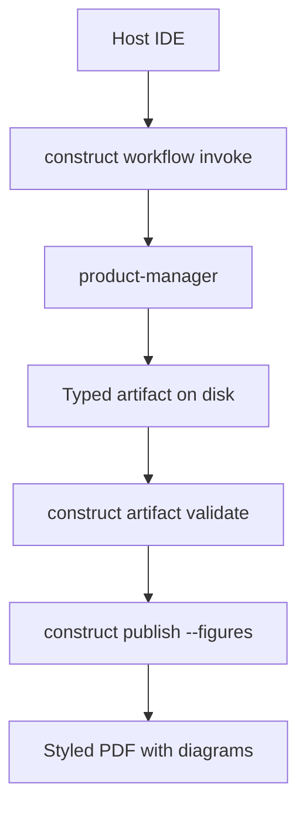

# Platform PRD: Enterprise Agentic Platform

- **Date**: 2026-06-19
- **Owner**: product-manager
- **Status**: draft

## TL;DR

Platform teams need a governed layer between IDE hosts and specialist-authored artifacts - not another chat wrapper. Construct routes work through provenanced invoke plans, blocks distribution until validate passes, and exports briefs with embedded diagrams. This fixture defines that contract for release-gate and demo tapes; it is not production product docs.

## Background

Internal platform consumers currently stitch ad hoc prompt conventions instead of a durable contract for routing, evidence, and distribution. Evidence for multi-agent orchestration patterns draws on https://arxiv.org/abs/2308.08155 (accessed 2026-06-19) and the LangGraph overview at https://langchain-ai.github.io/langgraph/ (accessed 2026-06-19).

| Evidence source | Type | What it shows | Link / id |
|---|---|---|---|
| Multi-agent survey | academic | Orchestration patterns | https://arxiv.org/abs/2308.08155 (accessed 2026-06-19) |
| LangGraph overview | vendor docs | Graph runtime patterns | https://langchain-ai.github.io/langgraph/ (accessed 2026-06-19) |

## Problem

Platform teams orchestrating multiple AI agents lack a governed operational layer. Each coding session starts cold, artifacts ship without provenance, and high-risk writes bypass approval queues.

Three failure modes recur in internal platform reviews:

1. **Cold start** — specialists re-discover repo context every session because invoke plans are not durable or replayable.
2. **Unprovenanced artifacts** — PRDs and ADRs reach stakeholders without citation discipline or manifest-enforced structure.
3. **Distribution drift** — PDF exports use host-default styling; diagrams lack Construct hand-drawn styling and bundled typography.

## Platform actors

| Actor | Job | Current workaround | Scale |
|---|---|---|---|
| Application developer | Invoke specialist chains from IDE hosts | Ad hoc prompts | unknown |
| Security admin | Citation + release gates before PDF | Manual review | unknown |
| Ops engineer | Toolchain detect for Pandoc/Typst/D2/Mermaid | Local checks | unknown |

```d2
direction: down

developer: Application developer {
  shape: person
}

security: Security admin {
  shape: person
}

ops: Ops engineer {
  shape: person
}

construct: Construct CLI {
  style.fill: "#eef1f3"
  style.stroke: "#1a1d24"
}

gate: Release gate\nvalidate + citations {
  style.fill: "#d8e6e7"
  style.stroke: "#1f5c61"
}

export: Publish export\nPDF + figures {
  style.fill: "#1a1d24"
  style.font-color: "#eef1f3"
  style.stroke: "#1a1d24"
}

developer -> construct: invoke + review plan
security -> gate: citation + reviewer policy
ops -> export: toolchain detect
construct -> gate
gate -> export
```

## Outcomes - Goals & Non-Goals

**Goals:**

1. Route requests through provenanced workflow invoke plans.
2. Block publish until artifact validate passes.
3. Export styled PDFs with Construct-branded D2 and Mermaid figures via `construct publish`.
4. Ship bundled typography so exports match across machines.

**Non-goals:**

| Non-goal | Why deferred |
|---|---|
| Replacing host LLM execution | Construct returns plans; specialists author content |
| Mandating npm deps in core CLI | ADR-0001 |
| Cloud rendering | Figures resolve locally via D2 and mermaid-cli |

## Why This Matters Now

Without a shared gate, distribution drift and unprovenanced artifacts compound across IDE hosts. Timing is driven by platform review failure modes above; quantified incident rate remains `unknown`.

## Competitive Landscape & Financial Considerations

| Alternative | Dimension | Approach | Our stance | Source |
|---|---|---|---|---|
| Host-default PDF styling | brand fidelity | Unbranded exports | Differentiate | observed in prior Construct 2.0 cutover notes |
| Ad hoc prompt conventions | governance | No release gate | Differentiate | this fixture Background |

| Cost / value item | Estimate | Confidence | Source |
|---|---|---|---|
| Build / run cost | unknown | low | [unverified] |
| Export p95 target | ≤10s with figures | med | Success Metrics |

## Phases

### Phase 1: Gate + branded publish

- **Goal**: Validate-before-export and branded PDF/figures on one `construct publish` path.
- **Status**: not started
- **Requirements**: FR-1.1, FR-1.2, FR-1.3, FR-1.4, FR-1.5
- **Exit**: Gate pass enforced; figures render with hand-drawn styling.

### Phase 2: Toolchain detect in CI

- **Goal**: Fail loud when Pandoc/Typst/D2/Mermaid missing; demos as fallback.
- **Status**: not started
- **Requirements**: FR-2.1
- **Exit**: `construct tools detect --figures` green in CI or documented fallback.

## Requirements

### Phase 1 requirements

#### FR-1.1: Publish runs release validate before export

`construct publish` must run `validateArtifactRelease` before export when type is known.

- **Phase**: 1
- **Acceptance criteria**: AC-1.1.1
- **NFR notes**: fail-closed

#### FR-1.2: Gate failure exits 2 with remediation

Gate failure exits 2 with hints pointing to `prd-workflow`.

- **Phase**: 1
- **Acceptance criteria**: AC-1.2.1
- **NFR notes**: operator UX

#### FR-1.3: PDF uses bundled Typst brand template

PDF export uses bundled Construct Typst template unless `.construct/publish-theme.typ` overrides.

- **Phase**: 1
- **Acceptance criteria**: AC-1.3.1
- **NFR notes**: typography OFL fonts bundled

#### FR-1.4: Figures render with hand-drawn styling

`--figures` renders fenced `d2` and `mermaid` via vendored `pandoc-ext/diagram` with D2 `--sketch` and Mermaid `handDrawn`.

- **Phase**: 1
- **Acceptance criteria**: AC-1.4.1
- **NFR notes**: local toolchain

#### FR-1.5: Masthead metadata from frontmatter

Masthead metadata (`doc_id`, `version`, `classification`) flows from YAML frontmatter — not repeated in body.

- **Phase**: 1
- **Acceptance criteria**: AC-1.5.1
- **NFR notes**: n/a

### Phase 2 requirements

#### FR-2.1: Toolchain detect for figures

Ops can detect missing figure toolchain; CI uses detect or committed demo MP4s as fallback.

- **Phase**: 2
- **Acceptance criteria**: AC-2.1.1
- **NFR notes**: CI reliability

## Acceptance Criteria

| AC id | FR id | Criterion (stranger-checkable) | Verification method |
|---|---|---|---|
| AC-1.1.1 | FR-1.1 | Publish without passing validate exits non-zero when type known | CLI test |
| AC-1.2.1 | FR-1.2 | Exit code 2 and message references prd-workflow | CLI test |
| AC-1.3.1 | FR-1.3 | PDF embeds Plus Jakarta Sans via bundled font-path | publish-template test |
| AC-1.4.1 | FR-1.4 | Fenced d2/mermaid produce figures under `--figures` | publish functional |
| AC-1.5.1 | FR-1.5 | Masthead shows doc_id from frontmatter only | visual/PDF inspect |
| AC-2.1.1 | FR-2.1 | `construct tools detect --figures` reports missing engines | CLI test |

## Success Metrics

| Metric | Type | Baseline | Target | Owner | Source |
|---|---|---|---|---|---|
| Gate pass before publish | lagging | manual validate | enforced by default | product-manager | this PRD |
| PDF export p95 | leading | n/a | ≤10s with figures | ops | [unverified] until measured |
| Demo tapes using `--no-gate` | lagging | unknown | 0 in CI | ops | CI policy |
| Distribution diagram style | lagging | ad hoc | D2 `--sketch` + Mermaid `handDrawn` | designer | publish templates |

## Risks

| Risk | Likelihood | Impact | Mitigation |
|---|---|---|---|
| Draft iteration blocked by hard gate | med | med | Advisory hook during Write; gate only at publish |
| Typst fonts missing on Linux | low | med | Bundled OFL fonts in `templates/distribution/fonts/` |
| Agents bypass via MCP | med | high | `publish_run` respects gate by default |
| Figure toolchain missing in CI | med | med | `construct tools detect --figures`; committed demo MP4s |

### Legal, privacy, and compliance triggers

| Trigger | Present? | Specialist | Gate before ship |
|---|---|---|---|
| PII in artifacts | unknown | security.privacy | classify before share demos |
| AI model I/O | yes | security.ai | disclosure in product docs |

### Adversarial challenge (FMEA)

| Failure mode | Effect | Cause | S×O×D | Mitigation |
|---|---|---|---|---|
| Gate skipped with `--no-gate` in demos | Unprovenanced PDFs | Escape hatch abuse | 8×4×3=96 | CI forbids `--no-gate` in tapes |

### Open questions

| Question | Owner | Decision needed by |
|---|---|---|
| Measured PDF export p95 on CI runners | ops | unknown |

## Platform flow



```d2
direction: down

host_ide: Host IDE (session) {
  shape: person
}

invoke: construct workflow invoke
author: Specialist chain
artifact: Typed artifact {
  shape: document
}
validate: construct artifact validate
publish: construct publish
pdf: Branded PDF {
  shape: document
}

host_ide -> invoke -> author -> artifact -> validate -> publish -> pdf
```

## References

- Construct artifact manifest: `registry/artifact-manifest.json`
- PRD workflow skill: `skills/docs/prd-workflow.md`
- Publish cookbook: `docs/guides/cookbook/diagram-and-demo.md`
- Golden D2 sources: `tests/fixtures/publish/diagrams/`
