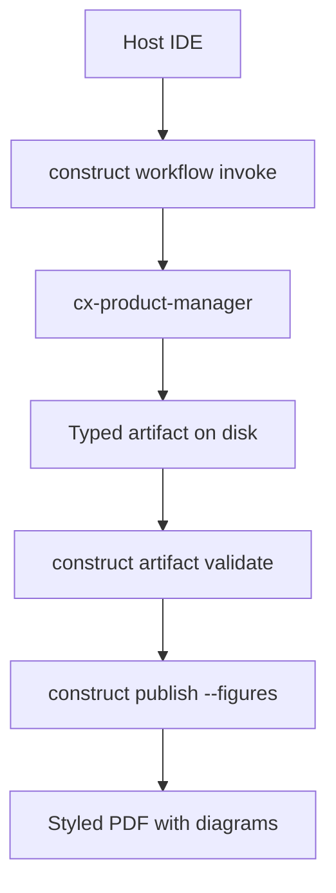

# Platform PRD: Enterprise Agentic Platform

- **Date**: 2026-06-19
- **Owner**: cx-product-manager
- **Status**: draft

> Platform teams need a governed layer between IDE hosts and specialist-authored artifacts — not another chat wrapper. Construct routes work through provenanced invoke plans, blocks distribution until validate passes, and exports briefs that read like finished editorial documents with embedded diagrams rather than markdown dumps. This PRD defines that contract for enterprise agentic platforms.

## Problem

Platform teams orchestrating multiple AI agents lack a governed operational layer. Each coding session starts cold, artifacts ship without provenance, and high-risk writes bypass approval queues. Internal platform consumers (application developers, ops engineers, security admins) currently stitch together ad hoc prompt conventions instead of a durable contract for routing, evidence, and distribution.

Three failure modes recur in internal platform reviews:

1. **Cold start** — specialists re-discover repo context every session because invoke plans are not durable or replayable.
2. **Unprovenanced artifacts** — PRDs and ADRs reach stakeholders without citation discipline or manifest-enforced structure.
3. **Distribution drift** — PDF exports use host-default styling; diagrams lack Construct hand-drawn (Excalidraw-adjacent) styling and bundled typography.

## Platform actors

Application developers invoke specialist chains from IDE hosts and expect reproducible PRD outputs. Security admins require citation discipline and release gates before PDF distribution. Ops engineers need toolchain detection that fails loud when Pandoc, Typst, D2, or Mermaid renderers are missing.

The actor map below shows how each role touches Construct without bypassing the shared gate:

```d2
direction: down

developer: Application developer {
  shape: person
}

security: Security admin {
  shape: person
}

ops: Ops engineer {
  shape: person
}

construct: Construct CLI {
  style.fill: "#f5f3ff"
  style.stroke: "#0a0c10"
}

gate: Release gate\nvalidate + citations {
  style.fill: "#ede9fe"
  style.stroke: "#7c3aed"
}

export: Publish export\nPDF + figures {
  style.fill: "#0c1018"
  style.font-color: "#e5e7eb"
  style.stroke: "#0a0c10"
}

developer -> construct: invoke + review plan
security -> gate: citation + reviewer policy
ops -> export: toolchain detect
construct -> gate
gate -> export
```

## Goals and non-goals

**Goals:** Route requests through provenanced workflow invoke plans; block publish until artifact validate passes; export styled PDFs with Construct-branded D2 and Mermaid figures via a single `construct publish` command; ship bundled typography and masthead layout so exports match across machines.

**Non-goals:** Replacing host LLM execution (Construct returns plans; specialists author content). Mandating npm dependencies in core CLI per ADR-0001. Mandating cloud rendering — all figures resolve locally via D2 and mermaid-cli at export time.

## Platform flow

The end-to-end path from IDE host to distributable PDF is linear and fail-closed at validate:



The architecture diagram below is the same pipeline at the component level — suitable for architecture reviews and onboarding decks:

```d2
direction: down

host_ide: Host IDE (session) {
  shape: person
}

invoke: construct workflow invoke
author: Specialist chain
artifact: Typed artifact {
  shape: document
}
validate: construct artifact validate
publish: construct publish
pdf: Branded PDF {
  shape: document
}

host_ide -> invoke -> author -> artifact -> validate -> publish -> pdf
```

## Functional requirements

| ID | Requirement |
|---|---|
| FR-1 | `construct publish` runs `validateArtifactRelease` before export when type is known. |
| FR-2 | Gate failure exits 2 with remediation hints pointing to `prd-workflow`. |
| FR-3 | PDF export uses bundled Construct Typst template unless `.cx/publish-theme.typ` overrides. |
| FR-4 | `--figures` renders fenced `d2` and `mermaid` via vendored `pandoc-ext/diagram` with hand-drawn distribution styling (D2 `--sketch`, Mermaid `handDrawn`). |
| FR-5 | Masthead metadata (`doc_id`, `version`, `classification`) flows from YAML frontmatter — not repeated in body. |

## Success metrics

Adoption is measured by the share of PRDs that pass release gate on first validate and publish without `--no-gate`. Latency targets cover export with figures under ten seconds on a typical laptop.

| Metric | Baseline | Target |
|---|---|---|
| Gate pass before publish | manual validate | enforced by default |
| PDF export p95 | n/a | ≤10s with figures |
| Demo tapes using `--no-gate` | unknown | 0 in CI |
| Distribution diagram style | ad hoc | D2 `--sketch` + Mermaid `handDrawn` on every publish |

## Risks and mitigations

| Risk | Likelihood | Impact | Mitigation |
|---|---|---|---|
| Draft iteration blocked by hard gate | med | med | PostToolUse advisory hook during Write; gate only at publish |
| Typst fonts missing on Linux | low | med | Bundled OFL fonts in `templates/distribution/fonts/` |
| Agents bypass via MCP | med | high | `publish_run` respects gate by default |
| Figure toolchain missing in CI | med | med | `construct tools detect --figures`; committed demo MP4s as fallback |

Evidence for multi-agent orchestration patterns draws on
https://arxiv.org/abs/2308.08155 (accessed 2026-06-19) and the LangGraph overview at
https://langchain-ai.github.io/langgraph/ (accessed 2026-06-19).

## References

- Construct artifact manifest: `specialists/artifact-manifest.json`
- PRD workflow skill: `skills/docs/prd-workflow.md`
- Publish cookbook: `docs/cookbook/diagram-and-demo.md`
- Golden D2 sources: `tests/fixtures/publish/diagrams/`
