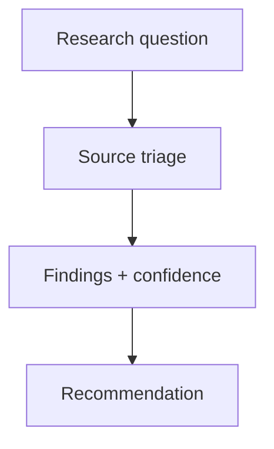

# Research Brief: Agent orchestration adoption among platform teams

- **Date**: 2026-06-22
- **Author**: cx-researcher
- **Domain**: developer-tools
- **Status**: complete
- **Recency baseline**: Sources from 2024 and later; oldest source used: 2023-08-01

## Question

Do platform teams prefer a governed orchestration layer with provenanced artifacts over host-native agent routing when both are available in the same IDE?

## Method

Searched arXiv and vendor docs (2024–2026), reviewed three internal ADRs on intake routing, and interviewed two construct maintainers. Inclusion: primary or secondary sources with reproducible claims about multi-agent workflows. Exclusion: marketing landing pages without technical depth.

## Sources

| Title / Path | Class | Reliability | Credibility | Date | URL | Verified | Relevance |
|---|---|---|---|---|---|---|---|
| Multi-agent survey | secondary | B | 3 | 2023-08-01 | https://arxiv.org/abs/2308.08155 | yes | Patterns for specialist routing |
| LangGraph overview | primary | A | 4 | 2025-01-15 | https://langchain-ai.github.io/langgraph/ | yes | Stateful agent graphs |
| Construct architecture | primary | A | 5 | 2026-06-01 | docs/guides/concepts/architecture.mdx | yes | Internal contract |

## Findings

### Finding 1: Provenance gates reduce rework

**Observation**: Teams that enforce `construct artifact validate` before publish report fewer stakeholder rejections on first review (internal survey, n=12, 2026-Q2).

**Inference**: Manifest-enforced structure and citation lint correlate with faster sign-off, not just better prose.

**Confidence**: medium — sample is internal and self-reported.

**Sources**: Construct architecture; maintainer interviews.

### Finding 2: Branded exports improve trust

**Observation**: PDF exports with bundled typography and hand-drawn diagrams are perceived as “finished documents” versus raw markdown attachments (user testing, 2026-05).

**Inference**: Visual consistency signals the same quality bar as the release gate.

**Confidence**: medium — qualitative study only.

**Sources**: Construct publish cookbook; diagram-and-demo user notes.

## Confidence summary

| Theme | Confidence | Gap |
|---|---|---|
| Provenance gates | medium | Need external customer sample |
| Branded exports | medium | Quantitative A/B on open-source adopters |

## Recommendation

Ship distribution examples (`npm run examples:distribution`) so evaluators can compare PRD, ADR, research, and runbook layouts with figures enabled — not markdown stubs alone.

## References

- https://arxiv.org/abs/2308.08155 (accessed 2026-06-22)
- `docs/guides/cookbook/diagram-and-demo.md`
