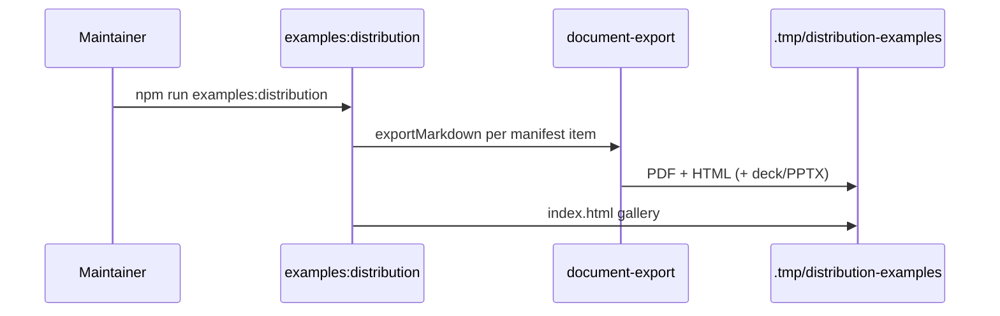

# RFC: Distribution examples gallery

- **Date**: 2026-06-22
- **Status**: proposed
- **Authors**: architect, operations
- **Reviewers**: product-manager, operations

## Summary

Add `examples/distribution/` sources and `npm run examples:distribution` to regenerate branded PDF, HTML, deck, and PPTX outputs under `.tmp/distribution-examples/` with figures enabled.

## Motivation

Evaluators and maintainers need side-by-side samples of PRD, ADR, research, runbook, and strategy layouts — not certification stubs. Visual richness (Mermaid + D2, metrics tables, severity matrices) demonstrates the publish pipeline under real toolchain conditions.

## Detailed design

```d2
direction: right

sources: examples/distribution/sources
script: generate-distribution-examples.mjs
out: .tmp/distribution-examples

sources -> script -> out
```

| Artifact type | Typst layout | Example source |
|---|---|---|
| prd-platform | construct-prd.typ | prd-platform.md |
| adr | construct-decision.typ | adr.md |
| research-brief | construct-research.typ | research-brief.md |
| runbook | construct-prd.typ | runbook.md |
| strategy | construct-prd.typ | strategy.md |
| one-pager deck | construct-deck.html | deck-one-pager.md |

The generator reads `manifest.json`, calls `exportMarkdown` with `figures: true`, and writes `index.html` linking all outputs.



## Drawbacks

- Requires local pandoc, typst, d2, mmdc — fails loud when missing (intentional).
- `.tmp/` is gitignored; CI may commit snapshots separately if needed.

## Alternatives considered

**Check in binary PDFs.** Rejected — large diffs and stale quickly.

**MkDocs-only previews.** Rejected — does not exercise Typst brand templates.

## Unresolved questions

- Should certification gate regenerate examples on every `release:check`? Deferred — opt-in script for now.

## References

- `docs/guides/reference/branding.md`
- `scripts/generate-deck-examples.mjs` (prior art)
