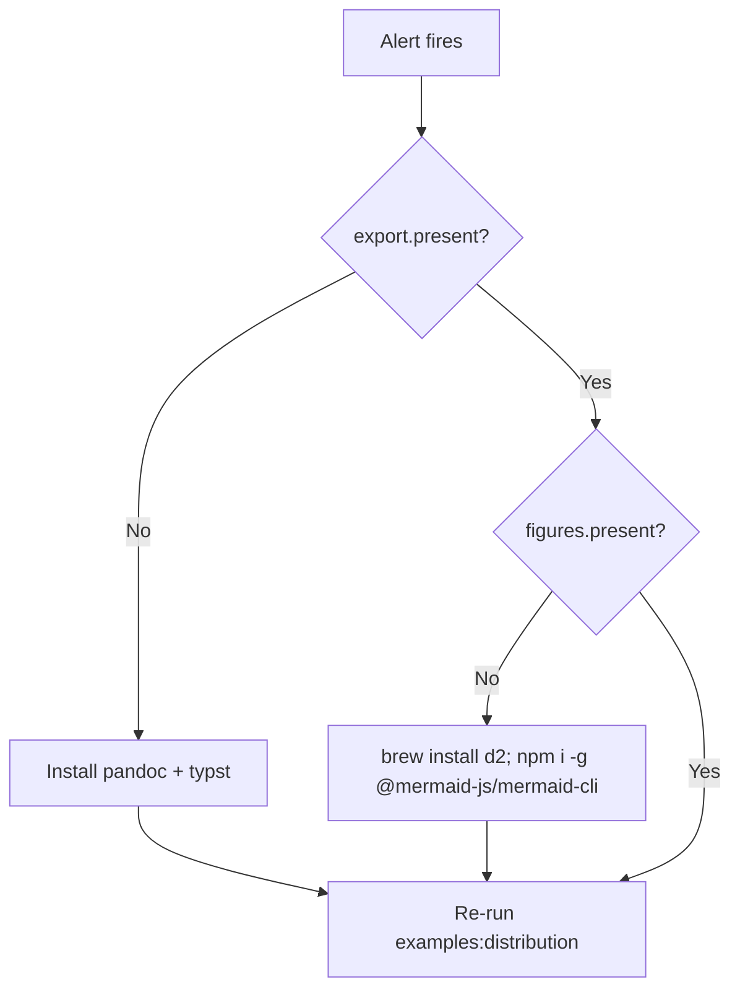

# Runbook: construct publish / export failures

- **Service**: document-export (`construct publish`, `construct export`)
- **Owner**: platform on-call
- **Last tested**: 2026-06-22
- **Severity**: SEV-2 when exports block release; SEV-3 when examples only

## Alert trigger

`construct publish` exits 2 with `missing: pandoc` or `Figure tooling` in `construct tools detect --figures` output. CI job `release:check` fails on export certification scenarios.

## Symptoms

- PDF export fails before Typst invocation
- `--figures` renders empty diagram placeholders
- `npm run examples:distribution` reports partial failures in summary

## Impact

| Audience | Impact |
|---|---|
| Release managers | Cannot ship branded PRDs/ADRs |
| Developers | Local previews blocked |
| Agents | `publish_run` MCP tool returns remediation hints |

## Severity and response

| Severity | Trigger condition | Page within | Comms | Error budget |
|----------|-------------------|-------------|-------|--------------|
| SEV-1 | All publish paths down in CI | 5 min | #incident + status | breach → freeze |
| SEV-2 | PDF down, HTML OK | 15 min | #platform | partial spend |
| SEV-3 | Examples script only | business hours | team channel | none |

## Diagnostic steps

1. Run `construct tools detect --figures --json` and read `steps.export` + `steps.figures`.
2. Confirm `pandoc` and `typst` on PATH; confirm `d2` and `mmdc` when `--figures` is set.
3. Re-run a single fixture: `node bin/construct export examples/distribution/sources/adr.md --to=pdf --figures`.



```d2
direction: down

detect: tools detect
pandoc: pandoc + typst
figures: d2 + mmdc
ok: Green export

detect -> pandoc: if missing
detect -> figures: if --figures
pandoc -> ok
figures -> ok
```

## Remediation

```bash
brew install pandoc typst d2 graphviz
npm install -g @mermaid-js/mermaid-cli
npm run examples:distribution
open .tmp/distribution-examples/index.html
```

Expected: index lists PDF and HTML links for each artifact type; no `FAILED` lines in script output.

## Rollback

Not applicable — this runbook restores tooling, not application state. If a bad template change caused failures, revert the Typst commit and re-run exports.

## Escalation

After 30 minutes without restore: page cx-platform-engineer. After 60 minutes with release blocked: page cx-release-manager.

## Post-incident

Preserve `construct tools detect --json` output and the failing pandoc/typst stderr in the incident ticket.

## References

- `docs/guides/reference/document-io.md`
- `docs/guides/cookbook/diagram-and-demo.md`
