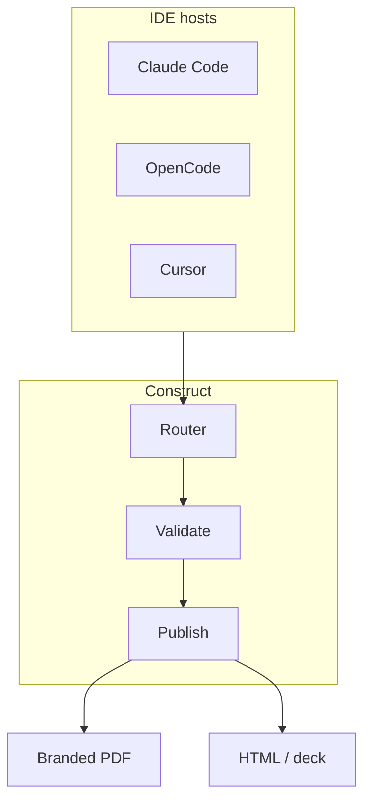

# Strategy: Governed agentic workflows for IDE-native teams

- **Date**: 2026-06-22
- **Owner**: cx-product-manager
- **Status**: draft
- **Horizon**: H1 2026 – H1 2027

> Platform and product teams want specialist routing without losing citation discipline, branded exports, or profile-aware terminology. Construct wins when evaluators can open one gallery of PDFs and see the same ink, typography, and diagram styling across document types.

## Problem

Host-native agents optimize for single-session chat. Enterprise platform teams need durable invoke plans, manifest-enforced artifacts, and distribution that looks intentional — not markdown attachments with host fonts.

## Goals

1. **Prove value in five minutes** — `npm run examples:distribution` produces a browsable gallery with figures.
2. **One brand contract** — `docs/guides/reference/branding.md` + `03d-brand` audit ratchet.
3. **Profile-aware language** — intake queue labels follow active profile rebrand in CLI, session prelude, and dashboard API.

## Non-goals

Replacing host LLM execution. Mandating cloud render farms. Re-linting every historical doc for marketing voice.

## Landscape



```d2
direction: down

construct: Construct {
  style.fill: "#f3f4f6"
}

hosts: IDE hosts
validate: Release gate
export: Branded export

hosts -> construct -> validate -> export
```

## Success metrics

| Metric | Baseline | Target |
|---|---|---|
| Brand audit findings | unknown | 0 in `03d-brand` |
| Example types with figures | 1 (PRD) | ≥6 layouts |
| Dashboard rebrand coverage | partial | intake API + pages |

## Risks and mitigations

| Risk | Mitigation |
|---|---|
| Toolchain missing on contributor laptops | `construct tools detect --figures` in runbook |
| Template drift | Functional tests on `construct-brand.typ` + HTML decks |
| Profile label regressions | `intake-rebrand.functional.test.mjs` |

## References

- `examples/distribution/manifest.json`
- https://langchain-ai.github.io/langgraph/ (accessed 2026-06-22)
