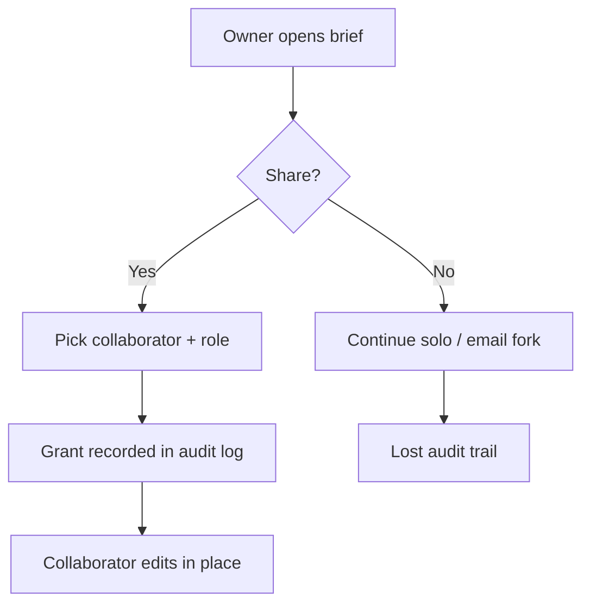

# PRD: Team workspace sharing for collaborative briefs

- **Date**: 2026-07-20
- **Owner**: product-manager
- **Status**: draft

## TL;DR

Collaborators today fork PRD and brief files over email, losing auditability and least-privilege access. This PRD proposes a Phase-1 named-user share for briefs (viewer/editor roles + grant/revoke audit log) and defers public unauthenticated links. The decision sought is whether to approve Phase 1 with mandatory privacy/legal gates before any marketing claim of “enterprise-ready sharing.” Load-bearing adoption and ROI figures remain `unknown` / `[unverified]` until instrumented.

## Background

Support and research notes describe friction when product, legal, and design hand off draft briefs as attachments. Prior related ADR in this fixture: none (`[unverified]` whether one exists in a host repo).

| Evidence source | Type | What it shows | Link / id |
|---|---|---|---|
| Product-manager anti-pattern: missing user evidence | qualitative guidance | Requirements need ≥2 sources | `skills/perspectives/product-manager.md` |
| Artifact authorship trigger matrix | process | User advocacy + competitive + legal required | `skills/docs/artifact-authorship.md` |
| Live interview corpus for this fixture | qualitative | unknown | `[unverified]` — research task required before scope lock |

Implication: **research-required** for a second primary user-evidence source before locking Phase 2 scope. Stakeholder preference alone is insufficient.

## Problem

Collaborators cannot share a single editable brief with least-privilege access, so teams fork copies and lose the audit trail of who changed what. The pain is collaboration integrity and access control — not a slogan about a missing “share button.”

## Outcomes - Goals & Non-Goals

**Goals:**

1. An owner can grant viewer or editor access to a named registered account for a single brief.
2. Grant and revoke events are durable in an access audit log with a named retention policy (or an owned open question).
3. Public unauthenticated links remain impossible in Phase 1 (explicit non-goal + release test).

**Non-goals:**

| Non-goal | Why deferred |
|---|---|
| Public unauthenticated share links | Data-leak blast radius; legal gate not ready |
| Anonymous comments | Identity and moderation unknown |
| SSO SCIM auto-provisioning | Depends on IdP readiness (`unknown`) |
| Domain-wide auto-share policies | Adjacent; needs separate threat model |

## Why This Matters Now

Email forks create contradictory “sources of truth” across product and legal review cycles. Timing pressure is inferred from process friction in the authorship contract and legal overlays — not from a measured incident rate (`unknown` ticket volume). Competitive pressure from unnamed SaaS ACL suites is `unknown` until researched. Legal/privacy windows matter because share grants process collaborator emails (PII) immediately in Phase 1.

| Trigger | Present? | Why it forces timing |
|---|---|---|
| User harm / support load | unknown | No ticket corpus yet — research-required |
| Competitive pressure | unknown | See Competitive section |
| Legal / compliance window | yes | Collaborator emails + ToS for sharing |
| Cost of delay | unknown | `[unverified]` until cost-of-delay model exists |

## Competitive Landscape & Financial Considerations

### Competitive landscape

| Competitor / alternative | Dimension | Their approach | Our stance | Source |
|---|---|---|---|---|
| Email + attachments | workflow | Forked files | Differentiate with in-place share + audit | observed practice (no URL) |
| Unnamed SaaS suite ACL | ACL model | unknown | unknown | unknown |
| Market-share claim | share % | unknown | Do not invent | `[unverified]` |

### Financial considerations

| Item | Estimate | Confidence | Source |
|---|---|---|---|
| Build / run cost | unknown | low | `[unverified]` — owner: platform eng by 2026-08-15 |
| Expected value / ROI | unknown | low | `[unverified]` — instrument email-export rate first |
| Support / compliance cost | unknown | low | privacy retention decision pending |

Refuse fabricated “40% faster collaboration” launch claims until instrumented.

## Phases

### Phase 1: Named share MVP

- **Goal**: Owner shares one brief with one registered collaborator under viewer/editor roles; grant/revoke audited.
- **Status**: not started
- **Requirements**: FR-1.1, FR-1.2, FR-1.3, FR-1.4
- **Exit**: AC table for FR-1.* green in review; public-link release test fails closed; privacy storage design signed off.

### Phase 2: Multi-collaborator + retention policy

- **Goal**: Multiple collaborators per brief; retention period for audit logs decided and enforced.
- **Status**: not started
- **Requirements**: FR-2.1, FR-2.2
- **Exit**: Retention open question closed; second user-evidence source present or Phase 2 deferred.

### Phase 3: Domain policies (deferred)

- **Goal**: Optional domain-wide share defaults — only after threat model.
- **Status**: deferred
- **Requirements**: FR-3.1
- **Exit**: Explicit go/no-go from security after Phase 2 evidence.

## Requirements

### Phase 1 requirements

#### FR-1.1: Owner can grant editor or viewer access to a registered user

The system must let an authenticated brief owner select a registered account and assign viewer or editor. Non-grantees must not read or edit. Role semantics: viewer read-only; editor can mutate brief body. Evidence for need: authorship contract + PM anti-pattern (Background); live corpus still `unknown`.

- **Phase**: 1
- **Acceptance criteria**: AC-1.1.1, AC-1.1.2
- **NFR notes**: authz checks on every read/write; no IDOR

#### FR-1.2: Owner can revoke access within a stated SLO

Revocation must remove edit and read capability within 60 seconds of the revoke action for active sessions, or document a stricter/weaker SLO with owner if 60s is `unknown` as a measured capability.

- **Phase**: 1
- **Acceptance criteria**: AC-1.2.1
- **NFR notes**: reliability — revoke propagation

#### FR-1.3: Share grant and revoke events are written to an access audit log

Each grant/revoke records actor, subject, role, brief id, and timestamp. Plaintext secrets must not appear in the share payload or audit row.

- **Phase**: 1
- **Acceptance criteria**: AC-1.3.1, AC-1.3.2
- **NFR notes**: privacy — storage design review required

#### FR-1.4: Share dialog is keyboard operable and meets a11y checklist

Share UI must be operable without a pointer and announced correctly to assistive tech per `designer.accessibility` checklist for this surface.

- **Phase**: 1
- **Acceptance criteria**: AC-1.4.1
- **NFR notes**: accessibility

### Phase 2 requirements

#### FR-2.1: Multiple named collaborators on one brief

Support ≥2 concurrent collaborators with independent roles without corrupting the audit trail.

- **Phase**: 2
- **Acceptance criteria**: AC-2.1.1
- **NFR notes**: consistency under concurrent edits — details `unknown` pending design

#### FR-2.2: Audit-log retention period enforced

Retain grant/revoke events for a privacy-approved period; deletion path named. Period currently `unknown` (open question).

- **Phase**: 2
- **Acceptance criteria**: AC-2.2.1
- **NFR notes**: compliance / privacy

### Phase 3 requirements

#### FR-3.1: Domain-wide auto-share policy (deferred)

Out of Phase 1–2 scope. Placeholder so hierarchy remains honest about deferred work.

- **Phase**: 3
- **Acceptance criteria**: AC-3.1.1
- **NFR notes**: security threat model required before design

## Acceptance Criteria

| AC id | FR id | Criterion (stranger-checkable) | Verification method |
|---|---|---|---|
| AC-1.1.1 | FR-1.1 | Grantee with editor can edit; non-grantee receives 403 on edit and read | automated API + manual |
| AC-1.1.2 | FR-1.1 | Viewer can read and cannot mutate body | automated |
| AC-1.2.1 | FR-1.2 | Within 60s of revoke, former editor’s write returns 403 | automated timing test |
| AC-1.3.1 | FR-1.3 | Audit row exists for grant and revoke with actor, subject, role, brief id, timestamp | log inspection |
| AC-1.3.2 | FR-1.3 | Security review confirms no plaintext secrets in share payload/storage | security review sign-off |
| AC-1.4.1 | FR-1.4 | Share dialog completes grant via keyboard only; checklist pass by designer.accessibility | a11y review |
| AC-2.1.1 | FR-2.1 | Two editors can hold distinct roles; audit lists both grants | automated + review |
| AC-2.2.1 | FR-2.2 | Retention job deletes or archives rows past approved period; deletion path documented | ops + privacy review |
| AC-3.1.1 | FR-3.1 | No domain auto-share ships without signed threat model | release gate test |

## Success Metrics

| Metric | Type | Baseline | Target | Owner | Source |
|---|---|---|---|---|---|
| Email-export rate for briefs | lagging | unknown | unknown (instrument first) | product-manager | `[unverified]` |
| Share-grant success rate (no 5xx) | leading | n/a | ≥99% of attempts | platform eng | to instrument |
| Public-link attempts blocked in Phase 1 | leading | n/a | 100% blocked | security | release test |

## Risks

### Delivery and product risks

| Risk | Likelihood | Impact | Mitigation or accept-with-rationale |
|---|---|---|---|
| Oversharing PII inside briefs | med | high | Default deny; classify data; privacy review |
| Fabricated adoption claims in launch copy | med | med | Anti-fabrication gate; mark unknowns |
| Public link scope creep | med | high | Out-of-scope + release test AC-3.1.1 / Phase 1 exit |

### Legal, privacy, and compliance triggers

| Trigger | Present? | Data / activity | Specialist to recruit | Gate before ship |
|---|---|---|---|---|
| PII / accounts / identity | yes | collaborator emails, audit actors | security.privacy | retention + deletion path named |
| Payments / money movement | no | n/a | n/a | N/A |
| Contracts / ToS / licenses | yes | sharing terms / acceptable use | security.legal-compliance | counsel or policy owner named |
| Minors / sensitive categories | unknown | depends on brief content | privacy + legal-compliance | explicit block or approved design |
| AI processing / model training | no | n/a | n/a | N/A |
| Cross-border transfer | unknown | collaborator region | security.legal-compliance | transfer mechanism or unknown |

### Adversarial challenge (FMEA)

| Failure mode | Effect | Cause | S×O×D (1–10) | Mitigation or accept-with-rationale |
|---|---|---|---|---|
| Author ships without legal review | Regulatory / trust damage | Trigger table skipped | 8×6×4=192 | Mandatory legal checklist + reviewer gate |
| Invented “40% faster collab” metric | Misleading launch | Fabrication | 7×5×3=105 | Mark unknown; instrument first |
| Public link sneaks into Phase 1 | Data leak | Scope creep | 9×4×5=180 | Out-of-scope row + release test |

### Open questions

| Question | Owner | Decision needed by |
|---|---|---|
| What is the retention period for share audit logs? | security.privacy | 2026-08-01 |
| Is counsel required before ToS update for sharing? | security.legal-compliance | 2026-08-01 |
| Where is the second primary user-evidence source? | researcher | 2026-07-27 |
| What is measured revoke SLO if 60s is wrong? | engineer.platform | 2026-08-08 |

## References

- `skills/docs/artifact-authorship.md`
- `skills/docs/prd-workflow.md`
- `skills/perspectives/security.legal-compliance.md`
- `skills/perspectives/product-manager.md`
- `templates/docs/prd.md` (12-section + Phase→FR→AC contract)
- Bead: `construct-9jkma`
