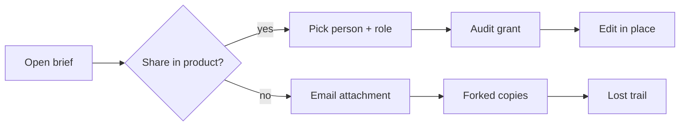
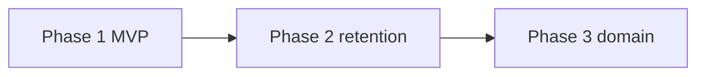

## TL;DR

Product managers, legal reviewers, and designers still ship draft briefs as email attachments. Every fork forgets who changed what and who was allowed to see it, so the second reader leaves the product the moment collaboration starts.

This PRD asks for approval of **Phase 1 only**: a brief owner grants viewer or editor access to one named registered account, grant and revoke land in an access audit log, and public unauthenticated links stay impossible. Retention period, multi-collaborator polish, and domain-wide policies wait until privacy, research, and threat modeling close their open questions.

Expansion revenue tied to “enterprise-ready sharing” stays `unknown` until sales provides deal IDs. Don't invent ROI, customer quotes, or ticket volume. Related decisions live in `stress-share-audit-adr.md` (append-only audit storage) and `stress-share-compliance-memo.md` (counsel gates before marketing claims).

## Background

Today a brief leaves the product the moment it needs a second reader. Support playbooks and authorship rules describe the workaround: export, attach, hope the right people open the right copy. That pattern is familiar and free, and it erases least-privilege access and any hope of reconstructing exposure after an overshare.

What we can re-verify today is process and craft evidence, not a second primary interview corpus for this fixture. Researcher marks the live corpus **research-required** before Phase 2 locks multi-collaborator scope. Architect already proposes append-only audit rows (`ADR-STRESS-SHARE-001`) so investigators aren't stuck with “current ACL only.” Privacy and legal-compliance fire immediately on collaborator emails and sharing terms; see the companion compliance memo.

| Evidence | What it shows | Link / id |
|---|---|---|
| PM anti-pattern: missing user evidence | Requirements need ≥2 independent sources before locking scope | [source: skills/perspectives/product-manager.md] |
| Artifact authorship trigger matrix | User advocacy + competitive + legal discovery are mandatory, not optional | [source: skills/docs/artifact-authorship.md] |
| Accessibility overlay | Share UI must be keyboard- and assistive-tech operable; automated axe alone is insufficient | [source: skills/perspectives/designer.accessibility.md] |
| Privacy / legal-compliance perspectives | PII, retention, ToS, and fabricated-citation refusal | [source: skills/perspectives/security.legal-compliance.md] |
| Live interview corpus for brief owners | unknown | `[unverified]`; researcher task before Phase 2 lock |
| Support volume of email-fork tickets | unknown | `[unverified]`; owner: support ops by 2026-08-15 |

People in this story are named by role and context, not as a monolithic “user.” Brief owners start shares; collaborators receive them; legal reviewers and designers are frequent second readers; privacy investigators reconstruct exposure; ops and QA own revoke timing and release gates.

## Problem

Collaborators can't share one editable brief under least privilege, so they fork files and erase the audit trail. The pain is collaboration integrity and access control, not a missing “share button” slogan.

When a legal reviewer needs to mark up a draft, or a designer needs to comment on framing, the current path forces them out of the product. People who navigate without a pointer, or who rely on screen readers, get whatever accessibility the email client happens to provide (not our product surface, and not something we can gate). Ops can't answer “who had editor access last Tuesday?” because there's no durable grant history. Security questionnaires already ask for share ACL and audit (`[unverified]` which RFPs; owner: product-manager by 2026-08-01). Without a real answer, expansion deals stall while email forks keep compounding.

*Figure: the break between in-product named share and the email-fork path that destroys reconstructability.*

## Outcomes - Goals & Non-Goals

**Goals**

1. A brief owner can grant viewer or editor access to a named registered account for one brief, and the collaborator can do their job without leaving the product.
2. Grant and revoke events land in an access audit log with a retention policy that privacy owns (or an open question with a dated owner, not a silent gap).
3. Public unauthenticated links are impossible in Phase 1 and covered by a release test that fails closed.
4. The share dialog is operable without a pointer and announced correctly to assistive technologies (WCAG 2.2 AA target for this surface).

**Non-goals**

- Public unauthenticated share links: blast radius and legal gate not ready; counsel and threat model required first
- Anonymous comments: identity and moderation unknown
- SSO / SCIM auto-provisioning: IdP readiness unknown
- Domain-wide auto-share policies: needs a separate threat model (Phase 3 placeholder only)
- Claiming “enterprise-ready” or “GDPR compliant” in marketing: blocked until compliance-memo gates pass

## Why This Matters Now

Named-user share is the gating capability for paid team seats. Without ACL and audit, expansion conversations stall in security review while support keeps triage-ing email forks. Observation: enterprise questionnaires already ask for share ACL and audit (`[unverified]` which RFPs; owner: product-manager by 2026-08-01). Inference: delaying Phase 1 compounds toil for brief owners and collaborators and compresses the team-plan packaging window before 2026-Q4 (roadmap intent, not revenue evidence).

Privacy’s clock starts the day collaborator emails land in audit rows. Shipping share without a retention decision isn't “move fast”; it's creating indefinite PII storage by accident. Legal-compliance refuses marketing claims until ToS and counsel gates are explicit. Researcher won't let Phase 2 lock on a single process-doc evidence base.

| Timing dimension | Estimate / window | Source |
|---|---|---|
| Revenue at risk | Expansion seats blocked; $ unknown | `[unverified]`; owner: sales ops by 2026-08-15 |
| Upside / opportunity window | Team-plan packaging before 2026-Q4 | roadmap intent (not evidence) |
| Market timing | Workspace ACL suites spreading in questionnaires | unknown; research-required |
| Cost of delay | Email-fork toil compounds; $ unknown | support playbook; $ owner: support by 2026-08-15 |
| Competitive window | SaaS ACL suites already ship share + audit | see Competitive; research-required for primary URLs |
| Compliance / legal deadline | Collaborator emails (PII) on Phase 1 ship | privacy overlay; counsel before “enterprise-ready” claims |

## Competitive Landscape & Financial Considerations

### Competitive landscape

The real alternative isn't another SaaS logo. It's email. Attachment forks are free, familiar, and opaque. Workspace tools (Notion / Docs class) already teach people named share; vertical SaaS ACL suites show up in security questionnaires. We match named share in Phase 1 and defer public links until counsel and threat modeling say otherwise. Architect’s stance: match the auditability bar questionnaires imply, without inventing a full event-sourced domain for every brief edit.

| Competitor / alternative | Dimension | Their approach | Our stance | Source |
|---|---|---|---|---|
| Email + attachments | workflow | Forked files, no ACL, no reconstructable trail | Differentiate: in-place share + audit | observed practice |
| Notion / Docs class | ACL + audit | Named share; optional links | Match named share; defer public links | primary docs; URL `[unverified]` until cited with access date |
| Vertical SaaS ACL suites | questionnaire | Share + audit expected | Match Phase 1 minimum | vendor matrix unknown; research-required |

### Financial considerations

Structural economics aren't ready for a launch number. Refuse fabricated “40% faster collaboration” or seat-attach percentages. Instrument email-export rate before any ROI claim. Platform engineering owns build/run cost ranges once scoped; until then every cell stays unknown with a dated owner.

| Item | Low | Base | High | Source |
|---|---|---|---|---|
| Build / run cost | unknown | unknown | unknown | `[unverified]`; owner: engineer.platform by 2026-08-15 |
| Unit economics | unknown | unknown | unknown | seats × attach model required |
| Expected value / ROI | unknown | unknown | unknown | instrument email-export first |
| Support / compliance cost | unknown | unknown | unknown | retention decision pending (privacy) |

## Phases

| Phase | Name | Why? (human purpose) | Ships when | Status |
|---|---|---|---|---|
| 1 | Named share MVP | Give brief owners and collaborators a least-privilege path that keeps one document of record and a reconstructable grant trail, without waiting for retention policy or domain controls | ACs for FR-1.* green; public-link test fails closed; privacy storage design signed | not started |
| 2 | Multi-collaborator + retention | Let more than one collaborator work without corrupting audit; stop indefinite PII growth by enforcing a privacy-owned retention period | Retention decided; second user-evidence source or Phase 2 deferred | not started |
| 3 | Domain policies | Optional org-wide defaults only after threat model: reduce admin toil without creating silent blast-radius | Explicit go/no-go after signed threat model | deferred |

## Requirements

### Phase 1: Named share MVP

**Why?** Product managers, legal reviewers, and designers who co-author briefs need a least-privilege path that keeps one document of record. Phase 1 cuts the immediate risk of email forks that erase who saw what, without waiting for retention policy or domain-wide controls that privacy and security haven't signed. Architect ships append-only audit rows now so investigators aren't blocked later. Designer.accessibility gates the share dialog so people who use keyboards or assistive technologies aren't second-class collaborators. Ops and QA own revoke timing and the public-link fail-closed release test.

Owner shares one brief with one registered collaborator under viewer/editor; grant and revoke are audited; public links stay impossible.

#### Access control

##### FR-1.1: Owner can grant editor or viewer access to a registered user

The system must let an authenticated brief owner select a registered account and assign viewer or editor. Non-grantees must not read or edit. Viewer is read-only; editor may mutate the brief body. Engineer.platform owns IDOR resistance: authz on every read and write path, not only the share dialog. Roles are named for the job (viewer / editor), not gendered or ability-coded labels.

**Acceptance criteria**

1. **AC-1.1.1**: Grantee with editor can edit; a non-grantee receives HTTP 403 on both edit and read. *Verify:* automated API + one manual path (QA).
2. **AC-1.1.2**: Viewer can read the brief body and cannot mutate it. *Verify:* automated.

*NFR:* authz on every read/write; no IDOR.

##### FR-1.2: Owner can revoke access within a stated SLO

Revocation must remove edit and read capability within 60 seconds of the revoke action for active sessions, or document a measured alternate SLO with an owner. Ops cares because “revoked in the UI but still writable for minutes” is an incident waiting for a security questionnaire. Engineer.platform measures propagation; QA owns the timing test.

**Acceptance criteria**

1. **AC-1.2.1**: Within 60s of revoke, a former editor’s write returns 403. *Verify:* automated timing test.

*NFR:* revoke propagation reliability.

#### Audit and accessibility

##### FR-1.3: Share grant and revoke events are written to an access audit log

Each grant/revoke records actor, subject, role, brief id, and timestamp. Plaintext secrets must not appear in the share payload or audit row. Storage shape is decided in `ADR-STRESS-SHARE-001` (append-only). Privacy owns retention; until the period is decided, Phase 1 may ship only with an explicit open question and dated owner, not with silent indefinite retention.

**Acceptance criteria**

1. **AC-1.3.1**: Audit rows exist for grant and revoke with actor, subject, role, brief id, timestamp. *Verify:* log inspection.
2. **AC-1.3.2**: Security review confirms no plaintext secrets in share payload or storage. *Verify:* security review sign-off.

*NFR:* privacy: storage design review required; aligns with compliance-memo remediation.

##### FR-1.4: Share dialog is keyboard operable and meets a11y checklist

Share UI must be operable without a pointer and announced correctly to assistive tech per `designer.accessibility` for this surface (WCAG 2.2 AA target). Automated axe/Lighthouse alone does not pass this FR; manual keyboard path and screen-reader smoke are required. Honor `prefers-reduced-motion` if any motion is introduced. Focus order must match the visual order people see; errors must be recoverable in plain language.

**Acceptance criteria**

1. **AC-1.4.1**: Grant completes via keyboard only; checklist passed by designer.accessibility with evidence (automated + manual). *Verify:* a11y review with evidence.

*NFR:* accessibility: WCAG 2.2 AA for this surface; contractual 508/EN claims need legal-compliance before promising.

### Phase 2: Multi-collaborator + retention

**Why?** Briefs rarely stop at one collaborator. Phase 2 exists so multiple people can hold independent roles without corrupting the audit trail, and so privacy can enforce a finite retention period instead of growing collaborator-email history forever. Researcher blocks lock of this phase until a second primary user-evidence source exists (or the phase is explicitly deferred). Ops owns the retention job; QA verifies deletion/archival paths.

Multiple collaborators per brief; retention period for audit logs decided and enforced.

#### Collaboration scale

##### FR-2.1: Multiple named collaborators on one brief

Support ≥2 concurrent collaborators with independent roles without corrupting the audit trail. Concurrent-edit consistency details remain `unknown` pending design. Don't invent CRDT or lock semantics here.

**Acceptance criteria**

1. **AC-2.1.1**: Two editors can hold distinct roles; audit lists both grants. *Verify:* automated + review.

*NFR:* concurrent-edit consistency: details `unknown` pending design.

#### Retention

##### FR-2.2: Audit-log retention period enforced

Retain grant/revoke events for a privacy-approved period; deletion path named. Period currently `unknown` (open question owned by security.privacy). Compliance memo treats unset retention as a high-severity gap that blocks GA marketing claims.

**Acceptance criteria**

1. **AC-2.2.1**: Retention job deletes or archives rows past the approved period; deletion path documented. *Verify:* ops + privacy review.

*NFR:* compliance / privacy.

### Phase 3: Domain policies (deferred)

**Why?** Domain-wide auto-share defaults can reduce admin toil for large teams, and can also create silent blast-radius if misconfigured. This phase stays visible so deferred work is honest, but it doesn't ship without a signed threat model. Security and architect own go/no-go; product doesn't sneak domain share into Phase 1 under a different name.

Optional domain-wide share defaults: only after threat model.

#### Domain policy

##### FR-3.1: Domain-wide auto-share policy (deferred)

Out of Phase 1–2 scope. Placeholder so hierarchy stays honest.

**Acceptance criteria**

1. **AC-3.1.1**: No domain auto-share ships without a signed threat model. *Verify:* release gate test.

*NFR:* security threat model required before design.

## Acceptance Criteria

| AC id | FR | Criterion | Verify |
|---|---|---|---|
| AC-1.1.1 | FR-1.1 | Editor can edit; non-grantee gets 403 on edit and read | automated + manual |
| AC-1.1.2 | FR-1.1 | Viewer reads; cannot mutate | automated |
| AC-1.2.1 | FR-1.2 | Within 60s of revoke, former editor write returns 403 | automated timing |
| AC-1.3.1 | FR-1.3 | Audit row for grant/revoke with actor, subject, role, brief id, timestamp | log inspection |
| AC-1.3.2 | FR-1.3 | No plaintext secrets in share payload/storage | security review |
| AC-1.4.1 | FR-1.4 | Keyboard-only grant; a11y checklist pass (automated + manual) | a11y review |
| AC-2.1.1 | FR-2.1 | Two collaborators, distinct roles, both in audit | automated + review |
| AC-2.2.1 | FR-2.2 | Retention job + documented deletion path | ops + privacy |
| AC-3.1.1 | FR-3.1 | No domain auto-share without signed threat model | release gate |

## Success Metrics

Instrument before celebrating. Email-export rate is the leading honesty check on whether forks actually decline. Share-grant success rate catches platform regressions before people fall back to email. Public-link attempts blocked proves the Phase 1 non-goal held under release pressure.

| Metric | Type | Baseline | Target | Owner | Source |
|---|---|---|---|---|---|
| Email-export rate for briefs | lagging | unknown | unknown (instrument first) | product-manager | `[unverified]` |
| Share-grant success rate (no 5xx) | leading | n/a | ≥99% of attempts | engineer.platform | to instrument |
| Public-link attempts blocked in Phase 1 | leading | n/a | 100% blocked | security + qa | release test |
| Keyboard-only share completion | leading | n/a | checklist pass | designer.accessibility | a11y evidence |

## Risks

### Delivery and product risks

Oversharing PII inside briefs and public-link scope creep are the two failures that turn a collaboration feature into an incident. Fabricated launch metrics are a trust failure we already know how to refuse. Reviewer’s adversarial pass keeps these failure modes visible with severity, not buried in a appendix.

| Risk | L | I | Mitigation or accept-with-rationale |
|---|---|---|---|
| Oversharing PII inside briefs | med | high | Default deny; classify data; privacy review |
| Fabricated adoption claims in launch copy | med | med | Anti-fabrication gate; mark unknowns |
| Public link scope creep | med | high | Out-of-scope + AC-3.1.1 / Phase 1 exit |
| A11y theater (axe-only green) | med | high | Manual keyboard + screen-reader evidence required |
| Phase 2 lock without second evidence source | med | med | Researcher gate; defer Phase 2 if unmet |

### Legal, privacy, and compliance triggers

| Trigger | Present? | Data / activity | Specialist to recruit | Gate before ship |
|---|---|---|---|---|
| PII / accounts / identity | yes | collaborator emails, audit actors | security.privacy | retention + deletion path; DPIA if novel |
| Payments / money movement | no | n/a | n/a | N/A |
| Contracts / ToS / licenses | yes | sharing terms / acceptable use | security.legal-compliance | counsel or policy owner; compliance-memo |
| Minors / sensitive categories | unknown | depends on brief content | privacy + legal-compliance | explicit block or approved design |
| AI processing / model training | no | n/a | n/a | N/A |
| Cross-border transfer | unknown | collaborator region | security.legal-compliance | transfer mechanism or unknown |

Companion: `examples/distribution/sources/stress-share-compliance-memo.md`.

### Adversarial challenge (FMEA)

| Failure mode | Effect | Cause | S×O×D | Mitigation or accept-with-rationale |
|---|---|---|---|---|
| Author ships without legal review | Regulatory / trust damage for brief owners and subjects | Trigger table skipped | 192 | Mandatory legal checklist + reviewer gate |
| Invented “40% faster collab” metric | Misleading launch; erodes trust with security reviewers | Fabrication under launch pressure | 105 | Mark unknown; instrument first |
| Public link sneaks into Phase 1 | Data leak; people who never consented get exposed | Scope creep | 180 | Out-of-scope row + release test |
| Append-only log without retention | Indefinite collaborator-email PII | Privacy open question ignored | 168 | Retention job is Phase 2 ship gate; period dated |
| A11y claimed from automated scan only | People who use assistive tech cannot complete share | Checklist theater | 120 | FR-1.4 requires manual evidence |

### Open questions

| Question | Owner | Needed by |
|---|---|---|
| Retention period for share audit logs? | security.privacy | 2026-08-01 |
| Counsel required before ToS update for sharing? | security.legal-compliance | 2026-08-01 |
| Second primary user-evidence source? | researcher | 2026-07-27 |
| Measured revoke SLO if 60s is wrong? | engineer.platform | 2026-08-08 |
| DPIA required for this processing? | security.privacy | 2026-08-08 |
| Expansion $ at risk (deal IDs)? | sales ops | 2026-08-15 |
| Concurrent-edit consistency model for Phase 2? | architect + designer | before Phase 2 design freeze |

## References

- `examples/distribution/sources/stress-share-audit-adr.md`
- `examples/distribution/sources/stress-share-compliance-memo.md`
- `examples/distribution/sources/stress-multi-persona-deck.md`
- `skills/docs/artifact-authorship.md`
- `skills/docs/prd-workflow.md`
- `skills/perspectives/security.legal-compliance.md`
- `skills/perspectives/designer.accessibility.md`
- `skills/perspectives/product-manager.md`
- `skills/perspectives/researcher.md`
- `templates/docs/prd.md`
- Bead: `construct-pe9sv` (depth-bar lineage; this fixture is a scenario stress, not a production PRD)
