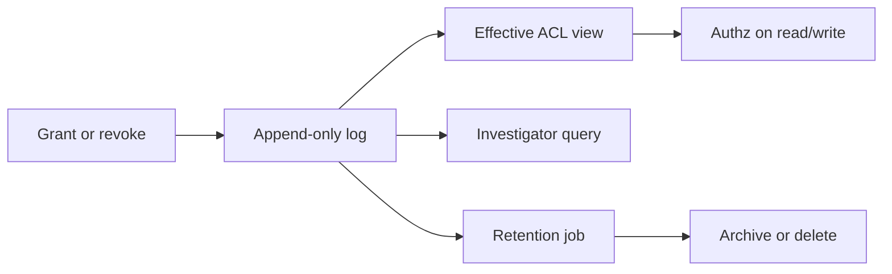

- **Deciders**: architect, security.privacy, engineer.platform
- **Supersedes**: none
- **Related**: PRD-STRESS-001 (FR-1.3 / FR-2.2), COMP-STRESS-SHARE-001

## Problem

When a brief is shared, grant and revoke events must survive investigation after an overshare. Mutable “current ACL only” storage can't answer who had editor access last Tuesday, and privacy investigators, legal reviewers, and ops on-call can't reconstruct exposure without that history.

Brief owners and collaborators already leave the product for email when share is missing. If we ship named share with only a live ACL snapshot, we fix the collaboration surface while leaving the forensic gap that security questionnaires and incident response care about. The decision is forced now because Phase 1 of the sharing PRD requires audited grants (FR-1.3) before GA marketing claims, and privacy refuses indefinite collaborator-email storage without a deletion path.

This is a scenario fixture for distribution stress testing. It doesn't invent production incident IDs, customer names, or measured storage-cost percentages.

## Context

Forces pull in different directions. Product and engineer.platform want a shippable Phase 1 without a full event-sourced brief domain. Privacy needs historical reconstructability **and** a finite retention job. Ops needs a job they can monitor and a runbook investigators can follow. Reviewer will reject “append forever” as compliance theater. Researcher notes we still lack a second primary interview corpus for multi-collaborator behavior. That doesn't block this storage decision, but it does block locking Phase 2 product scope on thin evidence.

| Force | Type | Implication | Source |
|---|---|---|---|
| Phase 1 PRD FR-1.3 | hard | Audit rows required for grant/revoke | `examples/distribution/sources/stress-multi-persona-prd.md` |
| PII (collaborator emails / account ids in actor-subject fields) | hard | Retention + deletion path required before GA claims | privacy overlay; COMP-STRESS-SHARE-001 |
| Query cost of full history | soft | Prefer append-only share events with retention over full brief event sourcing | `[unverified]` cost; owner: engineer.platform by 2026-08-15 |
| Revoke SLO (60s) | hard | Authz checks must read effective ACL quickly; history is for investigation, not every request path | PRD FR-1.2 |
| Accessibility of investigator UX | soft | Phase 1 may ship SQL/runbook; inaccessible investigator UI is accepted short-term with dated follow-up | designer.accessibility; Phase 1 accept-with-rationale |

*Figure: share events append once; effective ACL serves live authz; retention bounds PII lifetime.*

## Decision

Persist every share grant and revoke as an **append-only audit row** containing actor, subject, role, brief id, and timestamp. Don't rewrite history to “fix” past grants. Derive the effective ACL for live authorization from the log (or a maintained projection that can be rebuilt). Enforce retention by an archival or deletion job owned by privacy, with ops owning job health and QA verifying the deletion path (PRD FR-2.2).

Plaintext secrets must never appear in share payloads or audit rows (PRD AC-1.3.2).

## Rationale

Investigators need historical ACL state. That's an observation from the PRD acceptance criteria, not a preference. Soft-delete of current grants alone loses forensics: once a row is gone, “who could edit last Tuesday?” becomes unknowable. Full event sourcing of every brief keystroke would answer more questions than we need for Phase 1 and carries unknown cost; architect rejects that scope until a multi-region audit mandate or similar hard force appears.

Privacy’s constraint is equal weight to reconstructability: append-only without retention is a different failure mode (indefinite PII). The decision therefore couples storage shape to a retention ship gate, even though the exact period is still an open question.

| Reason | Observation vs inference | Source |
|---|---|---|
| Investigators need historical ACL state | observation (PRD AC-1.3.1) | stress PRD |
| Soft-delete of grants alone loses forensics | inference from incident-response practice | security.privacy practice; mark as practice, not measured incident |
| Full brief event sourcing overkill for Phase 1 | inference | architect judgment; cost `[unverified]` |
| Retention job required to bound PII | observation (compliance-memo high gap) | COMP-STRESS-SHARE-001 |

## Rejected alternatives

| Alternative | What it is | Why rejected | Reconsider if |
|---|---|---|---|
| Current-ACL snapshot only | Store latest grants; overwrite on change | Can't answer historical exposure; fails privacy investigation and questionnaire reconstructability | Compliance explicitly waives history in writing |
| Full event-sourced domain | Every brief edit as an event | Overkill for Phase 1 share audit; cost and ops burden unknown | Multi-region audit mandate or regulatory order requires full history |
| Client-side-only audit export | Download CSV of grants for owners | Not durable, not investigator-trusted, easy to lose; no ops retention control | Never for security-boundary evidence |
| Immutable cloud WORM without deletion path | Write-once store with no purge | Conflicts with retention/deletion obligations for PII | Counsel approves indefinite retention with documented legal basis |

## Consequences

| Dimension | Easier | Harder | Locked in |
|---|---|---|---|
| Privacy investigations | Reconstruct who had access when | Retention period must be decided and automated | Append-only schema for share events |
| Live authz (engineer) | Clear event semantics | Must maintain effective ACL projection or fast derive | Authz path must not scan unbounded history per request |
| Storage / ops | Simple write path | Log growth; job monitoring; runbook for investigators | Retention job is a ship gate for GA claims |
| Accessibility | n/a (Phase 1) | Investigator UX may be SQL/runbook in Phase 1 | Follow-up for accessible investigation UI dated |
| Product narrative | Honest “we can audit grants” | Can't claim full document forensics | Scope limited to share grant/revoke, not every edit |

## Reversibility

| Field | Value |
|---|---|
| Door type | two-way until GA |
| Cost to reverse | Migrate rows or dual-write; unknown | `[unverified]`; engineer.platform |
| Revisit triggers | Retention period decided; volume exceeds budget; counsel requires different retention class; threat model demands domain-policy events in same store |

## Legal, privacy, and security triggers

| Trigger | Present? | Data / boundary | Specialist | Gate before accept |
|---|---|---|---|---|
| PII / accounts / identity | yes | emails or account ids in audit actors/subjects | security.privacy | retention + deletion; DPIA if counsel says novel |
| AuthN / AuthZ / secrets | yes | authz on log read; no secrets in rows | security.appsec | review AC-1.3.2; threat model for log read ACL |
| Payments / money movement | no | n/a | n/a | N/A |
| Contracts / ToS / licenses | yes | sharing terms may need ToS update | security.legal-compliance | counsel if ToS changes; see compliance memo |
| Cross-border / regulated data | unknown | collaborator region unknown | security.legal-compliance | `[unverified]`; counsel by 2026-08-01 |
| AI processing / model training | no | n/a | n/a | N/A |

People whose identifiers appear in audit rows are data subjects for retention purposes, not anonymous “log noise.” Inclusive framing: investigators and on-call engineers must be able to run the reconstruction path. Phase 1 runbook acceptance must not assume only one privileged CLI user forever.

## Adversarial challenge

| Challenge | Severity | Response |
|---|---|---|
| Append-only without deletion = indefinite PII | high | Retention job is a ship gate; period is an open question with privacy owner. Don't accept GA marketing without it. |
| Investigators lack accessible query UX | med | Accept Phase 1 with SQL/runbook; file dated follow-up owned by designer.accessibility + ops |
| Projection drift vs log truth | high | Rebuild-from-log must be possible; QA adds consistency check before GA |
| Scope creep into full edit history | med | Explicit reject of full event sourcing until hard force appears |
| Fabricated storage-cost savings to justify choice | med | Cost stays `[unverified]`; refuse invented percentages |

## Open questions

| Question | Owner | Decision needed by |
|---|---|---|
| Retention period (days/years) and archive vs delete? | security.privacy | 2026-08-01 |
| Effective ACL: derived live vs materialized projection? | architect + engineer.platform | 2026-08-08 |
| Who may read audit rows (RBAC)? | security.appsec + privacy | 2026-08-08 |
| Accessible investigator UI timeline? | designer.accessibility + ops | 2026-08-15 |
| DPIA required for this processing? | security.privacy | 2026-08-08 |

## References

- `examples/distribution/sources/stress-multi-persona-prd.md` (scenario fixture)
- `examples/distribution/sources/stress-share-compliance-memo.md`
- `examples/distribution/sources/stress-multi-persona-deck.md`
- `templates/docs/adr.md`
- `templates/docs/compliance-memo.md`
- `skills/perspectives/` overlays for architect, privacy, operations, qa
