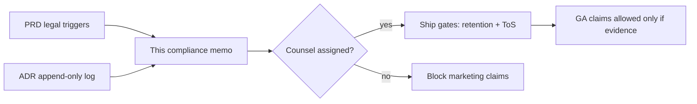

- **Related artifacts**: `examples/distribution/sources/stress-multi-persona-prd.md`, `examples/distribution/sources/stress-share-audit-adr.md`, `examples/distribution/sources/stress-multi-persona-deck.md`
- **Not legal advice**: Structures obligations for counsel review. Doesn't assert compliance. Scenario fixture for Construct publish/export stress; not a production counsel packet.

## TL;DR

Phase 1 named-user sharing processes collaborator account identifiers (often emails) and writes access audit rows. Privacy and ToS triggers fire immediately. Counsel must confirm retention period and whether a ToS update is required before any “enterprise-ready sharing” or “GDPR compliant” marketing claim.

Architect proposes append-only audit storage (`ADR-STRESS-SHARE-001`). That control helps reconstructability but **increases** residual risk if retention slips. Product’s Phase 1 may ship with an open retention question only if GA marketing stays blocked. Case-law and statute article numbers aren't load-bearing in this fixture; marked `[unverified]` / not searched. Don't invent holdings.

## Scope and activity

Named share is a human collaboration feature: brief owners invite legal reviewers, designers, and other collaborators into one document of record. The compliance question isn't “can we build a button?” It’s whether we can process identity data and audit events for that purpose without creating indefinite PII storage or false marketing claims.

| Field | Value |
|---|---|
| Product / surface | Brief sharing (viewer/editor); PRD-STRESS-001 Phase 1 |
| Data / activity | Collaborator emails or account ids; grant/revoke audit rows (actor, subject, role, brief id, timestamp) |
| Jurisdictions | unknown; owner: counsel by 2026-08-01 |
| Users / subjects | Registered accounts; brief owners; collaborators; investigators reading logs |
| Decision sought | Approve Phase 1 engineering with counsel gates on retention + ToS; block GA marketing until gates pass |
| Explicitly out of scope | Public unauthenticated links (product non-goal); domain auto-share (deferred); claiming compliance without counsel |

*Figure: product and architecture feed obligation analysis; counsel gates marketing, not merely engineering merge.*

## Obligation → control register

Every load-bearing obligation needs a primary statute/regulation cite or an explicit `[unverified]` with counsel owner. This fixture refuses invented article numbers.

| Obligation | Source | Cite verified? | Control in product | Residual risk | Owner |
|---|---|---|---|---|---|
| Purpose limitation for share identifiers | Primary privacy regulation text | `[unverified]` until counsel cites article | Collect email/account id only for ACL and audit of sharing | Secondary use (analytics, training) unknown; default deny | security.privacy |
| Retention + deletion of audit rows | Agency guidance + contract + privacy practice | `[unverified]` | Append-only log + retention job (ADR-STRESS-SHARE-001) | Period undecided; high residual until dated decision | security.privacy + ops |
| Accurate marketing claims | Consumer-protection posture (FTC-class) | n/a (no case cite in this fixture) | Refuse “enterprise-ready” / “GDPR compliant” until gates pass | Launch pressure may push premature claims | product-manager + counsel |
| Access control least privilege | Security baseline / questionnaire expectation | practice; not a statute cite here | Named viewer/editor; public links impossible in Phase 1 | Scope creep to public links | security.appsec + qa |
| Accessibility obligations if contractual | Section 508 / EN 301 549 if in MSA | unknown whether contractual | FR-1.4 WCAG 2.2 AA target for share dialog | Promising 508 without legal-compliance review | designer.accessibility + legal-compliance |

## Regulatory Citations

| Citation | Kind | Verification | Notes |
|---|---|---|---|
| Primary privacy regulation article for email / account id as personal data | statute | `[unverified]`; counsel | Don't invent article numbers in this fixture |
| Retention / storage-limitation provision applicable to audit logs | statute / agency | `[unverified]`; counsel | Period decision depends on verified cite + contract |
| CourtListener opinion on analogous sharing / access logs | case law | not searched this fixture | Use `skills/compliance/case-law-research.md` before asserting holdings |
| Contractual accessibility (508 / EN) if present in customer MSA | contract | unknown | Recruit legal-compliance before promising |

## DPIA-adjacent framing

Whether a formal DPIA (or equivalent privacy assessment) is required is **unknown** until counsel and privacy decide. Signals that push toward assessment: new processing of collaborator identifiers; append-only history that can reconstruct relationships between people and briefs; potential cross-border access by collaborators (`unknown` regions).

If counsel says a DPIA is required, draft against `templates/docs/dpia-or-privacy-assessment.md`. Don't invent residual-risk scores or “low risk” conclusions without evidence. Researcher and product must not treat a missing DPIA decision as approval.

| DPIA signal | Present? | Note |
|---|---|---|
| New identifier processing for collaboration | yes | Share grants |
| Systematic monitoring / audit of access | yes | Append-only grant/revoke log |
| Special-category data in briefs | unknown | Depends on brief content; product cannot assume absence |
| Cross-border transfer | unknown | Collaborator region unknown |

## Remediation Plan

| Gap | Severity | Remediation | Decision needed by | Owner |
|---|---|---|---|---|
| Retention period unset | high | Privacy decides days/years; ops implements job; QA verifies | 2026-08-01 | security.privacy |
| ToS silent on sharing | high | Counsel review before GA marketing | 2026-08-01 | security.legal-compliance |
| No DPIA decision | med | Explicit yes/no from counsel; draft assessment if yes | 2026-08-08 | security.privacy |
| Jurisdictions unset | med | Counsel names in-scope jurisdictions or “unknown; block claim X” | 2026-08-01 | counsel |
| Investigator log access RBAC unset | med | Appsec + privacy define who may read audit rows | 2026-08-08 | security.appsec |
| A11y contractual claims undefined | med | Legal-compliance confirms whether 508/EN promised | 2026-08-15 | security.legal-compliance |

## Residual risk and counsel gate

| Risk | Accept? | Rationale | Counsel required before ship? |
|---|---|---|---|---|
| Indefinite audit PII if retention slips | no | Block GA marketing until job + period with evidence | yes |
| Marketing “GDPR compliant” / “enterprise-ready sharing” | no | Never without counsel + control proof | yes |
| Phase 1 engineering with open retention question | unknown | Engineering may proceed if marketing blocked and open question dated | counsel confirm |
| Public-link scope creep | no | Product non-goal; release test fail-closed | no (engineering gate) but report incidents to counsel |

**Counsel gate**: not yet assigned; owner: security.legal-compliance by 2026-08-01. Don't claim sign-off without a dated record. Reviewer treats undated “counsel said OK” as fabrication-adjacent failure.

## Adversarial challenge

| Failure mode | Effect | Cause | Mitigation or block |
|---|---|---|---|
| Theater controls (policy without enforcement) | False compliance confidence for brief owners and enterprise buyers | Checklist without retention-job evidence | Require retention job proof + period before accept |
| Hallucinated citation / invented case holding | Wrong legal posture; counsel distrust | Agent or author invents statute/case | Refuse; CourtListener / primary text verify; mark `[unverified]` |
| “Privacy approved” without named owner | Silent gap at GA | Vague status language | Named owner + decision-by date only |
| Treating email forks as “out of scope so no PII” | Misses that Phase 1 **introduces** product-side PII processing | Narrow framing | Scope table includes collaborator identifiers explicitly |
| A11y marketing claims without contractual review | Misleading accessibility promises | Designer checklist confused with legal commitment | Legal-compliance gate before 508/EN claims |

## Inclusive and human impact notes

Collaborator identifiers belong to people: legal reviewers, designers, contractors, and others invited into a brief. Retention and deletion are about those people’s data, not “log hygiene.” Investigator and on-call paths shouldn't assume a single able-bodied CLI workflow forever (ADR accepts Phase 1 runbook with a dated accessible-UI follow-up). Don't use gendered defaults for roles; name the job (brief owner, collaborator, counsel, investigator).

## References

- `examples/distribution/sources/stress-multi-persona-prd.md`
- `examples/distribution/sources/stress-share-audit-adr.md`
- `examples/distribution/sources/stress-multi-persona-deck.md`
- `templates/docs/compliance-memo.md`
- `templates/docs/dpia-or-privacy-assessment.md`
- `skills/compliance/case-law-research.md`
- `skills/compliance/regulatory-review.md`
- `skills/perspectives/security.legal-compliance.md`
- CourtListener: https://www.courtlistener.com/ (access for future cite verify; not used as a holding in this fixture)
