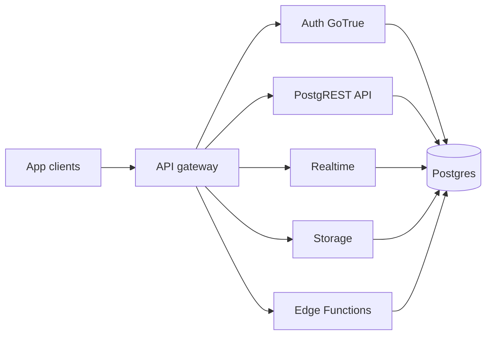

# Research Brief: Supabase as a backend platform

- **Date**: 2026-07-21
- **Author**: researcher
- **Domain**: cloud-api
- **Status**: complete
- **Recency baseline**: Sources fetched 2026-07-21 via Supabase docs MCP (`search_docs`) and the official pricing page; oldest cited primary page still maintained as current platform docs

This brief is a Construct distribution stress artifact. It summarizes **vendor-documented** platform facts for product and engineering decisions. It does **not** invent customer quotes, production SLAs beyond what Supabase publishes, or Construct-product commitments.

## Question

For a product or engineering team choosing a hosted Postgres-centric backend with Auth, Realtime, Storage, and Edge Functions in one project, what does Supabase document as the platform shape, pricing posture, fit/non-fit signals, and material risks (including who gets locked out when access control is wrong)?

| Field | Value |
|---|---|
| Question | What does Supabase officially document as its platform primitives, billing model, and security defaults for a 2026 build/buy decision? |
| Decision this unlocks | Whether to shortlist hosted Supabase (vs self-host vs a different BaaS / DIY Postgres stack) for a greenfield or migration spike |
| Out of scope | Live load tests, contract negotiation, SOC2 report review, Construct runtime integration, competitor feature matrices beyond vendor self-description |

## Method

| Step | What was done | Result |
|---|---|---|
| Domain starting point | Official Supabase docs + pricing | Primary vendor corpus |
| Tool path | `user-supabase` MCP `search_docs` GraphQL queries; WebFetch of [Pricing](https://supabase.com/pricing) | Docs hits + pricing plan text retrieved 2026-07-21 |
| Date filter | Prefer currently published guides (no archival cutoff needed for vendor product docs) | All citations accessed 2026-07-21 |
| Internal paths checked | `examples/distribution/sources/`, Construct research template | No prior Construct Supabase brief in this stress pack |
| Queries run | platform overview; Auth/JWT/sessions; RLS; Realtime; Storage ACL; Edge Functions; billing/pricing; architecture/self-host | Covered required decision topics |
| Inclusion / exclusion | Include official docs and pricing page; exclude blogs, third-party tutorials, and unsourced memory | Marketing claims without a docs URL marked `[unverified]` or omitted |

## Sources

| Title / Path | Class | Reliability | Credibility | Date | URL | Verified | Relevance |
|---|---|---|---|---|---|---|---|
| Supabase Platform | primary | A | 5 | 2026-07-21 | [Supabase Platform](https://supabase.com/docs/guides/platform) | yes | Hosted project contents |
| Architecture | primary | A | 5 | 2026-07-21 | [Architecture](https://supabase.com/docs/guides/getting-started/architecture) | yes | Component map (Postgres, Auth, API, Realtime, Storage, Functions) |
| Features | primary | A | 5 | 2026-07-21 | [Features](https://supabase.com/docs/guides/getting-started/features) | yes | Non-exhaustive product inventory + maturity stages |
| Auth | primary | A | 5 | 2026-07-21 | [Auth](https://supabase.com/docs/guides/auth) | yes | Auth methods and authz via RLS |
| User sessions | primary | A | 5 | 2026-07-21 | [User sessions](https://supabase.com/docs/guides/auth/sessions) | yes | Session control for compliance-oriented apps |
| Row Level Security | primary | A | 5 | 2026-07-21 | [Row Level Security](https://supabase.com/docs/guides/database/postgres/row-level-security) | yes | Browser-facing data security model |
| Securing your API | primary | A | 5 | 2026-07-21 | [Securing your API](https://supabase.com/docs/guides/api/securing-your-api) | yes | Grants + RLS layering |
| Data REST API | primary | A | 5 | 2026-07-21 | [Data REST API](https://supabase.com/docs/guides/api) | yes | PostgREST auto API |
| Realtime | primary | A | 5 | 2026-07-21 | [Realtime](https://supabase.com/docs/guides/realtime) | yes | Broadcast / Presence / Postgres Changes |
| Storage | primary | A | 5 | 2026-07-21 | [Storage](https://supabase.com/docs/guides/storage) | yes | File storage capabilities |
| Storage Buckets | primary | A | 5 | 2026-07-21 | [Storage Buckets](https://supabase.com/docs/guides/storage/buckets/fundamentals) | yes | Public vs private buckets |
| Storage Access Control | primary | A | 5 | 2026-07-21 | [Storage Access Control](https://supabase.com/docs/guides/storage/security/access-control) | yes | RLS on `storage.objects` |
| Edge Functions | primary | A | 5 | 2026-07-21 | [Edge Functions](https://supabase.com/docs/guides/functions) | yes | Deno TypeScript edge compute |
| About billing on Supabase | primary | A | 5 | 2026-07-21 | [About billing on Supabase](https://supabase.com/docs/guides/platform/billing-on-supabase) | yes | Org billing, quotas table |
| Billing FAQ | primary | A | 5 | 2026-07-21 | [Billing FAQ](https://supabase.com/docs/guides/platform/billing-faq) | yes | Fair Use, free project limits, spend cap |
| Pricing | primary | A | 5 | 2026-07-21 | [Pricing](https://supabase.com/pricing) | yes | Plan tiers and included quotas (as published) |
| Access Control (org/project roles) | primary | A | 5 | 2026-07-21 | [Access Control (org/project roles)](https://supabase.com/docs/guides/platform/access-control) | yes | Who can administer projects; Read-Only plan gate |
| Self-Hosting with Docker | primary | A | 5 | 2026-07-21 | [Self-Hosting with Docker](https://supabase.com/docs/guides/self-hosting/docker) | yes | Self-host path exists |

## Findings

### Finding 1: Hosted project is Postgres plus integrated services

**Observation**: Supabase documents a hosted platform where each project includes a dedicated Postgres database, auto-generated APIs, Auth, file Storage, Edge Functions, and Realtime ([Supabase Platform](https://supabase.com/docs/guides/platform); accessed 2026-07-21). Architecture docs place an API gateway in front of Auth (GoTrue), PostgREST, Realtime, Storage, postgres-meta, Functions, and GraphQL, all talking to one Postgres instance ([Architecture](https://supabase.com/docs/guides/getting-started/architecture); accessed 2026-07-21). Supabase states it is open source, Postgres-centric, and not a 1-to-1 Firebase mapping ([Features](https://supabase.com/docs/guides/getting-started/features); accessed 2026-07-21).

**Inference**: Teams get a full SQL database with BaaS-style surfaces, not a proprietary document store with SQL bolted on. Portability claims rest on Postgres standards and self-host compatibility, not on zero-ops forever.

**Confidence**: high for product shape (primary architecture + platform guides).

**Sources**: ([Supabase Platform](https://supabase.com/docs/guides/platform); accessed 2026-07-21) · ([Architecture](https://supabase.com/docs/guides/getting-started/architecture); accessed 2026-07-21) · ([Features](https://supabase.com/docs/guides/getting-started/features); accessed 2026-07-21).

*Figure: client traffic enters via the gateway; core services share one Postgres project database (per Architecture docs).*

### Finding 2: Auth issues JWTs; authorization is expected to live in Postgres RLS

**Observation**: Auth docs list password, magic link, OTP, social login, and SSO among supported methods ([Auth](https://supabase.com/docs/guides/auth); accessed 2026-07-21). Sessions docs describe JWT-based sessions with controls aimed at compliance-sensitive apps ([User sessions](https://supabase.com/docs/guides/auth/sessions); accessed 2026-07-21). Features and Auth guides explicitly pair authorization with Postgres Row Level Security policies ([Features](https://supabase.com/docs/guides/getting-started/features); accessed 2026-07-21). RLS docs warn that convenient browser data access depends on enabling RLS ([Row Level Security](https://supabase.com/docs/guides/database/postgres/row-level-security); accessed 2026-07-21). API security docs describe two layers: grants for roles (`anon`, `authenticated`, `service_role`) and RLS policies for which rows those roles can touch ([Securing your API](https://supabase.com/docs/guides/api/securing-your-api); accessed 2026-07-21).

**Inference**: Shipping with the Data API exposed and RLS off (or policies too loose) is a production risk: anonymous or authenticated clients can see more than intended. Over-restrictive policies can lock legitimate users out of their own rows. Inclusive framing matters: people with assistive tech, shared devices, or SSO-only enterprise accounts aren't special-cased by Postgres policies; wrong policies deny them the same way they deny everyone else.

**Confidence**: high for the documented model; medium for operational failure rates (no incident corpus in this brief).

**Sources**: ([Auth](https://supabase.com/docs/guides/auth); accessed 2026-07-21) · ([User sessions](https://supabase.com/docs/guides/auth/sessions); accessed 2026-07-21) · ([Row Level Security](https://supabase.com/docs/guides/database/postgres/row-level-security); accessed 2026-07-21) · ([Securing your API](https://supabase.com/docs/guides/api/securing-your-api); accessed 2026-07-21) · ([Features](https://supabase.com/docs/guides/getting-started/features); accessed 2026-07-21).

### Finding 3: Database API is PostgREST-generated from schema

**Observation**: The Data REST API guide states the API is auto-generated from the database schema via PostgREST at `https://<project_ref>.supabase.co/rest/v1/` ([Data REST API](https://supabase.com/docs/guides/api); accessed 2026-07-21), reflects schema changes, and is designed to work with Postgres RLS, roles, and grants. Features list auto-generated REST and GraphQL (`pg_graphql`) as GA for Database.

**Inference**: Schema design is API design. Teams that need a thick domain API still can, but the default path is table-shaped HTTP. That's a fit when CRUD + policies match the product; it's a mismatch when you need heavy orchestration, non-Postgres workloads, or APIs that shouldn't mirror tables.

**Confidence**: high.

**Sources**: ([Data REST API](https://supabase.com/docs/guides/api); accessed 2026-07-21) · ([Features](https://supabase.com/docs/guides/getting-started/features); accessed 2026-07-21).

### Finding 4: Realtime covers Broadcast, Presence, and Postgres Changes

**Observation**: Realtime docs describe a globally distributed service ([Realtime](https://supabase.com/docs/guides/realtime); accessed 2026-07-21) with Broadcast (client messages), Presence (shared state such as online status), and Postgres Changes (database events over WebSockets). Features mark those three as GA; several authorization-related Realtime features are listed as public beta.

**Inference**: Collaborative UIs and live feeds are first-class, but beta authorization features should be treated as immature for hard security gates until the Features table moves them to GA.

**Confidence**: high for feature list; medium for scale limits in your workload (benchmarks exist but weren't re-run here).

**Sources**: ([Realtime](https://supabase.com/docs/guides/realtime); accessed 2026-07-21) · ([Features](https://supabase.com/docs/guides/getting-started/features); accessed 2026-07-21).

### Finding 5: Storage defaults private; access is RLS on storage objects

**Observation**: Storage docs describe file storage with CDN ([Storage](https://supabase.com/docs/guides/storage); accessed 2026-07-21), image transforms, resumable uploads, and S3 compatibility. Bucket fundamentals state buckets are private by default ([Storage Buckets](https://supabase.com/docs/guides/storage/buckets/fundamentals); accessed 2026-07-21); private downloads need an authenticated JWT that passes RLS or a time-limited signed URL. Storage access-control docs say uploads aren't allowed without RLS policies on `storage.objects` ([Storage Access Control](https://supabase.com/docs/guides/storage/security/access-control); accessed 2026-07-21).

**Inference**: Empty policy sets fail closed for uploads (good for accidental exposure; bad for "why can't anyone upload?" onboarding). Public buckets are an explicit choice. Mis-scoped policies can either leak private user files or lock out collaborators who should share assets.

**Confidence**: high.

**Sources**: ([Storage](https://supabase.com/docs/guides/storage); accessed 2026-07-21) · ([Storage Buckets](https://supabase.com/docs/guides/storage/buckets/fundamentals); accessed 2026-07-21) · ([Storage Access Control](https://supabase.com/docs/guides/storage/security/access-control); accessed 2026-07-21).

### Finding 6: Edge Functions are Deno TypeScript at the edge

**Observation**: Edge Functions docs describe globally distributed TypeScript ([Edge Functions](https://supabase.com/docs/guides/functions); accessed 2026-07-21) functions on a Deno-compatible runtime for webhooks, third-party integrations, and short-lived HTTP work. Docs note cold starts are possible and steer long-running jobs to background workers. Features mark Edge Functions and regional invocations as GA.

**Inference**: Fit for request/response glue and webhook receivers. Not a substitute for a durable worker fleet without additional design.

**Confidence**: high for documented intent; cold-start latency for a given region is `[unverified]` without measurement.

**Sources**: ([Edge Functions](https://supabase.com/docs/guides/functions); accessed 2026-07-21) · ([Features](https://supabase.com/docs/guides/getting-started/features); accessed 2026-07-21).

### Finding 7: Pricing is organization-based with Free / Pro / Team / Enterprise

**Observation**: Billing docs and the pricing page list Free, Pro, Team, and Enterprise ([About billing on Supabase](https://supabase.com/docs/guides/platform/billing-on-supabase); accessed 2026-07-21) ([Pricing](https://supabase.com/pricing); accessed 2026-07-21). Billing is per organization: one plan per org, no mixing Free and paid projects in the same org. Free plan: two active free projects (paused don't count toward the quota), inactivity pausing on Free, community support. Paid plans add compute per project (Pro/Team include compute credits covering one default Micro-sized project per billing docs/pricing examples). Quotas cover egress, DB/disk, MAUs, storage, Edge Function invocations, Realtime messages/connections; overages and Fair Use restrictions (including read-only DB or paused projects) are documented. Team adds compliance-oriented items such as SOC2 & ISO 27001 (per pricing page), longer log retention, and Read-Only dashboard roles (access-control docs: Read-Only only on Team and Enterprise ([Access Control](https://supabase.com/docs/guides/platform/access-control); accessed 2026-07-21)). Pricing page states pricing is in Beta and may change.

**Inference**: Cost surprises usually come from compute-per-project, egress, and Realtime peaks, not from the base Pro fee alone. Free is fine for spikes and demos; production that can't tolerate pausing or Fair Use clamps needs paid. Dashboard Read-Only for auditors/contractors isn't available on Free/Pro per docs, which can push compliance-minded orgs toward Team earlier than raw usage would.

**Confidence**: high for plan structure and documented quotas as of 2026-07-21; low for your org's actual invoice (usage-dependent). Dollar figures below are as published on that date and should be re-checked before budget lock.

**Sources**: ([About billing on Supabase](https://supabase.com/docs/guides/platform/billing-on-supabase); accessed 2026-07-21) · ([Billing FAQ](https://supabase.com/docs/guides/platform/billing-faq); accessed 2026-07-21) · ([Pricing](https://supabase.com/pricing); accessed 2026-07-21) · ([Access Control](https://supabase.com/docs/guides/platform/access-control); accessed 2026-07-21).

| Plan (published) | From (USD/mo, pricing page 2026-07-21) | Notable documented traits |
|---|---|---|
| Free | $0 | 2 active free projects; pause after inactivity; limited quotas |
| Pro | $25 | Email support; daily backups (7 days); spend cap on by default |
| Team | $599 | SOC2 & ISO 27001; Read-Only / project-scoped roles; longer retention |
| Enterprise | Custom | Uptime SLAs, premium support, BYO cloud (per pricing page) |

### Finding 8: Self-hosting is documented; hosted platform features aren't all portable

**Observation**: Self-Hosting with Docker is a first-class guide ([Self-Hosting with Docker](https://supabase.com/docs/guides/self-hosting/docker); accessed 2026-07-21). The Features maturity table marks many Database/Auth/Storage/Realtime/Functions items available on self-hosted, while several Platform items (custom domains, network restrictions, SSL enforcement, branching, read replicas, Management API) are `N/A` or need external tooling on self-hosted.

**Inference**: Self-host reduces vendor lock-in for core open-source pieces but reintroduces ops burden and drops some hosted conveniences. "We can always self-host later" is only partially true for platform add-ons.

**Confidence**: high for docs table; operational cost of self-host is `[unverified]` here.

**Sources**: ([Self-Hosting with Docker](https://supabase.com/docs/guides/self-hosting/docker); accessed 2026-07-21) · ([Features](https://supabase.com/docs/guides/getting-started/features); accessed 2026-07-21).

## Counter-evidence

| Counter-claim | Source | How addressed |
|---|---|---|
| Supabase is "just Firebase with Postgres" | Architecture explicitly rejects 1-to-1 Firebase mapping | Bounded: similar product categories, different datastore and OSS stack |
| Free tier is enough for always-on production | Pricing + Billing FAQ (pausing, Fair Use) | Rejected for always-on prod without further evidence of paid plan |
| RLS alone makes browser-direct APIs safe by default | RLS danger admonition; Storage denies uploads without policies | Policies are required craft; defaults don't replace threat modeling |
| Self-host equals full feature parity with hosted | Features self-hosted column | Partial parity only; platform features often N/A |

Actively searched billing FAQ and Features table for limits and maturity, not only marketing overviews.

## Confidence summary

Overall confidence in **what Supabase is and how it bills** is high for a shortlist decision, because claims rest on primary vendor docs fetched the same day. Confidence in **whether it wins for your specific product** is medium-low until you map workload (MAU, egress, Realtime peaks, compliance attestations needed) and re-verify pricing. What would most change the conclusion: a requirement for non-Postgres primary storage, hard multi-region write, or compliance controls only on Team/Enterprise that your budget can't carry.

## Gaps

| Gap | Missing evidence | What would fill it | Owner |
|---|---|---|---|
| Live SLA / uptime history for your region | This brief didn't fetch SLA PDFs beyond Features/pricing mentions | Read [Supabase SLA](https://supabase.com/sla) and status history | operations |
| Actual cold-start and Realtime p95 under load | No k6 run in this session | Spike with production-like subscription mix | engineer / qa |
| Contractual HIPAA path | Pricing notes HIPAA as Team add-on; terms not reviewed | Legal review of BAA process | security.legal-compliance |
| Competitor bake-off | Out of scope | Separate brief vs Neon+Auth0, Firebase, PlanetScale+custom, etc. | researcher |

## Implications

Product can treat Supabase as a credible shortlist when the domain model fits Postgres + RLS and the team accepts org-based usage billing. Engineering should budget time for policy design (database and storage), key handling (`anon` vs `service_role`), and observability of Fair Use / spend-cap behavior. Security and privacy should assume browser-reachable APIs and ask who is denied access when policies fail closed, and who is exposed when they fail open. Ops should decide early: hosted Pro/Team vs self-host Docker, knowing platform add-ons may not travel.

## Recommendation

| Recommendation | Flip threshold | Confidence |
|---|---|---|
| Shortlist **hosted Supabase** for greenfield apps that want Postgres + Auth + Storage + Realtime + Edge Functions in one project, and plan a Pro (or Team if Read-Only roles / SOC2 packaging matter) org before production traffic | Flip away if primary datastore can't be Postgres, if self-host parity for required platform features is mandatory day one, or if pricing re-check shows usage envelope cheaper on a DIY stack | medium (platform fit high; cost/compliance fit needs your numbers) |
| Do **not** treat Free as production always-on without accepting pause and Fair Use risk | Flip if Supabase documents a Free always-on guarantee (not present in sources checked 2026-07-21) | high |
| Treat **RLS + storage policies** as launch-blocking engineering work, not a polish pass | Flip only if the app never exposes Data API / Storage to end-user credentials | high |

## Open questions

| Question | Owner | Decision needed by |
|---|---|---|
| Which compliance attestations (SOC2, ISO, HIPAA add-on) are hard requirements for the first customer segment? | security.legal-compliance | before Team vs Pro choice |
| Expected MAU, egress, Realtime peak connections, and Edge invocations in Low/Base/High? | product-manager + data-analyst | before spend-cap off |
| Is browser-direct PostgREST acceptable, or is a BFF mandatory? | architect + security | before schema freeze |
| Hosted vs self-host for the first production region? | operations + architect | before infra commit |

## References

- Supabase. (accessed 2026-07-21). [Supabase Platform](https://supabase.com/docs/guides/platform).
- Supabase. (accessed 2026-07-21). [Architecture](https://supabase.com/docs/guides/getting-started/architecture).
- Supabase. (accessed 2026-07-21). [Features](https://supabase.com/docs/guides/getting-started/features).
- Supabase. (accessed 2026-07-21). [Auth](https://supabase.com/docs/guides/auth).
- Supabase. (accessed 2026-07-21). [User sessions](https://supabase.com/docs/guides/auth/sessions).
- Supabase. (accessed 2026-07-21). [Row Level Security](https://supabase.com/docs/guides/database/postgres/row-level-security).
- Supabase. (accessed 2026-07-21). [Securing your API](https://supabase.com/docs/guides/api/securing-your-api).
- Supabase. (accessed 2026-07-21). [Data REST API](https://supabase.com/docs/guides/api).
- Supabase. (accessed 2026-07-21). [Realtime](https://supabase.com/docs/guides/realtime).
- Supabase. (accessed 2026-07-21). [Storage](https://supabase.com/docs/guides/storage).
- Supabase. (accessed 2026-07-21). [Storage Buckets](https://supabase.com/docs/guides/storage/buckets/fundamentals).
- Supabase. (accessed 2026-07-21). [Storage Access Control](https://supabase.com/docs/guides/storage/security/access-control).
- Supabase. (accessed 2026-07-21). [Edge Functions](https://supabase.com/docs/guides/functions).
- Supabase. (accessed 2026-07-21). [About billing on Supabase](https://supabase.com/docs/guides/platform/billing-on-supabase).
- Supabase. (accessed 2026-07-21). [Billing FAQ](https://supabase.com/docs/guides/platform/billing-faq).
- Supabase. (accessed 2026-07-21). [Pricing](https://supabase.com/pricing).
- Supabase. (accessed 2026-07-21). [Access Control](https://supabase.com/docs/guides/platform/access-control).
- Supabase. (accessed 2026-07-21). [Self-Hosting with Docker](https://supabase.com/docs/guides/self-hosting/docker).
