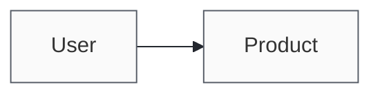

# Output vibe (construct-modern)

Apply this skill before drafting or exporting any customer-facing artifact (PRD, deck, brief, runbook, video script). User instructions always win; this sets the default feel.

## Typography and color

- Sans: Space Grotesk (400–700). Mono: JetBrains Mono for code, IDs, and tables.
- Monochrome ink ramp only for page furniture: near-black body (`#23272e`), muted labels (`#565c66`), hairline rules (`#e3e4e8`). Color belongs in diagrams and data, not chrome.
- Do not stamp "Construct" on external deliverables unless the user asks.

## Prose rhythm

- Lead with a short declarative paragraph, then structure (headings, one compact table, selective bullets).
- Avoid bullet walls; never more than seven bullets in a row without a prose bridge.
- Rare em dashes; prefer commas or parentheses.

## Diagrams (sketch-forward)

- Prefer hand-drawn / sketch aesthetic over rigid box-and-arrow clipart.
- In Mermaid, open with a sketch theme block:

- For high-touch user flows, an Excalidraw embed (`*.excalidraw` beside the doc) is acceptable when Mermaid feels too mechanical.
- Every flowchart shows at least one non-happy path (error, escalation, or rollback).

## Tables and metrics

- Use tables for metrics, acceptance criteria, and comparisons — not for narrative.
- Pin baselines and targets; cite sources or mark `[unverified]`.

## Export parity

- PDF/HTML/PPTX inherit the same fonts and ink ramp from distribution templates.
- No stock clip-art icons; use simple line icons or typographic labels.

When invoked at the start of a workflow skill, restate which vibe choices apply to this artifact type in one sentence, then proceed.
