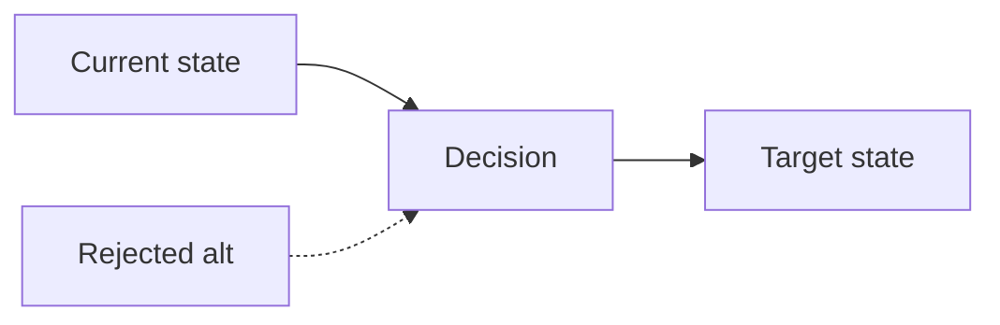

# ADR-{NNN}: {title}

- **Date**: {YYYY-MM-DD}
- **Status**: proposed | accepted | superseded | deprecated
- **Deciders**: {names}
- **Supersedes**: {ADR-NNN or none}

<!--
Architectural decision record. Records a decision already made (or proposed
for acceptance). Use rfc.md when the proposal still needs structured review
before a decision.

Owning specialist: architect (rules/common/doc-ownership.md).
Before drafting: rules/common/framing.md + get_skill("docs/artifact-authorship")
  + get_skill("perspectives/architect").

NATIVE SPINE:
  Problem → Context → Decision → Rationale → Rejected alternatives
  → Consequences → Reversibility → Adversarial challenge → Open questions
  → References

Depth means: domain problem (not ticket IDs), ≥1 concrete rejected alternative
with a specific rejection reason, and consequences that name what is locked in.
An ADR without rejected alternatives is a proposal, not a decision.
Prefer unknown / [unverified] with owner + decision-by date over fabrication.
-->

## Problem

{The decision-forcing tension in the domain. What is currently true and what pressure makes a choice unavoidable.}

Must NOT reference ticket IDs, PRD filenames, chat transcripts, or process framing ("we need to decide how to document X").

Should reference the constraint that makes this non-trivial, the cost of not deciding, and what is observably broken, ambiguous, or at risk.

## Context

{Forces beyond the core problem. Prior ADRs, architectural constraints, external commitments.}

| Force | Type | Implication | Source |
|---|---|---|---|
| {constraint / prior ADR / commitment} | hard / soft | {how it bounds the decision} | {path / ADR / unknown} |

## Decision

{The position taken, in one or two sentences. State it as a commitment, not a proposal.}

## Rationale

{Why this decision over the alternatives. Load-bearing reasons, cited to evidence. If rationale leans on external references (standards, prior art, vendor behavior), cite them.}

| Reason | Observation vs inference | Source |
|---|---|---|
| {load-bearing reason} | observation / inference | {path / URL+date / unknown} |

## Rejected alternatives

For each alternative considered:

| Alternative | What it is | Why rejected | Reconsider if |
|---|---|---|---|
| {option A} | {concrete enough to evaluate} | {specific reason — not "we preferred the chosen option"} | {trigger} |
| {option B} | {…} | {…} | {…} |

An empty table fails review.

## Consequences

| Dimension | Easier | Harder | Locked in |
|---|---|---|---|
| {ops / security / DX / cost / …} | {…} | {…} | {new constraint this decision imposes} |

Include second-order effects. Mark unverified second-order claims as `[unverified]`.

## Reversibility

| Field | Value |
|---|---|
| Door type | one-way / two-way |
| Cost to reverse | {or unknown} |
| Revisit triggers | {conditions that force reconsideration} |

## Adversarial challenge

Strongest case that this decision is premature or wrong:

| Challenge | Severity | Response |
|---|---|---|
| {strongest counter-argument} | high / med / low | {mitigation, accept-with-rationale, or defer decision} |

## Open questions

| Question | Owner | Decision needed by |
|---|---|---|
| {unknown that could change the decision} | {role} | {YYYY-MM-DD} |

## References

Primary sources, prior ADRs, research briefs, standards. Execution artifacts (tickets, chat) may be listed for traceability but never as load-bearing reasoning.

- {path / URL + access date / ADR id / bead id}
