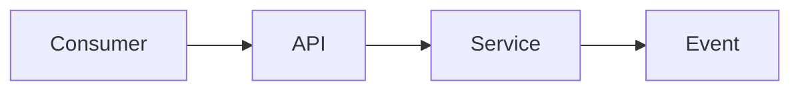

<!--
Internal platform / API / SDK / ops tooling — not end-customer UX.
Customer-facing capabilities: use prd.md (exact 12-section contract).
Product OS requirements: use meta-prd.md.

Owning specialist: product-manager. Call get_skill("docs/artifact-authorship")
and get_skill("perspectives/product-manager") before drafting.

Same hierarchy as customer PRDs:
  Phase → Requirement (FR-<phase>.<n>) → Acceptance Criteria (AC-<phase>.<n>.<k>)
Each phase needs **Why?** (human purpose: who benefits, what risk it reduces).
Depth is mandatory. Inclusive framing for named consumer roles.
Prefer unknown / [unverified] over fabrication.
-->

## TL;DR

{What platform capability changes, which consumer role it serves, why now, what decision is sought.}

## Background

{Current platform state, prior ADRs/RFCs, incidents/tickets. Cite ≥2 independent evidence sources or mark research-required.}

| Evidence source | Type | What it shows | Link / id |
|---|---|---|---|
| {incident / ticket / telemetry} | qualitative / quantitative | {claim} | {path or URL + date} |
| {second source} | … | … | … |

## Problem

{Named platform actor} cannot reliably {outcome} because {constraint}. Pain, not solution.

## Platform actors

| Actor | Job | Current workaround | Scale |
|---|---|---|---|
| {app developer / ops / security admin} | {job} | {workaround} | {unknown or evidenced} |

## Outcomes - Goals & Non-Goals

**Goals:**

1. {consumer-observable outcome}
2. {…}

**Non-goals:**

| Non-goal | Why deferred |
|---|---|
| {…} | {…} |

## Why This Matters Now

<!-- Timing economics for platform bets. -->

{2–4 sentences: why this platform decision cannot wait.}

| Timing dimension | Estimate / window | Source |
|---|---|---|
| Revenue at risk | {downstream revenue / contract $ or unknown} | {URL+date / unknown — owner: {name} by {YYYY-MM-DD}} |
| Upside / opportunity window | {enablement window or unknown} | {…} |
| Market timing | {ecosystem / partner pressure or unknown} | {…} |
| Cost of delay | {incident / toil $ or unknown} | {…} |
| Competitive window | {build-vs-buy / vendor move or unknown} | {see Competitive} |
| Compliance / legal deadline | {date / obligation or unknown} | {recruit privacy/legal if yes} |

## Competitive Landscape & Financial Considerations

### Competitive landscape

{Short prose, then matrix.}

| Alternative | Dimension | Approach | Our stance | Source |
|---|---|---|---|---|
| {build vs buy / prior internal tool} | {…} | {…} | {…} | {unknown or URL+date} |

### Financial considerations

| Item | Low | Base | High | Source |
|---|---|---|---|---|
| Build / run cost | unknown | unknown | unknown | [unverified] — owner: {name} by {YYYY-MM-DD} |
| Unit economics | unknown | unknown | unknown | [unverified] |
| Consumer migration cost | unknown | unknown | unknown | [unverified] |
| Expected value / ROI | unknown | unknown | unknown | [unverified] |

## Phases

| Phase | Name | Why? (human purpose) | Ships when | Status |
|---|---|---|---|---|
| 1 | {name} | {which consumer roles benefit + risk reduced} | {exit} | not started |
| 2 | {name} | {…} | {…} | not started |

## Requirements

### Phase 1 — {name}

**Why?** {Human purpose for named platform consumers; what operational or security risk this phase reduces.}

{One sentence consumer-observable value.}

#### {Area: e.g. Contract surface}

##### FR-1.1: {contract or capability obligation}

{Prose depth: what consumers get, constraints, compatibility stance.}

**Acceptance criteria**

1. **AC-1.1.1** — {condition}. *Verify:* contract test / review.

*NFR:* {perf / security / …}

### Phase 2 — {name}

**Why?** {Human purpose for this phase.}

{One sentence goal.}

#### {Area}

##### FR-2.1: {…}

{Prose depth.}

**Acceptance criteria**

1. **AC-2.1.1** — {condition}. *Verify:* {…}.

### API and interface contract

| Id | Surface | Change | Breaking? |
|---|---|---|---|
| C-1 | {endpoint / schema / event} | {…} | yes / no |

### Backwards compatibility and versioning

{New vs change; versioning; consumer support plan. unknown allowed with owner.}

### Operational requirements

{Observability, audit, rate limits, failure modes, admin controls.}

## Acceptance Criteria

| AC id | FR | Criterion | Verify |
|---|---|---|---|
| AC-1.1.1 | FR-1.1 | {same as under FR} | contract test |
| AC-2.1.1 | FR-2.1 | {…} | … |

## Success Metrics

| Metric | Type | Baseline | Target | Owner | Source |
|---|---|---|---|---|---|
| {adoption / error rate / latency} | leading / lagging | {or unknown} | {or unknown} | {name} | {path or [unverified]} |

## Risks

{Short prose, then table.}

| Risk | L | I | Mitigation |
|---|---|---|---|
| {…} | low / med / high | low / med / high | {…} |

### Legal, privacy, and compliance triggers

| Trigger | Present? | Specialist | Gate before ship |
|---|---|---|---|
| PII / accounts | yes / no / unknown | security.privacy | retention/deletion |
| Cross-tenant / secrets | yes / no / unknown | security.appsec | STRIDE notes |
| Contracts / licenses | yes / no / unknown | security.legal-compliance | counsel named |

### Adversarial challenge (FMEA)

| Failure mode | Effect | Cause | S×O×D | Mitigation |
|---|---|---|---|---|
| {…} | {…} | {…} | {…} | {…} |

### Open questions

| Question | Owner | Needed by |
|---|---|---|
| {unknown} | {role} | {YYYY-MM-DD} |

## Platform flow

## References

- {path / URL + access date / bead / ADR}
