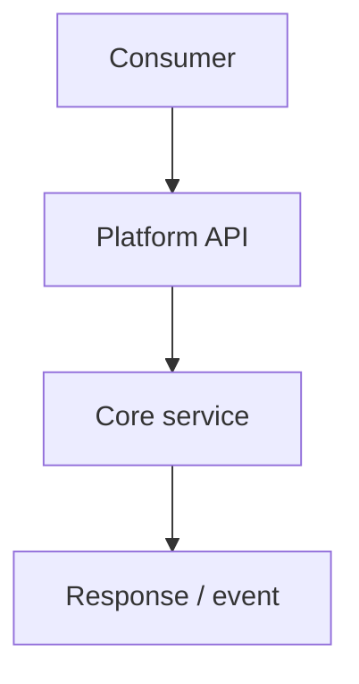

# Platform PRD: {title}

- **Date**: {YYYY-MM-DD}
- **Owner**: {name}
- **Status**: draft | in-review | approved | shipped | deprecated

<!--
Internal platform / API / SDK / ops tooling — not end-customer UX.
Customer-facing capabilities: use prd.md (exact 12-section contract).
Product OS requirements: use meta-prd.md.

Owning specialist: product-manager. Call get_skill("docs/artifact-authorship")
and get_skill("perspectives/product-manager") before drafting.

Same hierarchy as customer PRDs:
  Phase → Requirement (FR-<phase>.<n>) → Acceptance Criteria (AC-<phase>.<n>.<k>)
Depth is mandatory. Prefer unknown / [unverified] over fabrication.
-->

## TL;DR

{What platform capability changes, which consumer role it serves, why now, what decision is sought.}

## Background

{Current platform state, prior ADRs/RFCs, incidents/tickets. Cite ≥2 independent evidence sources or mark research-required.}

| Evidence source | Type | What it shows | Link / id |
|---|---|---|---|
| {incident / ticket / telemetry} | qualitative / quantitative | {claim} | {path or URL + date} |
| {second source} | … | … | … |

## Problem

{Named platform actor} cannot reliably {outcome} because {constraint}. Pain, not solution.

## Platform actors

| Actor | Job | Current workaround | Scale |
|---|---|---|---|
| {app developer / ops / security admin} | {job} | {workaround} | {unknown or evidenced} |

## Outcomes - Goals & Non-Goals

**Goals:**

1. {consumer-observable outcome}
2. {…}

**Non-goals:**

| Non-goal | Why deferred |
|---|---|
| {…} | {…} |

## Why This Matters Now

{Cost of delay, incident pressure, contract freeze window. Observation vs inference.}

## Competitive Landscape & Financial Considerations

| Alternative | Dimension | Approach | Our stance | Source |
|---|---|---|---|---|
| {build vs buy / prior internal tool} | {…} | {…} | {…} | {unknown or URL+date} |

| Cost / value item | Estimate | Confidence | Source |
|---|---|---|---|
| Build / run cost | unknown | low | [unverified] |
| Consumer migration cost | unknown | low | [unverified] |

## Phases

### Phase 1: {name}

- **Goal**: {…}
- **Status**: not started
- **Requirements**: FR-1.1, …
- **Exit**: {…}

### Phase 2: {name}

- **Goal**: {…}
- **Status**: not started
- **Requirements**: FR-2.1, …
- **Exit**: {…}

## Requirements

### Phase 1 requirements

#### FR-1.1: {contract or capability obligation}

{Prose depth: what consumers get, constraints, compatibility stance.}

- **Phase**: 1
- **Acceptance criteria**: AC-1.1.1
- **NFR notes**: {perf / security / …}

### Phase 2 requirements

#### FR-2.1: {…}

{Prose depth.}

- **Phase**: 2
- **Acceptance criteria**: AC-2.1.1
- **NFR notes**: {…}

### API and interface contract

<!-- Numbered contract items C-1… may map to FRs above. -->

| Id | Surface | Change | Breaking? |
|---|---|---|---|
| C-1 | {endpoint / schema / event} | {…} | yes / no |

### Backwards compatibility and versioning

{New vs change; versioning; consumer support plan. unknown allowed with owner.}

### Operational requirements

{Observability, audit, rate limits, failure modes, admin controls — product requirements, not afterthoughts.}

## Acceptance Criteria

| AC id | FR id | Criterion (stranger-checkable) | Verification method |
|---|---|---|---|
| AC-1.1.1 | FR-1.1 | {condition} | contract test / review |
| AC-2.1.1 | FR-2.1 | {condition} | … |

## Success Metrics

| Metric | Type | Baseline | Target | Owner | Source |
|---|---|---|---|---|---|
| {adoption / error rate / latency} | leading / lagging | {or unknown} | {or unknown} | {name} | {path or [unverified]} |

## Risks

| Risk | Likelihood | Impact | Mitigation |
|---|---|---|---|
| {…} | low / med / high | low / med / high | {…} |

### Legal, privacy, and compliance triggers

| Trigger | Present? | Specialist | Gate before ship |
|---|---|---|---|
| PII / accounts | yes / no / unknown | security.privacy | retention/deletion |
| Cross-tenant / secrets | yes / no / unknown | security.appsec | STRIDE notes |
| Contracts / licenses | yes / no / unknown | security.legal-compliance | counsel named |

### Adversarial challenge (FMEA)

| Failure mode | Effect | Cause | S×O×D | Mitigation |
|---|---|---|---|---|
| {…} | {…} | {…} | {…} | {…} |

### Open questions

| Question | Owner | Decision needed by |
|---|---|---|
| {unknown} | {role} | {YYYY-MM-DD} |

## Platform flow

## References

- {path / URL + access date / bead / ADR}
