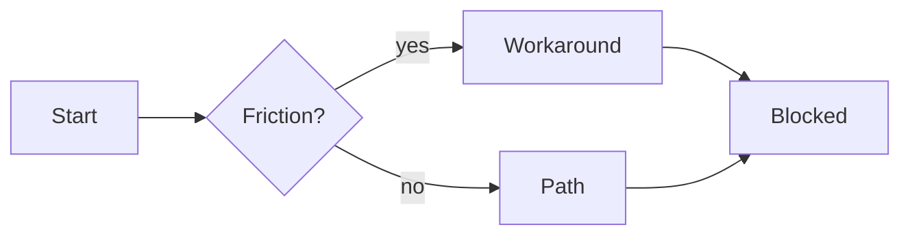
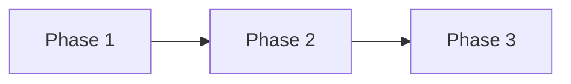

<!--
Customer-facing product capability, user workflow, or requirement set.
Use meta-prd.md for product-system / agent / process requirements.
Use prd-platform.md for internal platform / API / SDK consumers.

Owning specialist: product-manager (rules/common/doc-ownership.md).
Before drafting: rules/common/framing.md + get_skill("docs/artifact-authorship")
  + get_skill("perspectives/product-manager").

HIERARCHY (mandatory; skeleton bullets fail review):
  Phase → one or more Requirements (FR-<phase>.<n>)
  Requirement → one or more Acceptance Criteria (AC-<phase>.<n>.<k>) listed
  under that requirement (not only referenced by id).

PHASE WHY? (mandatory):
  Every phase needs a human Why?: purpose, who benefits, what risk it reduces.
  Put Why? in the Phases roadmap table and as **Why?** prose under each
  ### Phase N heading (before FRs). Name roles/contexts, not a monolithic "user."

LAYOUT (mandatory; walls of tables fail review):
  Mix prose, short lists, compact tables, and diagrams. Prefer LR Mermaid
  flowcharts with short labels. Don't restate Phase on every FR; phase is
  the ### heading under Requirements; area is the #### subsection.
  Prose must carry real thought. Bullet theater fails review.

INCLUSIVE / HUMAN FRAMING:
  Write for people in named roles and contexts. Avoid ableist or gendered
  defaults. Accessibility is product quality (WCAG targets where UI ships),
  not a footnote. Impact framing: who is helped or harmed if this ships wrong.

VOICE (human, not corporate-LLM) — rules/common/human-voice.md +
  get_skill("docs/artifact-authorship") Human voice bar:
  Short beats. Prefer contractions (don't, won't, can't, isn't, we're, it's)
  except where formal negation is load-bearing (shall not, AC precision).
  Avoid spaced em dashes; prefer commas, periods, colons, or parentheses.
  Avoid AI tells: delve, landscape (outside the section title), robust,
  leverage, "it's important to note", "In today's…", "This ensures that…".

Refuse fabrication. Prefer unknown / [unverified] with owner + decision-by date.
When ordering Goals or phase priority is contested, use
strategy/prioritization-methods rather than gut ranking.
Multi-persona tension (researcher, architect, privacy/legal, a11y, ops/QA,
engineer, reviewer) belongs in Requirements, Risks, and Open questions, not
as name-drops in Contributors alone.
-->

## TL;DR

{3–5 sentence executive brief in human voice: what changes, which named roles
it serves, why now, what “done” looks like for the decision-maker. No undecided
solutions. No ticket IDs. No invented team or customer names.}

## Background

{1–2 short paragraphs: current workflow, prior decisions, and what evidence exists. Then a compact evidence table, not a dump of process docs.}

| Evidence | What it shows | Link / id |
|---|---|---|
| {interview / ticket / telemetry} | {claim} | {path or URL + access date} |
| {second independent source} | {claim} | {…} |

If fewer than two sources exist, mark **research-required** and open a research task before locking scope.

## Problem

{Affected users} can't reliably achieve {desired outcome} because {constraint or failure mode}.

Write pain in prose, not a solution pitch. Cite observed behavior or mark `[unverified]`.

*Figure: where the user journey breaks today. Keep labels short; prefer LR layout.*

## Outcomes - Goals & Non-Goals

**Goals** (outcome change, not activity; 3–5 max):

1. {Measurable or observable outcome for a named segment}
2. {…}
3. {…}

**Non-goals** (protect schedule):

- {explicitly out of scope}: {one-line why}
- {adjacent follow-up}: {one-line why}

## Why This Matters Now

<!-- Timing economics: revenue, upside, market, cost of delay, competitive window, compliance. -->

{2–4 sentences: the timing thesis in prose. Name what compounds if we wait.}

Then the compact timing table (do not expand into six separate essays):

| Timing dimension | Estimate / window | Source |
|---|---|---|
| Revenue at risk | {ARR/pipeline/$ or unknown} | {URL+date / unknown; owner: {name} by {YYYY-MM-DD}} |
| Upside / opportunity window | {window end or unknown} | {…} |
| Market timing | {season / shift or unknown} | {…} |
| Cost of delay | {$ / compounding harm or unknown} | {…} |
| Competitive window | {who moves / when or unknown} | {see Competitive} |
| Compliance / legal deadline | {date / regulation or unknown} | {recruit privacy/legal if yes} |

## Competitive Landscape & Financial Considerations

### Competitive landscape

{2–3 sentences on how alternatives solve (or fail) this job. Then a small matrix.}

| Competitor / alternative | Dimension | Their approach | Our stance | Source |
|---|---|---|---|---|
| {name or unknown} | price / workflow / trust | {observed} | match / differentiate / defer | {URL+date or unknown} |

### Financial considerations

{One short paragraph on structural economics. Refuse point ROI.}

| Item | Low | Base | High | Source |
|---|---|---|---|---|
| Build / run cost | unknown | unknown | unknown | [unverified]; owner: {name} by {YYYY-MM-DD} |
| Unit economics | unknown | unknown | unknown | [unverified] |
| Expected value / ROI | unknown | unknown | unknown | [unverified] until model exists |

## Phases

<!-- Roadmap only. Don't list every FR id here; that lives under Requirements. -->

| Phase | Name | Why? (human purpose) | Ships when | Status |
|---|---|---|---|---|
| 1 | {name} | {who benefits + what risk this phase reduces} | {exit in one line} | not started |
| 2 | {name} | {…} | {…} | not started |
| 3 | {name} | {…} | {…} | deferred |

## Requirements

<!--
Nest once: ### Phase N: Name, then #### Area, then ##### FR-n.m.
Do NOT repeat **Phase**: N on every FR. List Acceptance criteria under each FR.
Each phase opens with **Why?** (human purpose) before the first FR.
-->

### Phase 1: {name}

**Why?** {2–4 sentences: purpose for named roles/contexts, who benefits, what
risk this phase reduces. Include substantive tension from recruited personas
(e.g. privacy retention, a11y keyboard path, ops revoke SLO), not name-drops.}

{One sentence: user-observable value this phase unlocks.}

#### {Area: e.g. Access control}

##### FR-1.1: {imperative system obligation}

{Paragraph: what the system must do, for whom, under what constraints. Link Background evidence.}

**Acceptance criteria**

1. **AC-1.1.1**: {stranger-checkable condition}. *Verify:* {manual / automated / review}.
2. **AC-1.1.2**: {condition}. *Verify:* {…}.

*NFR:* {privacy / a11y / perf as applicable, or n/a}

##### FR-1.2: {…}

{Paragraph depth.}

**Acceptance criteria**

1. **AC-1.2.1**: {condition}. *Verify:* {…}.

#### {Area: e.g. Audit}

##### FR-1.3: {…}

{Paragraph depth.}

**Acceptance criteria**

1. **AC-1.3.1**: {condition}. *Verify:* {…}.
2. **AC-1.3.2**: {condition}. *Verify:* {…}.

### Phase 2: {name}

**Why?** {Human purpose for this phase: who benefits, what risk it reduces.}

{One sentence goal.}

#### {Area}

##### FR-2.1: {…}

{Paragraph depth.}

**Acceptance criteria**

1. **AC-2.1.1**: {condition}. *Verify:* {…}.

## Acceptance Criteria

<!-- Index of every AC for scanning and release gates. Detail lives under Requirements. -->

| AC id | FR id | Criterion (stranger-checkable) | Verification method |
|---|---|---|---|
| AC-1.1.1 | FR-1.1 | {same text as under FR-1.1} | automated |
| AC-1.1.2 | FR-1.1 | {…} | … |
| AC-1.2.1 | FR-1.2 | {…} | … |
| AC-2.1.1 | FR-2.1 | {…} | … |

## Success Metrics

{One sentence on how you will know the bet worked.}

| Metric | Type | Baseline | Target | Owner | Source |
|---|---|---|---|---|---|
| {name} | leading / lagging | {or unknown} | {or unknown} | {name} | {path/URL or [unverified]} |

## Risks

### Delivery and product risks

{Short prose on the top delivery risks, then the table.}

| Risk | L | I | Mitigation or accept-with-rationale |
|---|---|---|---|
| {risk} | low / med / high | low / med / high | {action} |

### Legal, privacy, and compliance triggers

Complete even if the requester never mentioned legal. Route fired rows to
`security.privacy` / `security.legal-compliance` before approval.

| Trigger | Present? | Data / activity | Specialist | Gate before ship |
|---|---|---|---|---|
| PII / accounts / identity | yes / no / unknown | {what} | security.privacy | retention + deletion path named |
| Payments / money movement | yes / no / unknown | {what} | security.legal-compliance | PCI/contract controls or N/A |
| Contracts / ToS / licenses | yes / no / unknown | {what} | security.legal-compliance | counsel or policy owner named |
| Minors / sensitive categories | yes / no / unknown | {what} | privacy + legal-compliance | explicit block or approved design |
| AI processing / model training | yes / no / unknown | {what} | security.ai + privacy | in-product disclosure plan |
| Cross-border transfer | yes / no / unknown | {what} | security.legal-compliance | transfer mechanism or unknown |

### Adversarial challenge (FMEA)

| Failure mode | Effect | Cause | S×O×D | Mitigation or accept-with-rationale |
|---|---|---|---|---|
| {highest-cost wrongness} | {who hurts} | {why} | {product} | {action} |

### Open questions

| Question | Owner | Needed by |
|---|---|---|
| {unknown} | {role} | {YYYY-MM-DD} |

## References

- {path / URL + access date / bead id / intake id}
