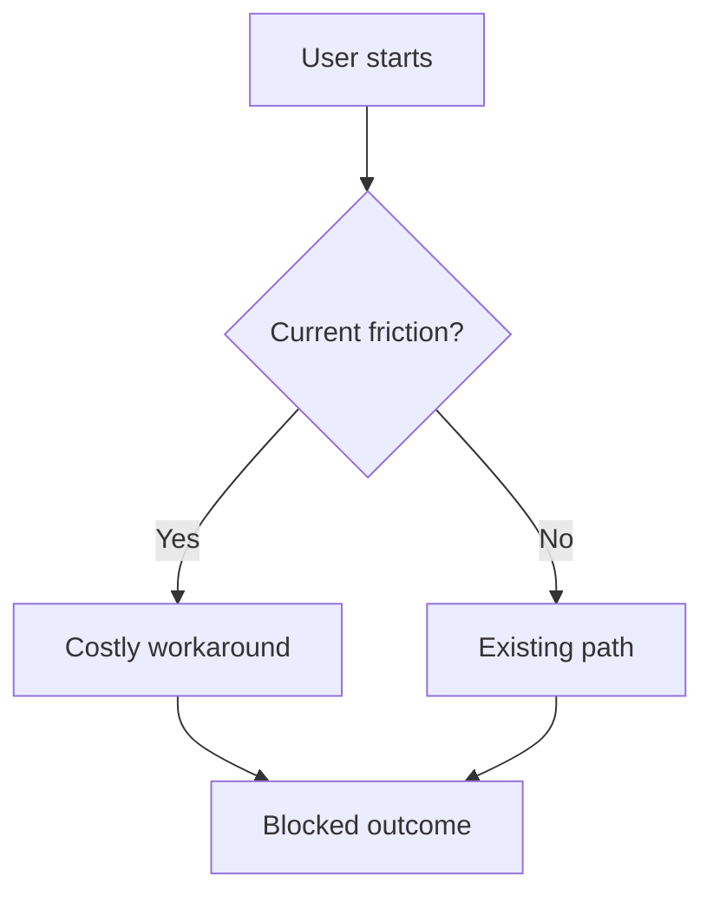

# PRD: {title}

- **Date**: {YYYY-MM-DD}
- **Owner**: {name}
- **Status**: draft | in-review | approved | shipped | deprecated

<!--
Customer-facing product capability, user workflow, or requirement set.
Use meta-prd.md for product-system / agent / process requirements.
Use prd-platform.md for internal platform / API / SDK consumers.

Owning specialist: product-manager (rules/common/doc-ownership.md).
Before drafting: rules/common/framing.md + get_skill("docs/artifact-authorship")
  + get_skill("perspectives/product-manager").

HIERARCHY (mandatory — skeleton bullets fail review):
  Phase → one or more Requirements (FR-<phase>.<n>)
  Requirement → one or more Acceptance Criteria (AC-<phase>.<n>.<k>)
Depth means: each FR states the system obligation in prose; each AC is an
observable, falsifiable check a stranger can run without asking the author.

Refuse fabrication. Prefer unknown / [unverified] with owner + decision-by date.
When ordering Goals or phase priority is contested, use
strategy/prioritization-methods rather than gut ranking.
-->

## TL;DR

{3–5 sentence executive brief: what changes, who it is for, why now, what “done” looks like for the decision-maker. No undecided solutions. No ticket IDs. No team names.}

<!-- Busy-reader section. If this is thin, the PRD is not ready. -->

## Background

{Current workflow or system, prior decisions (linked PRDs/ADRs), and re-verifiable evidence. Cite ≥2 independent user-evidence sources or mark research-required.}

| Evidence source | Type | What it shows | Link / id |
|---|---|---|---|
| {interview / ticket / telemetry / research brief} | qualitative / quantitative | {claim} | {path or URL + access date} |
| {second independent source} | … | … | … |

If fewer than two sources exist, set implication to **research-required** and open a research task before locking scope. Stakeholder preference alone is insufficient.

## Problem

{Affected users} cannot reliably achieve {desired outcome} because {constraint or failure mode}.

Write pain, not solution. Must not cite ticket IDs, OKRs, or “the team decided.” Must cite observed behavior or quantitative signals (or mark `[unverified]`).

## Outcomes - Goals & Non-Goals

**Goals** (outcome change, not activity; 3–5 max; order by importance):

1. {Measurable or observable outcome for a named segment}
2. {…}
3. {…}

**Non-goals** (protect schedule; be specific):

| Non-goal | Why deferred |
|---|---|
| {explicitly out of scope} | {reason} |
| {adjacent follow-up} | {reason} |

## Why This Matters Now

{Why this decision cannot wait: cost of delay, competitive pressure, compliance window, or compounding user harm. Separate observation from inference. No roadmap-speak without evidence.}

| Trigger | Present? | Why it forces timing |
|---|---|---|
| User harm / support load | yes / no / unknown | {evidence or unknown} |
| Competitive pressure | yes / no / unknown | {see Competitive section} |
| Legal / compliance window | yes / no / unknown | {recruit privacy/legal if yes} |
| Cost of delay | yes / no / unknown | {what compounds if we wait} |

## Competitive Landscape & Financial Considerations

### Competitive landscape

| Competitor / alternative | Dimension | Their approach | Our stance | Source |
|---|---|---|---|---|
| {name or unknown} | price / workflow / trust / … | {observed} | match / differentiate / defer | {URL+date or unknown} |

Do not invent market share, pricing, or feature matrices. Prefer `unknown` / `[unverified]`.

### Financial considerations

| Item | Estimate | Confidence | Source |
|---|---|---|---|
| Build / run cost | unknown | low | [unverified] — owner: {name} by {YYYY-MM-DD} |
| Expected value / ROI | unknown | low | [unverified] until model + evidence exist |
| Support / compliance cost | unknown | low | {path or unknown} |

Refuse fabricated ROI. If finance claims are load-bearing, recruit data-analyst (and finance if available) before approval.

## Phases

<!--
Each phase is independently shippable user/platform value — not “backend then frontend”.
Status: not started | in progress | shipped | deferred.
Every phase MUST list ≥1 Requirement id that lives under ## Requirements.
-->

### Phase 1: {name}

- **Why?**: {who benefits + what risk this phase reduces}
- **Goal**: {user-observable value this phase unlocks}
- **Status**: not started
- **Requirements**: FR-1.1, FR-1.2, …
- **Exit**: {what must be true to call this phase shipped}

### Phase 2: {name}

- **Why?**: {…}
- **Goal**: {…}
- **Status**: not started
- **Requirements**: FR-2.1, …
- **Exit**: {…}

### Phase 3: {name}

- **Why?**: {…}
- **Goal**: {…}
- **Status**: not started
- **Requirements**: FR-3.1, …
- **Exit**: {…}

## Requirements

<!--
Hierarchy: Phase owns Requirements. Nest by phase. Each FR needs prose depth
(what/why/constraint), not a one-line slogan. NFR categories to consider:
performance, reliability, security, privacy, accessibility, observability,
compliance, cost — with numeric targets where possible.
-->

### Phase 1 requirements

#### FR-1.1: {imperative system obligation}

{Paragraph: what the system must do, for whom, under what constraints. Link to evidence in Background.}

- **Phase**: 1
- **Acceptance criteria**: AC-1.1.1, AC-1.1.2
- **NFR notes**: {privacy / a11y / perf as applicable, or n/a}

#### FR-1.2: {…}

{Paragraph depth.}

- **Phase**: 1
- **Acceptance criteria**: AC-1.2.1
- **NFR notes**: {…}

### Phase 2 requirements

#### FR-2.1: {…}

{Paragraph depth.}

- **Phase**: 2
- **Acceptance criteria**: AC-2.1.1
- **NFR notes**: {…}

## Acceptance Criteria

<!--
Every AC maps to exactly one FR. Observable and falsifiable. Ban “intuitive”,
“fast”, “robust”, “delightful” without a numeric or behavioral threshold.
-->

| AC id | FR id | Criterion (stranger-checkable) | Verification method |
|---|---|---|---|
| AC-1.1.1 | FR-1.1 | {condition} | manual / automated / review |
| AC-1.1.2 | FR-1.1 | {condition} | … |
| AC-1.2.1 | FR-1.2 | {condition} | … |
| AC-2.1.1 | FR-2.1 | {condition} | … |

## Success Metrics

<!-- Leading vs lagging. No vanity metrics. Baseline/target may be unknown. -->

| Metric | Type | Baseline | Target | Owner | Source |
|---|---|---|---|---|---|
| {name} | leading / lagging | {current or unknown} | {goal or unknown} | {name} | {path/URL or [unverified]} |

## Risks

### Delivery and product risks

| Risk | Likelihood | Impact | Mitigation or accept-with-rationale |
|---|---|---|---|
| {risk} | low / med / high | low / med / high | {action} |

### Legal, privacy, and compliance triggers

Complete even if the requester never mentioned legal. Route fired rows to
`security.privacy` / `security.legal-compliance` before approval.

| Trigger | Present? | Data / activity | Specialist | Gate before ship |
|---|---|---|---|---|
| PII / accounts / identity | yes / no / unknown | {what} | security.privacy | retention + deletion path named |
| Payments / money movement | yes / no / unknown | {what} | security.legal-compliance | PCI/contract controls or N/A |
| Contracts / ToS / licenses | yes / no / unknown | {what} | security.legal-compliance | counsel or policy owner named |
| Minors / sensitive categories | yes / no / unknown | {what} | privacy + legal-compliance | explicit block or approved design |
| AI processing / model training | yes / no / unknown | {what} | security.ai + privacy | in-product disclosure plan |
| Cross-border transfer | yes / no / unknown | {what} | security.legal-compliance | transfer mechanism or unknown |

### Adversarial challenge (FMEA)

| Failure mode | Effect | Cause | S×O×D (1–10) | Mitigation or accept-with-rationale |
|---|---|---|---|---|
| {highest-cost wrongness} | {who hurts} | {why} | {product} | {action} |

### Open questions

| Question | Owner | Decision needed by |
|---|---|---|
| {unknown} | {role} | {YYYY-MM-DD} |

## References

<!-- Every load-bearing claim above should resolve here. -->

- {path / URL + access date / bead id / intake id}
