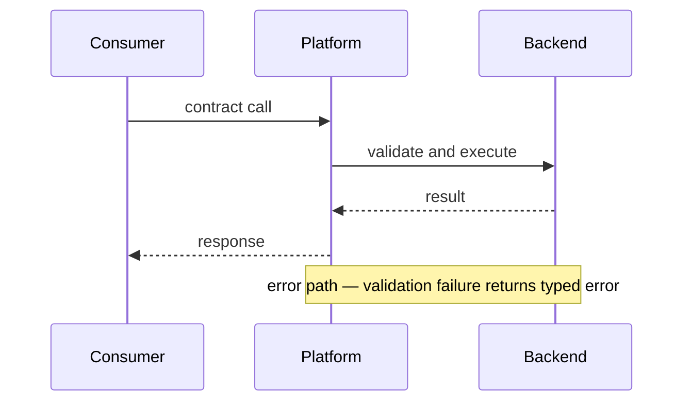

# Platform RFC: {title}

- **Date**: {YYYY-MM-DD}
- **Author**: {name}
- **Status**: draft | in-review | accepted | rejected | superseded
- **Change type**: breaking | non-breaking | additive
- **Affects**: {API | SDK | schema | event | config | permission model | protocol}
- **Supersedes**: {RFC title or N/A}

<!--
Proposal that changes a contract consumed by other systems: APIs, SDKs,
schemas, event payloads, permission models, config shapes, or protocols.

Use rfc.md for proposals that do not touch external contracts.

Owning specialist: architect.
Before drafting: get_skill("docs/artifact-authorship")
  + get_skill("perspectives/architect").

NATIVE SPINE:
  Summary → Motivation → Goals & Non-Goals → Breaking change declaration
  → Proposed contract → Backwards compatibility strategy → Migration guide
  → Versioning and deprecation → Consumer impact analysis → Rollout plan
  → Operational requirements → Tradeoffs and alternatives → Risks
  → Verification → Unresolved questions → References

Depth means: explicit breaking surface, consumer-by-consumer impact, and
verification that the old version can be removed safely.
Prefer unknown / [unverified] with owner + decision-by date over fabrication.
-->

## Summary

{One paragraph. What contract is changing, in what direction, why, and what decision is sought.}

## Motivation

{What problem or limitation in the current contract drives this change? Cite evidence. Explain why the current interface cannot simply be extended.}

| Evidence source | Type | What it shows | Link / id |
|---|---|---|---|
| {consumer pain / incident / support load} | qualitative / quantitative | {claim} | {path or URL + date} |
| {second source} | … | … | … |

## Goals & Non-Goals

**Goals:**

1. {Contract outcome}
2. {…}

**Non-goals:**

| Non-goal | Why deferred |
|---|---|
| {…} | {…} |

## Breaking change declaration

Be explicit: what is breaking, what is not. Omitting a breaking change here is a contract violation.

| Element | Change | Breaking? | Notes |
|---|---|---|---|
| {endpoint / field / event / permission} | removed / renamed / semantic change / additive | yes / no | {…} |

## Proposed contract

{The new interface in full. Schemas, endpoint signatures, payload shapes, permission rules, config fields. Precise enough that a consumer can write against this spec without asking questions.}

## Backwards compatibility strategy

{Versioning, dual-write, feature flags, shim layer, deprecation window. State which and why.}

## Migration guide

{Step-by-step: what a consumer must change, in what order, with examples. Tooling vs manual; estimate effort or mark unknown.}

## Versioning and deprecation

| Milestone | Date | Owner | Communication plan |
|---|---|---|---|
| Announce | {YYYY-MM-DD or unknown} | {name} | {channel} |
| Sunset | {…} | {…} | {…} |
| Remove | {…} | {…} | {…} |

## Consumer impact analysis

| Consumer | What breaks | What changes | Compatible? | Migration effort |
|---|---|---|---|---|
| {name or unknown} | {…} | {…} | yes / no / partial | {or unknown} |

Flag consumers that require coordinated migration.

## Rollout plan

| Phase | Observable signal | Kill switch |
|---|---|---|
| Dual-version / canary / GA / remove-old | {metric or gate} | {how} |

## Operational requirements

{Observability, rate limits, error handling, fallback behavior, admin controls required for the new contract to be supportable.}

## Tradeoffs and alternatives

| Alternative | What it is | Why not chosen |
|---|---|---|
| {option} | {concrete} | {specific reason} |

## Risks

| Risk | Likelihood | Impact | Mitigation |
|---|---|---|---|
| {compatibility / adoption / coordination} | low / med / high | low / med / high | {action} |

### Adversarial challenge (FMEA)

| Failure mode | Effect | Cause | S×O×D (1–10) | Mitigation or accept-with-rationale |
|---|---|---|---|---|
| {highest-cost contract failure} | {who hurts} | {why} | {product} | {action} |

## Verification

| Check | Method | Owner | Pass criteria |
|---|---|---|---|
| Migration succeeded | {metric / test} | {name} | {stranger-checkable} |
| Old version removable | {…} | {…} | {…} |

## Unresolved questions

| Question | Owner | Decision needed by |
|---|---|---|
| {unknown that blocks acceptance} | {role} | {YYYY-MM-DD} |

## References

- {related ADRs, prior RFCs, API guidelines, consumer runbooks, URL + access date}
