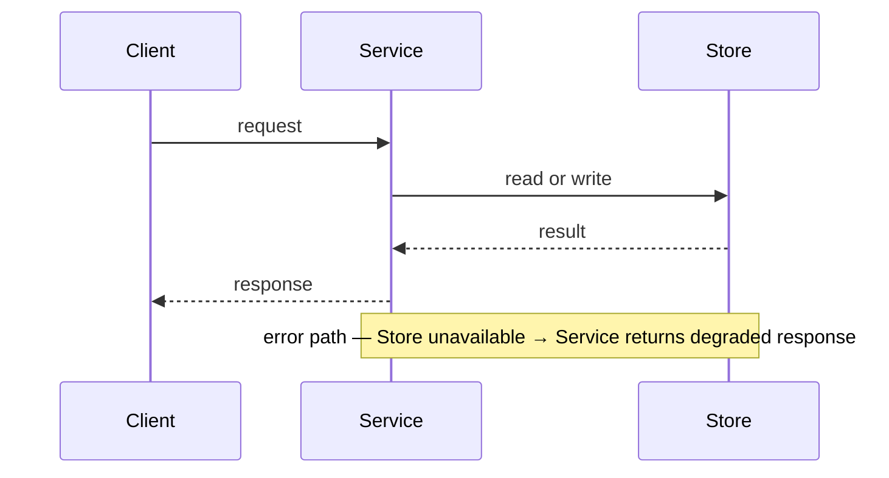

# RFC: {title}

- **Date**: {YYYY-MM-DD}
- **Author**: {name}
- **Status**: draft | in-review | accepted | rejected | superseded
- **Supersedes**: {RFC title or N/A}
- **Superseded by**: {RFC title or N/A}

<!--
Significant technical or architectural proposal that needs structured review
before implementation. An RFC is not an ADR (which records a decision already
made): it is the proposal that leads to one.

Use rfc-platform.md when the proposal introduces breaking changes to a
contract, API, schema, or protocol consumed by other systems.

Owning specialist: architect.
Before drafting: get_skill("docs/artifact-authorship")
  + get_skill("perspectives/architect").

NATIVE SPINE:
  Summary → Motivation → Goals & Non-Goals → Proposed design
  → Tradeoffs and alternatives → Drawbacks → Risks → Rollout
  → Verification → Unresolved questions → References

Depth means: evidenced motivation, concrete design (happy + error path),
no-strawman alternatives, and verification that a stranger can run.
Prefer unknown / [unverified] with owner + decision-by date over fabrication.
-->

## Summary

{One paragraph. What is being proposed and why. Someone who reads only this should understand the intent and the decision sought.}

## Motivation

{What problem or limitation drives this proposal? Include evidence: incidents, performance data, support tickets, developer friction. Explain why the status quo is not acceptable.}

| Evidence source | Type | What it shows | Link / id |
|---|---|---|---|
| {incident / ticket / telemetry / research} | qualitative / quantitative | {claim} | {path or URL + date} |
| {second source} | … | … | … |

## Goals & Non-Goals

**Goals:**

1. {Outcome this RFC must achieve}
2. {…}

**Non-goals:**

| Non-goal | Why deferred |
|---|---|
| {explicitly out of scope} | {reason} |

## Proposed design

{Concrete proposal. Enough detail for reviewers to evaluate feasibility and tradeoffs. Include the happy path and at least one error path.}

## Tradeoffs and alternatives

No strawmen. For each credible design:

| Alternative | What it is | Why not chosen | Prefer when |
|---|---|---|---|
| {option A} | {concrete} | {specific reason} | {conditions} |
| {option B} | {…} | {…} | {…} |

## Drawbacks

{What this proposal makes harder, slower, or more expensive. Technical debt, operational complexity, team burden.}

| Drawback | Severity | Acceptable because |
|---|---|---|
| {cost / complexity / lock-in} | high / med / low | {rationale or unknown} |

## Risks

| Risk | Likelihood | Impact | Mitigation |
|---|---|---|---|
| {implementation or production risk} | low / med / high | low / med / high | {action} |

### Adversarial challenge (FMEA)

| Failure mode | Effect | Cause | S×O×D (1–10) | Mitigation or accept-with-rationale |
|---|---|---|---|---|
| {highest-cost wrongness of this design} | {who hurts} | {why} | {product} | {action} |

### Legal / security / ops triggers

| Trigger | Present? | Specialist | Gate before accept |
|---|---|---|---|
| Auth / secrets / multi-tenant | yes / no / unknown | security | STRIDE notes |
| PII / retention | yes / no / unknown | security.privacy | data classes named |
| SLO / on-call / migration | yes / no / unknown | operations | runbook delta |

## Rollout

{Phased rollout, feature flags, dark launch, migration path, deprecation timeline.}

| Phase | Signal to advance | Rollback |
|---|---|---|
| {flag / canary / GA} | {observable} | {how} |

## Verification

{How we confirm the proposal achieved its goals. Tests, metrics, observable evidence.}

| Check | Method | Owner | Pass criteria |
|---|---|---|---|
| {goal or risk} | test / metric / review | {name} | {stranger-checkable} |

## Unresolved questions

| Question | Owner | Decision needed by |
|---|---|---|
| {unknown that blocks acceptance} | {role} | {YYYY-MM-DD} |

## References

- {related ADRs, prior RFCs, design docs, research, external standards, URL + access date}
