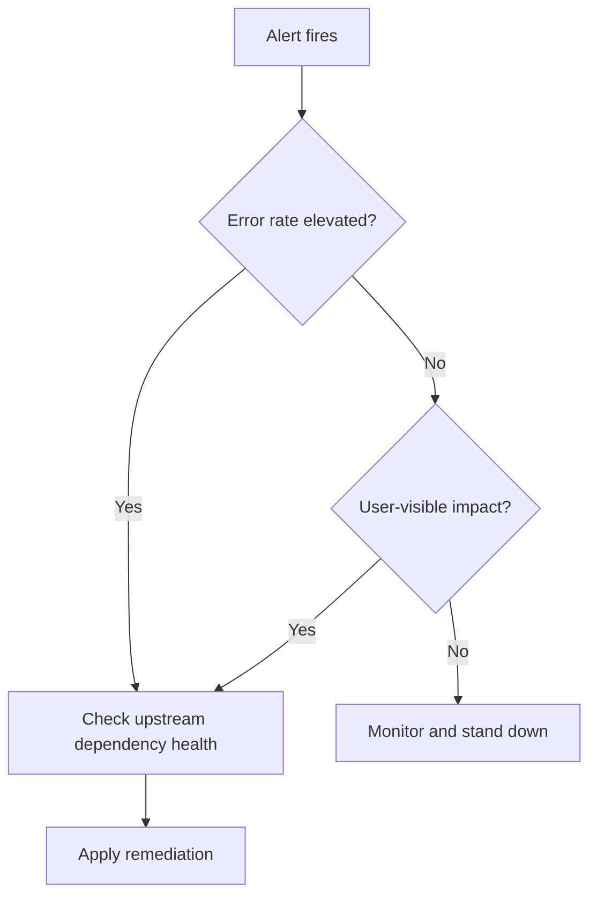

# Runbook: {service or alert name}

- **Service**: {service}
- **Owner**: {team or on-call rotation}
- **Last tested**: {YYYY-MM-DD}
- **Severity**: SEV-1 | SEV-2 | SEV-3

<!--
Operational procedure for a service, alert, or recurring operation.
Owning specialist: operations.
Before drafting: get_skill("docs/artifact-authorship")
  + get_skill("perspectives/operations").

NATIVE SPINE:
  Alert trigger → Symptoms → Impact → Severity and response
  → Diagnostic steps → Remediation → Rollback → Escalation
  → Post-incident → Adversarial challenge → References

HIERARCHY (operator-runnable):
  Diagnostic step → expected signal → next action
  Remediation step → expected output → failure branch
  Rollback → last tested date (mark [unverified] if untested)

Depth means: exact checks, expected signals, and a rollback that will not
strand an on-call engineer mid-incident.
-->

## Alert trigger

{The exact alert, log pattern, or user report that brings someone to this page. Include the query or alert rule.}

| Field | Value |
|---|---|
| Alert / rule | {name or query} |
| Source system | {pager / log / user report} |
| Link | {dashboard or runbook index path} |

## Symptoms

{What an operator will observe. Dashboards, error rates, user-visible behavior.}

## Impact

{Who is affected and how badly. Data loss? Degraded performance? Complete outage?}

| Scope | Impact | Evidence |
|---|---|---|
| {tenants / regions / roles} | {severity} | {dashboard or unknown} |

## Severity and response

Map each severity to response: page urgency, comms cadence, and error-budget consequence.

| Severity | Trigger condition | Page within | Comms | Error budget |
|----------|-------------------|-------------|-------|--------------|
| SEV-1 | {full outage / data loss / SLO breach} | 5 min | exec + status page | breach → freeze releases |
| SEV-2 | {major degradation, workaround exists} | 15 min | team + stakeholders | partial spend |
| SEV-3 | {minor / single-tenant / cosmetic} | business hours | team channel | none |

## Diagnostic steps

Ordered checks from cheapest to most expensive. Each step: what to check, how, what the answer means.

| Step | Check | How | Expected if healthy | If unhealthy → |
|---|---|---|---|---|
| D-1 | {…} | {command / UI / query} | {signal} | {next step or remediation} |
| D-2 | {…} | {…} | {…} | {…} |

## Remediation

Step-by-step fix with exact commands or UI paths and expected output.

| Step | Action | Expected output | If fails |
|---|---|---|---|
| R-1 | {command or UI path} | {signal} | {rollback / escalate} |
| R-2 | {…} | {…} | {…} |

## Rollback

How to undo the remediation if it makes things worse. Include last test date. Mark untested paths `[unverified]`.

| Step | Action | Expected output | Last tested |
|---|---|---|---|
| RB-1 | {…} | {…} | {YYYY-MM-DD or [unverified]} |

## Escalation

Who to page, in what order, after how long. Technical and business paths.

| After | Page | Why |
|---|---|---|
| {N min without recovery} | {role / rotation} | {…} |
| {…} | {business / exec} | {…} |

## Post-incident

What to capture for the incident report. Pointers to logs, dashboards, trace IDs to preserve.

| Artifact | Location | Owner |
|---|---|---|
| Logs / traces | {path or query} | {role} |
| Timeline notes | {…} | {…} |

## Adversarial challenge

Failure mode that would strand an on-call engineer mid-incident:

| Failure mode | Effect | Mitigation |
|---|---|---|
| {missing permission / stale command / unknown dependency} | {stranded operator} | {guardrail or verified alternate path} |

## References

- {architecture docs, related runbooks, past incidents, dashboards, bead ids}
