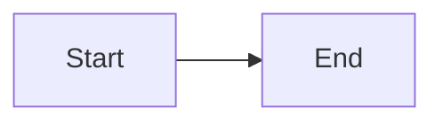

# Golden fixture: adr

## Problem

This paragraph supports the Problem section with observable evidence. Source: https://example.com/fixture (accessed 2026-06-22). This paragraph supports the Problem section with observable evidence. Source: https://example.com/fixture (accessed 2026-06-22). This paragraph supports the Problem section with observable evidence. Source: https://example.com/fixture (accessed 2026-06-22).

## Context

This paragraph supports the Context section with observable evidence. Source: https://example.com/fixture (accessed 2026-06-22). This paragraph supports the Context section with observable evidence. Source: https://example.com/fixture (accessed 2026-06-22). This paragraph supports the Context section with observable evidence. Source: https://example.com/fixture (accessed 2026-06-22).

## Decision

Fixture content for Decision.

## Rationale

Fixture content for Rationale.

## Rejected alternatives

| Alternative | What it is | Why rejected | Reconsider if |
|---|---|---|---|
| Option A | Shared ledger | Cross-tenant risk | Isolation proven |

## Consequences

Fixture content for Consequences.

## Reversibility

Fixture content for Reversibility.

## Legal, privacy, and security triggers

| Trigger | Present? | Data / boundary | Specialist | Gate before accept |
|---|---|---|---|---|
| PII / accounts / identity | no | n/a | security.privacy | n/a |
| AuthN / AuthZ / secrets | yes | tenant boundary | security.appsec | threat model |
| Payments / money movement | no | n/a | security.legal-compliance | n/a |
| Contracts / ToS / licenses | no | n/a | security.legal-compliance | n/a |
| Cross-border / regulated data | unknown | unknown | security.legal-compliance | [unverified] |
| AI processing / model training | no | n/a | security.ai + privacy | n/a |

## Adversarial challenge

| Challenge | Severity | Response |
|---|---|---|
| Decision is premature without load test | high | Accept with revisit trigger |

## References

Fixture content for References.

