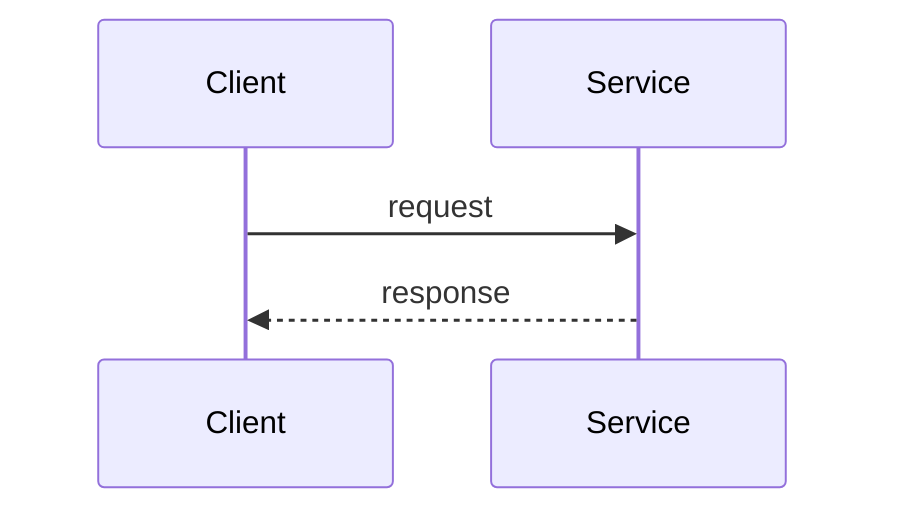

# Golden fixture: rfc-platform

## Summary

This paragraph supports the Summary section with observable evidence. Source: https://example.com/fixture (accessed 2026-06-22). This paragraph supports the Summary section with observable evidence. Source: https://example.com/fixture (accessed 2026-06-22). This paragraph supports the Summary section with observable evidence. Source: https://example.com/fixture (accessed 2026-06-22).

## Motivation

This paragraph supports the Motivation section with observable evidence. Source: https://example.com/fixture (accessed 2026-06-22). This paragraph supports the Motivation section with observable evidence. Source: https://example.com/fixture (accessed 2026-06-22). This paragraph supports the Motivation section with observable evidence. Source: https://example.com/fixture (accessed 2026-06-22).

## Breaking change declaration

This paragraph supports the Breaking change declaration section with observable evidence. Source: https://example.com/fixture (accessed 2026-06-22). This paragraph supports the Breaking change declaration section with observable evidence. Source: https://example.com/fixture (accessed 2026-06-22). This paragraph supports the Breaking change declaration section with observable evidence. Source: https://example.com/fixture (accessed 2026-06-22).

## Proposed contract

Fixture content for Proposed contract.

## Tradeoffs and alternatives

Fixture content for Tradeoffs and alternatives.

## Risks

### Adversarial challenge (FMEA)

| Failure mode | Effect | Cause | S×O×D (1–10) | Mitigation or accept-with-rationale |
|---|---|---|---|---|
| Migration stalls | Dual-write forever | Weak consumer plan | 7×5×3 | Kill switch in rollout |

## Verification

Fixture content for Verification.

## Unresolved questions

Fixture content for Unresolved questions.

## References

Fixture content for References.

