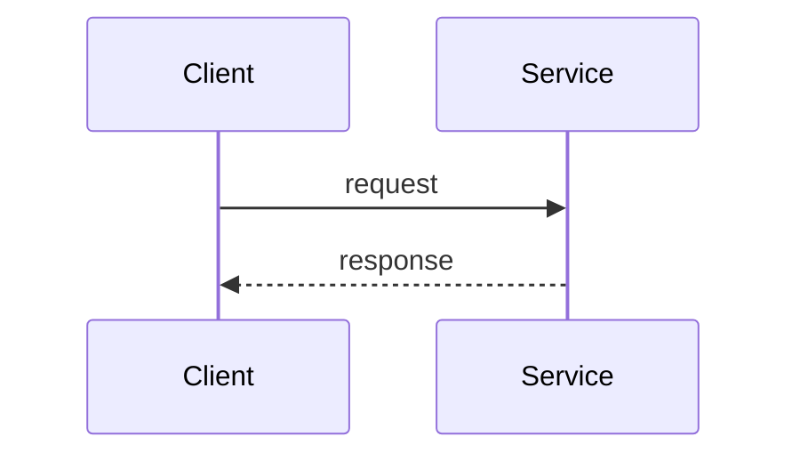

# Golden fixture: rfc-platform

## Summary

This paragraph supports the Summary section with observable evidence. Source: https://example.com/fixture (accessed 2026-06-22). This paragraph supports the Summary section with observable evidence. Source: https://example.com/fixture (accessed 2026-06-22). This paragraph supports the Summary section with observable evidence. Source: https://example.com/fixture (accessed 2026-06-22).

## Motivation

This paragraph supports the Motivation section with observable evidence. Source: https://example.com/fixture (accessed 2026-06-22). This paragraph supports the Motivation section with observable evidence. Source: https://example.com/fixture (accessed 2026-06-22). This paragraph supports the Motivation section with observable evidence. Source: https://example.com/fixture (accessed 2026-06-22).

## Proposed contract

This paragraph supports the Proposed contract section with observable evidence. Source: https://example.com/fixture (accessed 2026-06-22). This paragraph supports the Proposed contract section with observable evidence. Source: https://example.com/fixture (accessed 2026-06-22). This paragraph supports the Proposed contract section with observable evidence. Source: https://example.com/fixture (accessed 2026-06-22).

## Risks

Fixture content for Risks.

## Verification

Fixture content for Verification.

## References

- https://example.com/fixture-source (accessed 2026-06-22)
