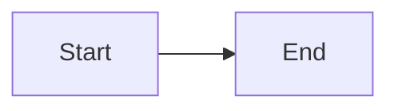

# Golden fixture: runbook

## Alert trigger

This paragraph supports the Alert trigger section with observable evidence. Source: https://example.com/fixture (accessed 2026-06-22). This paragraph supports the Alert trigger section with observable evidence. Source: https://example.com/fixture (accessed 2026-06-22). This paragraph supports the Alert trigger section with observable evidence. Source: https://example.com/fixture (accessed 2026-06-22).

## Symptoms

This paragraph supports the Symptoms section with observable evidence. Source: https://example.com/fixture (accessed 2026-06-22). This paragraph supports the Symptoms section with observable evidence. Source: https://example.com/fixture (accessed 2026-06-22). This paragraph supports the Symptoms section with observable evidence. Source: https://example.com/fixture (accessed 2026-06-22).

## Impact

Fixture content for Impact.

## Severity and response

Fixture content for Severity and response.

## Diagnostic steps

Fixture content for Diagnostic steps.

## Remediation

Fixture content for Remediation.

## Rollback

Fixture content for Rollback.

## Escalation

Fixture content for Escalation.

