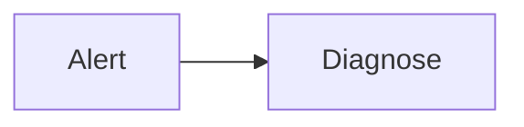
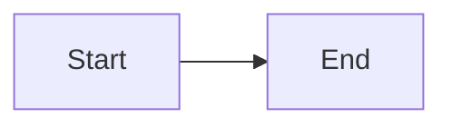

# Golden fixture: runbook

## Alert trigger

This paragraph supports the Alert trigger section with observable evidence. Source: https://example.com/fixture (accessed 2026-06-22). This paragraph supports the Alert trigger section with observable evidence. Source: https://example.com/fixture (accessed 2026-06-22). This paragraph supports the Alert trigger section with observable evidence. Source: https://example.com/fixture (accessed 2026-06-22).

## Symptoms

This paragraph supports the Symptoms section with observable evidence. Source: https://example.com/fixture (accessed 2026-06-22). This paragraph supports the Symptoms section with observable evidence. Source: https://example.com/fixture (accessed 2026-06-22). This paragraph supports the Symptoms section with observable evidence. Source: https://example.com/fixture (accessed 2026-06-22).

## Impact

Fixture content for Impact.

## Severity and response

Fixture content for Severity and response.

## Diagnostic steps

| Step | Check | How | Expected if healthy | If unhealthy → |
|---|---|---|---|---|
| D-1 | Error rate | Dashboard | <1% | Remediation R-1 |

## Remediation

Fixture content for Remediation.

## Rollback

| Step | Action | Expected output | Last tested |
|---|---|---|---|
| RB-1 | Revert flag | Prior healthy rate | 2026-06-22 |

## Escalation

Fixture content for Escalation.

## Adversarial challenge

| Failure mode | Effect | Mitigation |
|---|---|---|
| Stale credentials | Operator stranded | Break-glass account |

## References

Fixture content for References.

