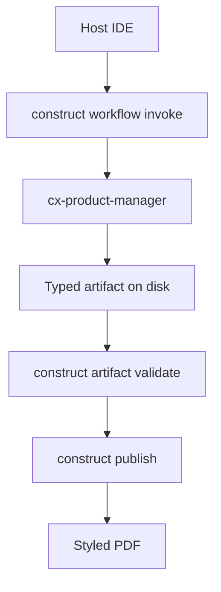

# Platform PRD: Enterprise Agentic Platform

- **Date**: 2026-06-19
- **Owner**: cx-product-manager
- **Status**: draft

> Platform teams need a governed layer between IDE hosts and specialist-authored artifacts — not another chat wrapper. Construct routes work through provenanced invoke plans, blocks distribution until validate passes, and exports briefs that read like finished editorial documents rather than markdown dumps. This PRD defines that contract for enterprise agentic platforms.

## Problem

Platform teams orchestrating multiple AI agents lack a governed operational layer. Each coding session starts cold, artifacts ship without provenance, and high-risk writes bypass approval queues. Internal platform consumers (application developers, ops engineers, security admins) currently stitch together ad hoc prompt conventions instead of a durable contract for routing, evidence, and distribution.

## Platform actors

Application developers invoke specialist chains from IDE hosts and expect reproducible PRD outputs. Security admins require citation discipline and release gates before PDF distribution. Ops engineers need toolchain detection that fails loud when Pandoc, Typst, or diagram renderers are missing.

## Goals and non-goals

**Goals:** Route requests through provenanced workflow invoke plans; block publish until artifact validate passes; export styled PDFs with rendered diagrams via a single construct publish command.

**Non-goals:** Replacing host LLM execution (Construct returns plans; specialists author content). Mandating npm dependencies in core CLI per ADR-0001.

## Platform flow

## Functional requirements

| ID | Requirement |
|---|---|
| FR-1 | `construct publish` runs validateArtifactRelease before export when type is known. |
| FR-2 | Gate failure exits 2 with remediation hints pointing to prd-workflow. |
| FR-3 | PDF export uses bundled Construct Typst template unless `.cx/publish-theme.typ` overrides. |

## Success metrics

Adoption is measured by the share of PRDs that pass release gate on first validate and publish without `--no-gate`. Latency targets cover export with figures under ten seconds on a typical laptop.

| Metric | Baseline | Target |
|---|---|---|
| Gate pass before publish | manual validate | enforced by default |
| PDF export p95 | n/a | ≤10s with figures |
| Demo tapes using --no-gate | unknown | 0 in CI |

## Risks and mitigations

| Risk | Likelihood | Impact | Mitigation |
|---|---|---|---|
| Draft iteration blocked by hard gate | med | med | PostToolUse advisory hook during Write; gate only at publish |
| Typst fonts missing on Linux | low | med | Font fallback chain in construct-pdf.typ |
| Agents bypass via MCP | med | high | publish_run respects gate by default |

Evidence for multi-agent orchestration patterns draws on
https://arxiv.org/abs/2308.08155 (accessed 2026-06-19) and the LangGraph overview at
https://langchain-ai.github.io/langgraph/ (accessed 2026-06-19).

## References

- Construct artifact manifest: `specialists/artifact-manifest.json`
- PRD workflow skill: `skills/docs/prd-workflow.md`
